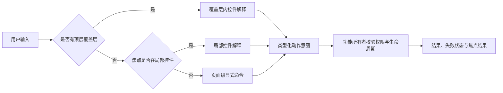

# 开赛了产品全局交互规范

| 字段         | 值                                                                                                |
| ------------ | ------------------------------------------------------------------------------------------------- |
| 产品         | 开赛了                                                                                            |
| 设计方向     | `静稳棋室`                                                                                        |
| 产品状态     | `COMPLETE_PRODUCT_DESIGN_FINAL_READY_FOR_PAGE_DESIGN`                                             |
| 产品基线     | `COMPLETE_PRODUCT_DESIGN_FINAL_READY_FOR_PAGE_DESIGN`                                             |
| 设计阶段门禁 | `PAGE_BY_PAGE_UI_DESIGN_READY_WITH_TRACKED_OWNER_DECISIONS（已完成）`                             |
| 当前实施门禁 | `PRODUCT_PAGE_DESIGN_DOCUMENTATION_READY_FOR_IMPLEMENTATION`                                      |
| 文档状态     | `ACTIVE_IMPLEMENTATION_AUTHORITY`                                                                 |
| 能力分类     | `CURRENT_IMPLEMENTED`、`APPROVED_TARGET`、`CONTRACT_BLOCKED`、`OPEN_OWNER_DECISION`、`PROHIBITED` |

## 1. 责任与关联文档

本文唯一拥有跨页面的动作语义、输入方式优先级、键盘与触控行为、焦点移动、取消、重试、恢复、状态播报和减弱动效规则。页面只声明触发点、页内焦点顺序和适用动作，不复制这些规则。

- 文档入口：[产品逐页 UI 设计文档索引](./PRODUCT_UI_DESIGN_INDEX.zh-CN.md)
- 状态标题、说明与恢复：[产品全局状态规范](./PRODUCT_GLOBAL_STATE_SPEC.zh-CN.md)
- 覆盖层呈现：[共用覆盖层与对话框规范](./PRODUCT_COMMON_OVERLAYS_AND_DIALOGS_SPEC.zh-CN.md)
- 视口、滚动和覆盖层空间：[产品全局布局规范](./PRODUCT_GLOBAL_LAYOUT_SPEC.zh-CN.md)
- 响应式输入组合：[产品响应式规范](./PRODUCT_RESPONSIVE_SPEC.zh-CN.md)
- 当前与概念组件边界：[产品组件责任规范](./PRODUCT_COMPONENT_RESPONSIBILITY_SPEC.zh-CN.md)
- Naive UI 只能承担的基础控件：[Naive UI 映射](./PRODUCT_NAIVE_UI_MAPPING.zh-CN.md)
- 当前实现差异：[实施纠正清单](./PRODUCT_IMPLEMENTATION_CORRECTION_BACKLOG.zh-CN.md)

适用页面：[登录](./pages/LOGIN_PAGE_SPEC.zh-CN.md)、[统一工作区](./pages/UNIFIED_WORKSPACE_PAGE_SPEC.zh-CN.md)、[赛事列表](./pages/COMPETITION_LIST_PAGE_SPEC.zh-CN.md)、[赛事详情](./pages/COMPETITION_DETAIL_PAGE_SPEC.zh-CN.md)、[场外大屏](./pages/VENUE_DISPLAY_PAGE_SPEC.zh-CN.md)、[设置表面](./pages/SETTINGS_SURFACE_SPEC.zh-CN.md)、[兼容与不可用表面](./pages/COMPATIBILITY_AND_UNAVAILABLE_SURFACES_SPEC.zh-CN.md)。

本文中的“责任”可以是已实现所有者，也可以是经批准的概念责任。只有[产品组件责任规范](./PRODUCT_COMPONENT_RESPONSIBILITY_SPEC.zh-CN.md)列为当前文件的名称才可视为现有组件。

## 2. 交互总则

1. 用户动作先由当前焦点所在控件解释，再由所属页面或功能容器转换为类型化意图；呈现组件不直接写 Store、仓储或持久层。
2. 来源、棋局、节点、变例和模式切换必须保持外层几何；状态变化在所属模块内完成。
3. 任何会丢失未应用编辑、删除内容、覆盖内容或清空批注的动作先进入确认流程。
4. 取消只终止当前任务或草稿，不回滚已经明确完成的其他动作；取消后必须给出稳定焦点结果。
5. 远端重试只重试同一已验证请求上下文；不得补造数据、改变筛选或偷偷切换来源。
6. 进行中实时内容只允许选择、查看、走法导航、视角和连接恢复；编辑、变例、来源批注、AI、评价和写回均为 `PROHIBITED`。
7. 受保护或完成内容只有在真实合同允许且用户明确选择“导入为本地副本”后，才进入可编辑状态。
8. 指针悬停不是任何核心动作的唯一发现方式。所有拖动动作都有按钮或键盘等价路径。
9. 页面不得注册无上下文的方向键监听。方向键解释严格遵循第 5 节的焦点优先级。
10. 状态颜色必须同时具备文字或图形语义；状态变化不得只靠闪烁、位移或颜色表达。

## 3. 共用动作合同

### 3.1 导航、选择与局面动作

| ID                    | 分类                                                               | 动作与所有者                                | 触发                                                 | 成功结果                                                                 | 失败结果                                                       | 焦点结果                                                                         |
| --------------------- | ------------------------------------------------------------------ | ------------------------------------------- | ---------------------------------------------------- | ------------------------------------------------------------------------ | -------------------------------------------------------------- | -------------------------------------------------------------------------------- |
| `IA-PRODUCT-NAV`      | `CURRENT_IMPLEMENTED` 基础导航；`APPROVED_TARGET` 未知路由失败关闭 | 产品导航；Vue Router 与当前页面入口所有者   | 激活产品级链接、返回动作或安全返回                   | 导航到已批准路由；取消前页请求；新页保留自己的固定几何                   | 路由无法解析时进入兼容/不可用状态，不生成空白成功页            | 常规导航把焦点置于新页主标题；浏览器后退恢复到历史焦点可用项，否则置于页面主标题 |
| `IA-SOURCE-SWITCH`    | `APPROVED_TARGET`                                                  | 来源切换；统一工作区来源容器                | 选择本地来源、赛事层级或合同就绪来源                 | 先处理未应用草稿，再更换类型化适配器；棋盘外壳不重建；清理旧来源瞬时状态 | 无效、无权或合同阻断时保留当前可信内容，并在来源区显示对应状态 | 成功后焦点到新来源标题；失败仍停在触发项；打开过确认框时按确认框合同返回         |
| `IA-GAME-SELECT`      | `CURRENT_IMPLEMENTED`，目标行为按本表补齐                          | 棋局选择；棋谱领域与当前集合所有者          | 点击、触控或键盘激活棋局项                           | 保存当前内存会话可保存状态，选择新棋局与其有效节点，保持面板几何         | 解析或选择失败时保留原棋局并播报失败                           | 焦点保留在被选棋局项；棋盘与棋谱更新，不强制抢焦点                               |
| `IA-MOVE-NAV`         | `CURRENT_IMPLEMENTED`，键盘目标按第 5 节                           | 走法导航；棋谱领域所有者                    | 上一步、下一步、起始、末尾、棋谱节点、允许的棋盘滚轮 | 选择同一棋局内的有效节点；棋盘、棋谱、节点批注同步                       | 到达边界时动作禁用；无有效节点时不改变状态                     | 按钮触发后保留按钮焦点；棋谱项触发后保留该项焦点并滚动到可见区域                 |
| `IA-VARIATION-NAV`    | `APPROVED_TARGET`（当前点击基线已存在）                            | 变例展开与选择；棋谱领域所有者              | 展开/收起变例、选择变例节点                          | 只改变可见分支或当前节点，不改变来源权限                                 | 无效分支保持原节点并显示模块内错误                             | 展开按钮保留焦点；选择节点后焦点保留在节点项                                     |
| `IA-VARIATION-CREATE` | `APPROVED_TARGET`                                                  | 本地变例创建；棋谱领域所有者                | 本地可编辑局面产生分支并选择“作为变例/作为主线”      | 写入当前本地副本的节点树；远端来源不变                                   | 非本地、进行中实时或只读来源拒绝动作并解释原因                 | 成功后焦点到新节点；取消后回到触发动作；失败回到选择按钮                         |
| `IA-BOARD-MOVE`       | `CURRENT_IMPLEMENTED`                                              | 棋盘走子意图；规范棋盘与棋谱领域所有者      | 点击两格、拖放、触控选择或棋盘键盘选择               | 仅在可编辑本地上下文提交合法走子；晋升时进入选择器                       | 非法走法回弹并播报；只读来源不提交；取消晋升保持原局面         | 成功后焦点留在棋盘；晋升结束后返回触发该走子的棋盘                               |
| `IA-BOARD-ANNOTATE`   | `CURRENT_IMPLEMENTED`，权限门禁需统一                              | 节点标注；规范棋盘与节点标注所有者          | 指针/触控绘制、工具按钮或等价键盘路径                | 箭头、方格或高亮只写入当前可编辑节点；撤销历史跟随同一所有者             | 只读或进行中实时拒绝写入；手势中断不产生半条标注               | 绘制后焦点不被移动；工具按钮保留焦点；清除按专用确认合同                         |
| `IA-BOARD-EDITOR`     | `APPROVED_TARGET`（当前编辑基础已存在）                            | 手动局面；棋盘编辑草稿与工作区容器          | 从空局面、初始局面或当前局面进入                     | “应用局面”校验后创建新的本地教学来源；“取消”完整恢复进入前状态           | 校验失败保留草稿并把错误关联到首个问题控件                     | 进入时焦点到编辑标题或首个棋子控件；应用后到新来源标题；取消后回到进入编辑按钮   |
| `IA-IMPORT-LOCAL`     | `APPROVED_TARGET`（当前文件入口和基础解析已存在）                  | 本地 PGN 导入；本地文件解析与教学集合所有者 | 文件选择器返回一个或多个文件                         | 本地逐项解析，有效棋局按稳定顺序加入集合；不上传                         | 部分失败进入导入摘要；全部失败保留原集合；不创建空棋局         | 完成后到首个新增棋局；部分失败先到摘要标题；取消文件选择回到导入按钮             |

### 3.2 控件、覆盖层、异步与恢复动作

| ID                | 分类                                                            | 动作与所有者                                                     | 触发                                           | 成功结果                                                         | 失败结果                                                   | 焦点结果                                                                   |
| ----------------- | --------------------------------------------------------------- | ---------------------------------------------------------------- | ---------------------------------------------- | ---------------------------------------------------------------- | ---------------------------------------------------------- | -------------------------------------------------------------------------- |
| `IA-TAB`          | `APPROVED_TARGET`（当前点击切换已存在）                         | 页签切换；页签组所属模块                                         | 点击、触控、`Enter`/`Space` 或方向键           | 激活唯一面板；保留未卸载内容所属状态；不改变外层几何             | 目标面板不可用时页签禁用并提供原因                         | 方向键切换时焦点随活动页签；点击切换时焦点留在触发页签                     |
| `IA-MENU`         | `APPROVED_TARGET`                                               | 菜单；项目自有覆盖层适配责任                                     | 激活菜单按钮                                   | 展开与触发按钮关联的选项；执行后关闭                             | 无可用选项时按钮禁用；动作失败由所属模块呈现               | 打开到首个可用项；关闭或执行后返回菜单按钮，除非动作发生页面导航           |
| `IA-DRAWER-SHEET` | `APPROVED_TARGET`                                               | 设置、来源、上下文抽屉/窄屏 Sheet；页面容器与项目覆盖层适配责任  | 激活对应打开按钮                               | 展示同一页面责任的替代组合，不复制 Store 或领域状态              | 内容无法取得时抽屉内显示状态，不关闭外层页面               | 打开到标题后的首个可操作控件；关闭回触发按钮；触发按钮消失则回同区域标题   |
| `IA-DIALOG`       | `APPROVED_TARGET`（棋盘专用升变选择已有独立基线）               | 模态对话框；发起功能与项目覆盖层适配责任                         | 登录要求、确认、首次提示、导入摘要或会话过期   | 只处理单一决策；背景不可交互                                     | 内部动作失败时对话框保持打开并显示非技术错误               | 打开按覆盖层规范设置初焦点；结束后回触发点或明确的新页面标题               |
| `IA-DESTRUCTIVE`  | `APPROVED_TARGET`                                               | 删除、覆盖、清空、放弃；拥有数据的功能容器                       | 激活危险动作                                   | 经确认后仅修改明确命名的本地对象；成功播报对象与结果             | 失败时对象与原内容保持，确认层关闭后在所属模块显示错误     | 初始焦点放在安全动作；确认成功回到合理相邻项或空状态主动作；取消回危险动作 |
| `IA-RETRY`        | `CURRENT_IMPLEMENTED`，保留数据规则为全局目标                   | 重试；失败请求或任务的原所有者                                   | 激活“重试”                                     | 使用同一已验证上下文重新执行；进入 `GS-RETRYING`                 | 再失败进入相同错误分类并更新说明，不循环弹层               | 重试按钮保留焦点并禁用至完成；成功不抢焦点；完整失败继续停在重试按钮       |
| `IA-CANCEL`       | `CURRENT_IMPLEMENTED`，一致焦点为全局目标                       | 取消；当前可取消任务/草稿所有者                                  | 激活“取消”或符合条件的 `Escape`                | 停止请求、AI、导入或草稿；清理监听器；保留已确认内容             | 已完成任务不伪装取消；清理失败转为模块错误但不泄漏内部信息 | 回到启动动作；若启动动作不存在，回所属模块标题                             |
| `IA-RECOVERY`     | `APPROVED_TARGET`（当前主题、布局、认证与交接恢复已有受限基线） | 恢复；主题、布局、认证、交接、路由及未来版本化教学记录各自所有者 | 刷新、重新进入、登录返回、重连或“返回可用内容” | 只恢复有当前所有者且校验通过的记录；其余回真实选择器或不可用状态 | 无效记录清除或忽略；不制造成功棋局，不覆盖仍可用本地内容   | 路由恢复到页面主标题；局部恢复保持触发点；登录返回到安全任务标题           |

## 4. 鼠标、触控、滚轮与拖动

| 输入         | 统一规则                                                                                                    | 禁止行为                                                                             |
| ------------ | ----------------------------------------------------------------------------------------------------------- | ------------------------------------------------------------------------------------ |
| 鼠标/触控板  | 单击选择，双击不承载唯一核心动作；右键只用于存在明确触控和键盘替代的棋盘标注；悬停只补充提示                | 依赖悬停显示唯一动作；在模块滚动时误触棋盘缩放；右键成为唯一入口                     |
| 触控         | 核心目标不小于项目触控尺寸规则；棋盘以“选择起点—选择终点”作为拖动替代；长按只能打开有可见替代入口的局部工具 | 长按执行破坏性动作；边缘手势与系统返回冲突；需要精确悬停                             |
| 棋盘拖动     | 只有本地可编辑且棋盘允许走子时提交；越界、非法或取消指针时回弹；拖动期间禁止分割条和滚轮竞争                | 在只读、实时或编辑权限未知时启动走子；拖动结束后保留幽灵棋子                         |
| 集合排序拖动 | `APPROVED_TARGET`。拖动句柄只改变当前教学集合顺序；同时提供“上移/下移”按钮和键盘命令                        | 整行任意位置成为拖动句柄；没有键盘替代；跨集合隐式移动                               |
| 分割条拖动   | 仅在句柄上按下后捕获指针；移动受所属面板最小/最大范围约束；释放、取消、卸载都结束拖动                       | 修改 body 滚动；离开页面仍保留指针捕获；把未批准尺寸写入持久化                       |
| 滚轮         | 指针位于棋盘且棋盘滚轮导航启用时，一次越过阈值只走一步；边界不重复播报。其他区域滚轮只滚动该模块            | 页面级全局拦截；在摆谱、分割条拖动或覆盖层打开时导航棋步；滚动一个面板带动另一个面板 |

## 5. 键盘上下文与方向键优先级

### 5.1 强制优先顺序

同一次按键只允许一个所有者处理，按以下顺序判定：

1. **输入法组合**：`event.isComposing` 或组合过程中的按键不触发产品命令。
2. **最上层模态覆盖层**：焦点陷阱、`Escape`、菜单或对话框内部控件先处理；背景页面不响应。
3. **原生编辑控件**：`input`、`textarea`、`select`、可编辑内容及其组合框保留光标移动、选择、撤销和候选操作。
4. **复合控件**：菜单、列表框、树、页签组、单选组、滑块、分割条按各自 ARIA 键盘模式解释方向键。
5. **棋盘**：棋盘获得焦点时，四个方向键只移动棋盘方格焦点；`Enter`/`Space`选择起点或合法终点；`Escape`取消当前方格选择或棋盘手势。
6. **棋谱着法/变例区域**：仅当焦点位于棋谱着法项时，方向键按第 5.2 节解释。
7. **页面级命令**：只有焦点不在上述上下文且没有模态层时才允许；本规范不批准无焦点条件的全局方向键走棋。

事件被当前层处理时必须调用阻止默认行为与停止继续解释；未处理的键不应被吞掉。

### 5.2 各控件方向键合同

| 焦点上下文      | `ArrowLeft` / `ArrowRight`                     | `ArrowUp` / `ArrowDown`          | `Home` / `End`                              | `Enter` / `Space`                                      | `Escape`                                 |
| --------------- | ---------------------------------------------- | -------------------------------- | ------------------------------------------- | ------------------------------------------------------ | ---------------------------------------- |
| 棋盘            | 按当前朝向在文件方向移动方格焦点               | 按当前朝向在横线方向移动方格焦点 | 可移动到当前横线首/末格；若未实现则不拦截   | 选择方格、提交合法终点                                 | 取消方格选择、拖动或标注草稿             |
| 棋谱着法项      | 上一/下一时间顺序着法；到边界不循环            | 上一/下一可见着法项              | 初始局面/末尾着法                           | 选择焦点着法                                           | 保持当前节点并退出局部键盘导航到区域容器 |
| 变例展开按钮    | 左收起，右展开                                 | 上一/下一可见展开按钮            | 首/末展开按钮                               | 切换展开                                               | 不改变展开状态，回当前着法项             |
| 水平页签组      | 上一/下一可用页签并循环                        | 不处理                           | 首/末页签                                   | 激活焦点页签；实现可采用自动激活，但一个产品内必须一致 | 不关闭页面                               |
| 菜单/列表框/树  | 树节点左收起/父级、右展开/子级；普通菜单不处理 | 上一/下一可用项并循环            | 首/末可用项                                 | 执行或展开                                             | 关闭并返回触发按钮                       |
| 水平/垂直分割条 | 仅与分割方向匹配的键调整；相反方向不处理       | 同左                             | 可选地恢复允许的最小/最大值，必须有可见说明 | 不处理                                                 | 取消正在进行的拖动并恢复拖动前值         |

### 5.3 已确认的当前不一致

`docs/ui/ACCESSIBILITY_SPEC.md` 当前同时写有“棋盘聚焦时左右方向键切换走法”和“棋盘聚焦后方向键移动方格焦点”。运行时 `src/features/board/useBoardView.ts` 实际把四个方向键全部用于方格焦点，工作区走法切换由显式按钮、棋谱项和已启用的棋盘滚轮承担。本文为页面设计确定唯一目标：**棋盘方向键属于方格空间导航；走法方向键只属于棋谱着法上下文；不存在上下文无关的全局左右键走法。**

该差异必须进入[实施纠正清单](./PRODUCT_IMPLEMENTATION_CORRECTION_BACKLOG.zh-CN.md)，并在实施阶段同步修正文档、棋谱键盘模式和浏览器验收；本次只记录，不修改运行时。

### 5.4 其他键盘规则

- `Tab`/`Shift+Tab`只在可聚焦控件间移动，不用方向键替代页面 Tab 顺序。
- `Escape`只关闭最上层可关闭覆盖层，或取消当前局部草稿；不得同时关闭两层。
- `Ctrl/Cmd+Z`在文本输入中保持原生撤销；在棋盘/标注上下文中只撤销当前节点标注；只读和实时上下文禁用产品撤销。
- `Ctrl/Cmd+Shift+Z`或平台等价键重做当前节点标注；页面必须同时提供可见按钮。
- `?` 快捷键只有在键盘帮助表面获得明确所有者后才能启用。当前没有该表面，不得在 UI 中宣称此快捷键可用。
- 登录表单 `Enter`提交；提交中忽略重复提交；校验失败聚焦首个无效字段。

## 6. 焦点顺序、陷阱与返回

### 6.1 页面级顺序

- 常规页面：跳转到主要内容的入口（实现时）→ 产品/页面头部 → 页面主要筛选或主动作 → 主内容 → 次要内容 → 页内状态。
- 统一工作区：产品工具栏 → 左侧来源区 → 中央棋盘及棋盘局部控制 → 右侧页签与活动面板 → 模块状态。面板折叠后，其内部控件必须退出 Tab 顺序。
- 场外大屏：返回/操作员选择 → 全部对阵格中的真实只读棋盘（仅存在时）→ 状态。无分页、轮播或聚焦控件；合同阻断舞台不伪装为可操作棋盘。
- 棋盘是一个页面级 Tab 停靠点；方格移动在棋盘内部完成，避免 64 个方格进入全局 Tab 顺序。

### 6.2 模态覆盖层

1. 打开前记录真实触发元素；程序性状态变化没有触发元素时记录所属模块标题。
2. 打开后背景使用模态语义并不可交互；焦点进入标题后的首个合适控件。破坏性确认的初焦点永远是安全动作。
3. `Tab`和`Shift+Tab`在最上层模态层内循环。
4. 关闭后优先返回仍连接且可操作的触发元素；触发元素被删除时，返回同列表的下一项、上一项、空状态主动作，最后才是模块标题。
5. 导航型主动作关闭覆盖层并转页时，不先把焦点闪回旧触发点；新页按路由焦点规则接管。

非模态的模块状态、加载提示和轻量结果播报不得抢焦点。覆盖层的具体初焦点与关闭策略由[共用覆盖层与对话框规范](./PRODUCT_COMMON_OVERLAYS_AND_DIALOGS_SPEC.zh-CN.md)拥有。

## 7. 状态播报

| 事件               | ARIA 行为                                           | 播报规则                                                                 |
| ------------------ | --------------------------------------------------- | ------------------------------------------------------------------------ |
| 页面导航           | 页面主标题由路由焦点接管                            | 只读标题，不额外重复 live-region 文案                                    |
| 初次加载/重试      | `role="status"`，`aria-live="polite"`               | 开始一次、完成一次；短刷新不逐帧播报                                     |
| 完整失败、权限丢失 | `role="alert"` 或等价 assertive 状态                | 只播报用户可行动的标题、原因与下一步；不播报端点、堆栈或协议             |
| 棋局/节点选择      | 棋谱区域 `polite`                                   | 播报棋局可见名称或 SAN 与轮到谁；连续快速导航节流，不逐键堆积            |
| 标注/编辑          | `polite`                                            | 只播报完成动作，如“已添加箭头”“局面未应用”；手势过程不播报               |
| 实时更新           | 独立 `polite` 区域                                  | 连接状态变化必播；新着法简短播报；重复心跳不播报；陈旧和断开不只靠颜色   |
| AI                 | `polite`；失败使用 `alert`                          | 播报开始、取消、失败、完成和过期结果被拒绝；不播报每次深度或内部请求标识 |
| 覆盖层             | 标题由 `aria-labelledby`，说明由 `aria-describedby` | 不额外重复整段文案；动作结果在关闭后的所属模块播报                       |

所有精确状态文案由[产品全局状态规范](./PRODUCT_GLOBAL_STATE_SPEC.zh-CN.md)拥有。

## 8. 动效与减弱动效

- 动效只解释来源交接、面板展开、棋子移动、结果到达和抽屉；不得延迟状态提交或焦点移动。
- 动画开始前状态已经可由辅助技术读取；动画中断、组件卸载或路由离开时清理监听器、时间线、指针捕获和滚动锁。
- `prefers-reduced-motion: reduce` 下，棋子和页面直接到最终状态；面板/抽屉不使用位移或弹性；进度使用静态文本或非循环指示；实时状态不闪烁。
- 场外大屏不实现自动轮播或换页；减弱动效下棋盘和状态直接进入真实最终状态。
- 焦点移动与滚动到当前着法可以即时完成；不使用平滑滚动造成长距离追随。

## 9. 开放决定对交互的约束

| OD      | 固定边界                             | 仍为开放决定；本文不得固化                 |
| ------- | ------------------------------------ | ------------------------------------------ |
| `OD-01` | 教学集合支持选择、搜索与排序目标     | 文件夹层级与命名深度                       |
| `OD-02` | 节点内容与棋局级教学笔记有明确所有权 | 课次级跨棋局笔记及其切换提示               |
| `OD-03` | AI 必须显式开启；会话内可取消        | AI 设置是设备级还是其他作用域              |
| `OD-04` | 首次开启必须说明资源影响             | 提示确认的持久范围及深度、时间、并发默认值 |
| `OD-05` | 大屏保持全对阵同屏与正方棋盘         | 最小与首选棋盘尺寸                         |
| `OD-06` | 本页不实现轮播                       | 最终边距与间距                             |
| `OD-07` | 陈旧与棋钟不得由客户端猜测           | 陈旧阈值与棋钟插值                         |
| `OD-08` | 当前公开赛事与公开对阵组合匿名       | 实时多棋盘匿名范围                         |
| `OD-09` | 窄屏必须保留导航和可达上下文         | 完整局面编辑与复杂标注范围                 |
| `OD-10` | 导出不得含敏感来源字段               | 导出/打印动作与范围                        |
| `OD-11` | 声音不能成为唯一反馈                 | 声音默认状态与持久化                       |

`OD-01` 至 `OD-11` 均保持 `OPEN`。

## 10. 当前实现事实与纠正依赖

下表仅定位差异；详情和实施阶段由[实施纠正清单](./PRODUCT_IMPLEMENTATION_CORRECTION_BACKLOG.zh-CN.md)唯一维护。

| 当前路径/责任                                                         | 当前事实                                                             | 本规范要求                                                      |
| --------------------------------------------------------------------- | -------------------------------------------------------------------- | --------------------------------------------------------------- |
| `docs/ui/ACCESSIBILITY_SPEC.md`、`src/features/board/useBoardView.ts` | 左右方向键同时被文档分配给走法和棋盘方格；运行时实际属于方格         | 按第 5 节统一上下文优先级，补齐棋谱键盘模式                     |
| `TeachingWorkspace.vue`、分析 Store                                   | 当前节点变化会立即启动分析，摆谱应用后也自动分析                     | AI 默认关闭，只有显式动作且允许的本地上下文才能启动             |
| `TeachingWorkspace.vue`、`WorkspaceToolbar.vue`                       | 评价轨和分析入口的模式/来源权限门禁不完整                            | 进行中实时、只读来源和无本地副本时不呈现 AI/评价                |
| `WorkspaceToolbar.vue`                                                | 清除标注直接执行                                                     | 使用“清除当前节点标注”确认合同                                  |
| `BoardEditorPanel.vue`、`TeachingWorkspace.vue`                       | 取消摆谱直接退出，未区分是否有草稿变化                               | 有变化时使用“放弃未应用局面”确认；无变化可直接退出              |
| `WorkspaceRightPanel.vue`                                             | 页签仅有点击切换，缺少完整 roving tabindex/关联面板合同              | 实施第 5.2 节页签键盘模式与焦点关联                             |
| `WorkspaceSplitter.vue`、`useWorkspaceSplitter.ts`                    | 分割条仅实现指针拖动                                                 | 增加可访问 separator 语义、方向键调整与取消恢复                 |
| `PromotionChooser.vue`                                                | 已实现模态语义、Tab 陷阱、Escape 和返回焦点                          | 保留为 `CURRENT_IMPLEMENTED` 基线，不扩散为第二套通用对话框实现 |
| `AppProviders.vue`                                                    | 只有 Naive UI 配置与全局样式 Provider；没有通用对话框/抽屉产品所有者 | 后续按组件责任和 Naive UI 映射建立项目自有覆盖层适配责任        |

## 11. 禁止行为

- `PROHIBITED`：在输入框、棋盘、菜单、页签或分割条拥有按键时仍执行页面级快捷键。
- `PROHIBITED`：来源切换时静默丢弃未应用局面或已确认的本地工作。
- `PROHIBITED`：在进行中实时上下文启用编辑、标注写回、AI、评价或变例创建。
- `PROHIBITED`：失败后自动切到样例、空棋局或旧来源并显示成功。
- `PROHIBITED`：对话框关闭后把焦点置于 `body`、隐藏控件或已删除元素。
- `PROHIBITED`：只有拖动、悬停、右键、颜色、声音或动画而没有等价路径。
- `PROHIBITED`：使用技术协议、端点、内部请求标识、原始 DTO 或秘密作为用户动作说明。
- `PROHIBITED`：把 OD 推荐值、目标持久化或合同阻断来源当成当前交互事实。

## 12. 页面实施与验收合同

每个页面规范必须：

1. 引用适用的动作 ID，不复制动作合同；
2. 声明页面首个焦点、完整 Tab 顺序、所有覆盖层触发点及返回点；
3. 声明指针、键盘、触控和拖动路径，特别是所有拖动的非拖动替代；
4. 声明哪些动作按模式、来源、生命周期和权限隐藏、禁用或禁止；
5. 对所有异步动作映射[产品全局状态规范](./PRODUCT_GLOBAL_STATE_SPEC.zh-CN.md)的状态 ID；
6. 对所有覆盖层映射[共用覆盖层与对话框规范](./PRODUCT_COMMON_OVERLAYS_AND_DIALOGS_SPEC.zh-CN.md)的覆盖层 ID；
7. 引用相关纠正项，不把当前缺陷写成目标行为；
8. 在真实浏览器验收中覆盖一个鼠标/触控路径、一个键盘路径、可见焦点、返回焦点、减弱动效和一次真实状态变化；文档任务本身不运行浏览器验证。
