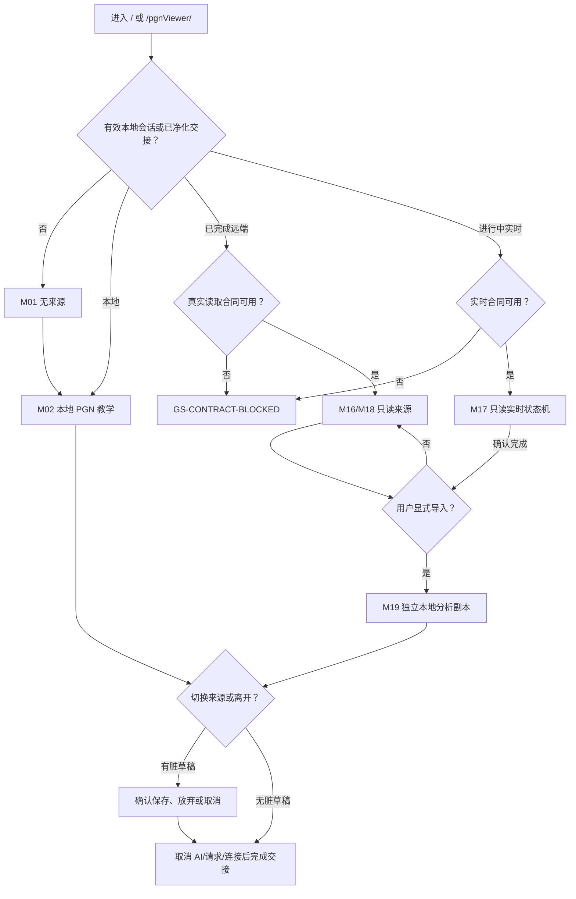

# 开赛了统一工作区页面规范

| 字段         | 值                                                                    |
| ------------ | --------------------------------------------------------------------- |
| 页面责任     | 唯一棋盘中心的教学、讲解、回放与只读实时工作区                        |
| Router 路径  | `/`                                                                   |
| 部署 URL     | `/pgnViewer/`                                                         |
| 页面标题     | `统一工作区`                                                          |
| 浏览器标题   | `开赛了｜统一工作区`                                                  |
| 产品状态     | `COMPLETE_PRODUCT_DESIGN_FINAL_READY_FOR_PAGE_DESIGN`                 |
| 产品基线     | `COMPLETE_PRODUCT_DESIGN_FINAL_READY_FOR_PAGE_DESIGN`                 |
| 设计阶段门禁 | `PAGE_BY_PAGE_UI_DESIGN_READY_WITH_TRACKED_OWNER_DECISIONS（已完成）` |
| 当前实施门禁 | `PRODUCT_PAGE_DESIGN_DOCUMENTATION_READY_FOR_IMPLEMENTATION`          |
| 文档状态     | `ACTIVE_IMPLEMENTATION_AUTHORITY`                                     |
| 设计表面     | `WS-001` 至 `WS-012`、`RP-001`、`RP-002`                              |

## 1. 文档责任与权威关系

本文只拥有统一工作区特有的页面责任、区域组合、模式投影、动作优先级、状态映射、来源切换、路由离开和验收路径。共同视觉、几何、交互、状态文案、覆盖层、响应式、组件边界和实施顺序由下列全局文档唯一拥有；本文不得复制或改写其通则。

- 总入口：[产品逐页 UI 设计文档索引](../PRODUCT_UI_DESIGN_INDEX.zh-CN.md)
- 设计表面：[产品设计表面清单](../PRODUCT_SCREEN_INVENTORY.zh-CN.md)
- 视觉与 Token：[产品 UI 设计系统](../PRODUCT_UI_DESIGN_SYSTEM.zh-CN.md)
- 壳、几何与滚动：[产品全局布局规范](../PRODUCT_GLOBAL_LAYOUT_SPEC.zh-CN.md)
- 动作、键盘与焦点：[产品全局交互规范](../PRODUCT_GLOBAL_INTERACTION_SPEC.zh-CN.md)
- 精确状态文案：[产品全局状态规范](../PRODUCT_GLOBAL_STATE_SPEC.zh-CN.md)
- 档位与折叠：[产品响应式规范](../PRODUCT_RESPONSIVE_SPEC.zh-CN.md)
- 当前与概念责任：[产品组件责任规范](../PRODUCT_COMPONENT_RESPONSIBILITY_SPEC.zh-CN.md)
- 通用控件候选：[产品 Naive UI 映射](../PRODUCT_NAIVE_UI_MAPPING.zh-CN.md)
- 对话框与抽屉：[共用覆盖层与对话框规范](../PRODUCT_COMMON_OVERLAYS_AND_DIALOGS_SPEC.zh-CN.md)
- 当前差异：[产品实现纠正清单](../PRODUCT_IMPLEMENTATION_CORRECTION_BACKLOG.zh-CN.md)
- 实施顺序：[产品 UI 实施交接](../PRODUCT_UI_IMPLEMENTATION_HANDOFF.zh-CN.md)

上游产品责任仍由[产品设计蓝图](../../product/PRODUCT_DESIGN_BLUEPRINT.zh-CN.md)、[所有者需求基线](../../product/OWNER_PRODUCT_REQUIREMENT_BASELINE.zh-CN.md)、[技术工作区模式](../../product/WORKSPACE_MODES.md)和[模式能力矩阵](../../product/PRODUCT_MODE_AND_CAPABILITY_MATRIX.json)拥有。本文不新增 API、持久化表、运行时模式或来源合同。

能力和状态必须且只能使用 `CURRENT_IMPLEMENTED`、`APPROVED_TARGET`、`CONTRACT_BLOCKED`、`OPEN_OWNER_DECISION`、`PROHIBITED` 中的一类。概念责任名不是现有文件。

## 2. 页面责任、用户与任务

### 2.1 页面责任

统一工作区使用一套稳定外壳承载本地 PGN 教学、手动局面、赛事讲解、已结束棋局回放、进行中实时观战和显式导入后的本地分析副本。左侧回答“内容从哪里来？”，中央始终保留唯一且占主导的规范棋盘，右侧回答“当前能看到什么、能做什么？”。

页面负责：

- 把直接访问、已净化交接和本地来源解析为一个 `WorkspaceModeContext`；
- 维持一套来源导航、棋盘、棋谱、评论、标注、教学笔记和分析状态图；
- 依据模式、来源、只读、合同与本地副本身份生成统一 capability model；
- 在来源、棋局、节点、主题、身份和响应式档位变化时尽量保留外部几何与任务连续性；
- 对未闭合合同显示真实阻断，对有效只读来源提供浏览，并仅在显式导入后创建独立本地副本。

页面不负责：

- 赛事发现与筛选；该责任属于[赛事列表页](./COMPETITION_LIST_PAGE_SPEC.zh-CN.md)；
- 赛事、组别、轮次和对阵浏览；该责任属于[赛事详情页](./COMPETITION_DETAIL_PAGE_SPEC.zh-CN.md)；
- 场外多棋盘展示；该责任属于[场外大屏页](./VENUE_DISPLAY_PAGE_SPEC.zh-CN.md)；
- 登录表单、认证协议、远端写入、赛事管理、在线对弈、通用云盘或技术诊断；
- 为不同来源建立第二工作区、第二棋盘、第二 PGN、第二标注或第二 AI 运行时。

### 2.2 用户与首要任务

| 用户                 | 进入目的                 | 页面首要任务                                               | 受限边界                                 |
| -------------------- | ------------------------ | ---------------------------------------------------------- | ---------------------------------------- |
| 教师、教练           | 备课、讲棋、复盘         | 选择来源并围绕棋盘导航、评论、标注、创建本地变例、按需分析 | 远端和进行中来源只读；AI 必须显式开启    |
| 俱乐部、机构教学人员 | 组织教学材料与赛事讲解   | 在教学集合或赛事层级中切换棋局并保持讲解连续               | 集合层级受 `OD-01`；受保护内容依真实合同 |
| 学员、授权观众       | 跟随讲解、查看回放或实时 | 浏览局面、走法、棋局信息和可信状态                         | 无来源编辑、远端写回或进行中实时分析     |

### 2.3 入口与出口

| 类型     | 路径或动作                         | 页面合同                                                                                                     |
| -------- | ---------------------------------- | ------------------------------------------------------------------------------------------------------------ |
| 直接入口 | Router `/`；部署 `/pgnViewer/`     | 无有效来源时进入 `M01`，不自动生成样例棋局                                                                   |
| 本地入口 | “导入本地 PGN”“添加 PGN”“设置局面” | 只读取用户明确选择的本地内容；不上传文件                                                                     |
| 赛事交接 | 赛事详情的类型化 handoff           | 只接受已净化、非敏感选择上下文；无效 handoff 进入不可用状态                                                  |
| 兼容交接 | live、match、share、cloud 兼容入口 | 成功时只交接到本页；失败由[兼容与不可用表面](./COMPATIBILITY_AND_UNAVAILABLE_SURFACES_SPEC.zh-CN.md)真实呈现 |
| 常规出口 | “赛事”、安全返回、浏览器后退、登录 | 先完成取消任务、停止实时、保存已确认本地内存状态和脏草稿判断                                                 |
| 保护出口 | 会话过期或登录恢复                 | 清除私有 Query、保护交接和实时瞬时状态；保留公开内容与非敏感本地工作                                         |

URL 只允许经过类型化解析的非敏感模式和选择上下文。密码、令牌、签名值、实时凭据、PGN 正文、评论、标注、AI 结果和草稿不得进入 URL 或 Router state。

## 3. 页面能力分类

下表每一行是一个独立能力判断，不把当前基础与目标完成态混写。

| 能力                                                                    | 分类                  | 页面合同与证据                                                            |
| ----------------------------------------------------------------------- | --------------------- | ------------------------------------------------------------------------- |
| 单一 `/` 工作区、`WorkspaceModeController.vue`、`TeachingWorkspace.vue` | `CURRENT_IMPLEMENTED` | 当前只渲染一个工作区，并可读取路由或已净化 handoff                        |
| 本地 PGN 文件入口、棋局列表、棋谱节点、规范棋盘、标注基础、手动局面基础 | `CURRENT_IMPLEMENTED` | 当前 Store 耦合容器可完成基础教学主链；不代表已满足目标状态、权限和持久化 |
| Analysis Store、本地分析任务、取消、失败与陈旧结果拒绝基础              | `CURRENT_IMPLEMENTED` | 当前运行时存在，但自动启动和模式门禁不符合本规范，见 `COR-001/002/003`    |
| 统一来源导航、权限适配器、完整右侧上下文、响应式 drawer/sheet           | `APPROVED_TARGET`     | 保持一个 shell，通过类型化投影补齐，不复制现有容器                        |
| 文件级导入进度、取消、逐项结果和部分失败摘要                            | `APPROVED_TARGET`     | 由 `LocalPgnImportFlow` 概念责任承载，见 `COR-017`                        |
| 节点评论编辑、棋局级教学笔记、本地副本身份和版本化教学记录              | `APPROVED_TARGET`     | 只作用于本地副本；版本化持久化 owner 未建立前只承诺内存行为               |
| AI 默认关闭、显式开启、统一生命周期产品表达                             | `APPROVED_TARGET`     | 当前自动分析必须纠正；进行中实时与远端只读内容无入口                      |
| 受保护回放、云端棋谱、分享读取、硬件历史/最新快照                       | `CONTRACT_BLOCKED`    | 无真实合同时显示 `GS-CONTRACT-BLOCKED`，不发起伪请求                      |
| 实时凭据、订阅、权威棋钟、来源确认的新鲜度                              | `CONTRACT_BLOCKED`    | 只定义状态和页面位置，不制造实时局面、时间或时钟                          |
| 教学集合层级、课次笔记、AI 设置作用域与首次资源默认值                   | `OPEN_OWNER_DECISION` | 分别由 `OD-01/02/03/04` 跟踪；本页不创建持久化 key 或默认常量             |
| 陈旧阈值、匿名实时范围、完整窄屏编辑、导出/打印和声音默认值             | `OPEN_OWNER_DECISION` | 分别由 `OD-07/08/09/10/11` 跟踪                                           |
| 第二工作区、来源专属棋盘/PGN、远端写回、自动 AI、进行中实时编辑/评价    | `PROHIBITED`          | 不显示、不保留隐藏开关、不通过调试入口绕过                                |
| 假棋局、假成功、样例回退、发明时钟、技术协议文案                        | `PROHIBITED`          | 失败关闭到状态或来源选择，不伪造内容                                      |

## 4. 信息层级与动作优先级

本页复用[全局交互规范](../PRODUCT_GLOBAL_INTERACTION_SPEC.zh-CN.md)的 `IA-SOURCE-SWITCH`、`IA-GAME-SELECT`、`IA-MOVE-NAV`、`IA-VARIATION-NAV`、`IA-VARIATION-CREATE`、`IA-BOARD-MOVE`、`IA-BOARD-ANNOTATE`、`IA-BOARD-EDITOR`、`IA-IMPORT-LOCAL`、`IA-TAB`、`IA-MENU`、`IA-DRAWER-SHEET`、`IA-DIALOG`、`IA-DESTRUCTIVE`、`IA-RETRY`、`IA-CANCEL`和 `IA-RECOVERY`。下列矩阵只补充模式许可、页面区域和页面特有焦点，不复制这些动作的 owner、触发、成功、失败与焦点合同。

### 4.1 信息层级

1. 页面身份与来源身份：页面标题、来源路径、只读/本地副本/实时状态和安全返回。
2. 当前任务：中央完整正方形棋盘、当前局面、棋手/状态条、上一步/下一步与视角。
3. 来源上下文：左侧教学集合或赛事层级。
4. 节点上下文：右侧棋谱、节点评论、标注、教学笔记、分析、棋局信息或实时状态。
5. 低频偏好和次级操作：设置、面板布局、对齐和非核心显示控制。

棋手/状态条位于棋盘正方形之外、中央列之内。上/下顺序跟随棋盘朝向，必须同时显示白方/黑方语义；只使用已验证的棋手、结果、轮到谁、来源和时间数据。没有可信棋手或时钟时显示对应来源/状态说明，不显示 `—`、假姓名或本地推算时间。

### 4.2 区域标题与默认语义

| 区域        | 可见标题或可访问名称                   | 回答的问题                   |
| ----------- | -------------------------------------- | ---------------------------- |
| 页面头      | “统一工作区”                           | 当前在哪个产品表面           |
| 左侧        | “来源”                                 | 内容从哪里来                 |
| 中央        | 当前棋局名称；无来源时“尚未选择棋局”   | 当前正在讲哪一局             |
| 上/下状态条 | 棋手、颜色、轮到谁、结果或可信来源状态 | 当前局面属于谁、处于什么状态 |
| 右侧        | 当前 section 名称                      | 当前能看到什么、能做什么     |

### 4.3 动作优先级

| 优先级        | 动作                                                                               | 呈现规则                                                            |
| ------------- | ---------------------------------------------------------------------------------- | ------------------------------------------------------------------- |
| `P0` 页面恢复 | 返回可用内容、重试、登录、停止重连、取消阻塞任务                                   | 状态出现时保持可见，不进入 overflow                                 |
| `P1` 主任务   | 选择来源/棋局、导入本地 PGN、设置局面、上一步、下一步、应用局面、显式开启/取消分析 | 靠近所属区域；窄屏仍有可达入口                                      |
| `P2` 上下文   | 起始/末尾、翻转、评论、标注、教学笔记、棋局信息、导入为本地副本                    | 可进入工具组或上下文 sheet，但不能只有右键、悬停或拖拽              |
| `P3` 低频     | 面板布局、棋盘对齐、设置                                                           | 桌面可见或进入 overflow/设置抽屉                                    |
| 危险          | 清除当前节点标注、清空局面、放弃未应用局面、删除本地棋局                           | 与主动作分离；调用对应确认层；初始焦点永不放在危险动作              |
| 隐藏          | 当前模式绝不允许或会误导的动作                                                     | ongoing live 的 AI、评价、编辑、变例、来源标注和写回必须从 DOM 移除 |
| 禁用          | 能力合法但当前缺少临时前置条件                                                     | 保持名称并提供可感知原因；如无棋局时“下一步”、非法局面时“应用局面”  |
| 阻断          | 真实合同不存在                                                                     | 不呈现可点击或假禁用成功入口；改用 `GS-CONTRACT-BLOCKED`            |

### 4.4 AI 范围动作合同

| 动作              | Owner / 触发                                             | 成功结果                                                                                           | 失败结果                                                                              | 焦点结果                                                   |
| ----------------- | -------------------------------------------------------- | -------------------------------------------------------------------------------------------------- | ------------------------------------------------------------------------------------- | ---------------------------------------------------------- |
| 选择分析范围      | Analysis 容器 / 激活“当前局面”或“整局”                   | 只更新内存草稿范围，不启动任务；整局使用当前已验证本地棋局的稳定节点集合                           | 当前 mode/source 不允许分析时整个范围控件不渲染；范围无法解析时保持原值并显示字段错误 | 保留在所选范围控件                                         |
| 开始分析          | Analysis Store 与本地分析适配器 / 激活对应范围的开始动作 | 首次进入 `OV-AI-FIRST-USE`；已确认会话进入 `GS-AI-RUNNING`，任务身份包含来源、棋局、范围和节点集合 | 创建任务失败进入 `GS-AI-FAILED`；无 Worker 残留，不修改棋局、评价或批注               | 首次提示按 dialog 合同；直接启动后到稳定的“取消分析”位置   |
| 取消分析          | `IA-CANCEL` / 激活“取消分析”或离开需清理的上下文         | 终止当前范围任务并进入 `GS-AI-CANCELLED`；已完成且仍匹配的旧结果可明确保留                         | 清理失败进入模块错误并拒绝晚到写入                                                    | 到“重新分析”；离开路由时由目标页 h1 接管                   |
| 重试分析          | `IA-RETRY` / 在同一有效范围与身份激活“重试分析”          | 创建新任务令牌并回 `GS-AI-RUNNING`                                                                 | 身份已失效则不重试并回 `GS-AI-OFF`；资源失败仍为 `GS-AI-FAILED`                       | 保留重试位置，成功不抢焦点                                 |
| 查看/采用整局结果 | PGN/Analysis 容器 / 选择整局结果中的真实节点或候选变化   | 棋盘导航到匹配节点；只有再次激活“加入本地变例”才写入该本地节点                                     | 范围、来源、棋局、令牌或节点不匹配时进入 `GS-AI-STALE-RESULT`，不显示或写入结果       | 查看后到所选结果项；采用后到新本地变例节点；失败留在触发项 |

整局运行只在引擎提供真实总局面时显示已完成/总局面和百分比；缺少总数时只显示当前分析局面与不确定进度，不合成百分比。

## 5. 页面布局与响应式组合

断点、Token 和折叠顺序由[全局布局规范](../PRODUCT_GLOBAL_LAYOUT_SPEC.zh-CN.md)与[响应式规范](../PRODUCT_RESPONSIVE_SPEC.zh-CN.md)拥有。下图只定义本页组合。

### 5.1 大桌面

```text
┌──────────────────────────────────── WorkspaceToolbar ────────────────────────────────────┐
│ 页面身份/赛事/登录 · 来源动作 · 棋盘导航 · 允许的标注/分析 · 设置                         │
├────────┬──────────────────┬──────────────────────────────────────┬────────────────────────┤
│ 评价轨 │ 来源导航         │ 上方棋手/状态条                      │ 右侧上下文 tabs         │
│ 固定宽 │ 独立滚动         │        完整正方形规范棋盘            │ 固定标题，内容独立滚动  │
│ 不滚动 │ 固定来源头/动作  │ 下方棋手/状态条 + 棋盘局部导航       │ 可选上下分析分区        │
└────────┴──────────────────┴──────────────────────────────────────┴────────────────────────┘
```

评价轨只在允许且存在当前有效分析语义时出现。AI 关闭时不显示旧评价冒充当前结果；进行中实时完全移除评价轨，中央列吸收其空间。

### 5.2 紧凑桌面

```text
┌────────────────────────── 可收起工具栏/低频动作进入 overflow ────────────────────────────┐
├──────┬───────────────┬─────────────────────────────────┬─────────────────────┤
│评价轨│来源导航       │ 棋手/状态 + 完整正方形棋盘     │ 右侧上下文          │
│按模式│优先可由用户收起│ 棋盘先获得可用宽高最小值       │ 保留当前 section     │
└──────┴───────────────┴─────────────────────────────────┴─────────────────────┘
```

空间不足时先收起来源，再把低频工具移入 overflow；不得先裁剪棋盘、隐藏来源状态或删除走法导航。

### 5.3 平板

```text
┌────────────── 工具栏：来源按钮 / 返回 / 核心走法 / 上下文按钮 ──────────────┐
├──────┬───────────────────────────────────────────────────────────────────┤
│评价轨│ 上方状态条 + 完整正方形棋盘 + 下方状态条                           │
├──────┴───────────────────────────────────────────────────────────────────┤
│ 可关闭的上下文区域或 Sheet：固定标题/tabs/关闭；内容体唯一滚动              │
└──────────────────────────────────────────────────────────────────────────┘
左侧来源通过 `OV-SOURCE-DRAWER`；不与上下文 Sheet 同时打开。
```

低高度横屏可采用“评价轨｜棋盘｜右侧上下文”关系；来源仍通过 drawer。完整窄化编辑不由布局自动批准。

### 5.4 窄屏

```text
┌──── 页面身份 / 来源按钮 / 返回 ────┐
│ 上方棋手或状态条                   │
│       完整正方形规范棋盘           │
│ 下方棋手或状态条                   │
│ 起始 / 上一步 / 下一步 / 末尾 / 翻转│
├────────────────────────────────────┤
│ 上下文入口；打开后为全宽 Sheet     │
└────────────────────────────────────┘
```

来源与上下文表面不能同时打开。棋盘、来源/返回、当前状态、上一步/下一步和上下文入口任何时候都不得删除。轻量标注为目标能力；完整局面编辑继续受 `OD-09` 约束。

### 5.5 固定、弹性与滚动所有权

| 区域                | 几何                                               | 滚动所有者                          | 状态替换规则                          |
| ------------------- | -------------------------------------------------- | ----------------------------------- | ------------------------------------- |
| Workspace 根        | `--workspace-viewport-h`，纵向 flex                | 不滚动；`body` 不滚动               | 路由状态不得改变视口合同              |
| WorkspaceToolbar    | 内容驱动、`flex: 0 0 auto`                         | 桌面不滚动；窄屏按规范分组/overflow | 收起仍保留可达展开动作                |
| 评价轨              | `--workspace-eval-w*`，模式允许时固定              | 不滚动                              | 隐藏后中央列吸收空间；无假中性评价    |
| 来源导航            | `--workspace-list-w*` 或 drawer                    | `list-inner` 内容体唯一滚动         | 固定来源标题、状态和首要导入动作      |
| 棋盘宿主            | `minmax(0, 1fr)`；消费方测量                       | 不滚动                              | 状态条占稳定槽；棋盘完整正方形        |
| 右侧上下文          | `--workspace-panel-w*` 或 sheet                    | 当前 section 内容体唯一滚动         | tabs/标题固定；状态只替换所属 section |
| 分析分区            | 受 `--workspace-right-pane-min-h` 与 splitter 约束 | 分析内容体滚动                      | 无分析分区时棋谱获得全部弹性高度      |
| Drawer/Sheet/Dialog | 由覆盖层规范拥有                                   | 覆盖层内容体滚动；背景锁定          | 关闭后回触发器；安全区不被遮挡        |

## 6. 组件、容器与 Naive UI 边界

### 6.1 当前运行时所有者

| 当前文件                                    | 当前责任                                   | 本页不得误写的目标                                         |
| ------------------------------------------- | ------------------------------------------ | ---------------------------------------------------------- |
| `WorkspaceModeController.vue`               | 解析 route/handoff 并提供模式上下文        | 无效 handoff 不能静默回退为成功本地模式                    |
| `TeachingWorkspace.vue`                     | 当前唯一工作区组合容器                     | 不复制第二 shell；需拆出来源、权限与状态投影而非复制运行时 |
| `WorkspaceToolbar.vue`                      | 当前 Store 耦合动作容器                    | 不是已完成的模式权限适配器                                 |
| `PgnGameList.vue`                           | 当前本地棋局列表、搜索、分页               | 不是赛事/云端/实时通用来源树                               |
| `CanonicalChessBoard.vue` / `BoardView.vue` | 唯一规范棋盘与内部交互                     | 只读可聚焦浏览仍需 `COR-014`；不得创建第二棋盘             |
| `BoardEditorPanel.vue`                      | 当前手动局面控制基础                       | 完整事务、离开确认和窄屏范围尚未完成                       |
| `WorkspaceRightPanel.vue`                   | 当前棋谱、评论读取、标注摘要、分析页签容器 | 不是已完成的方向键 tabs、教学笔记编辑器或模式化上下文      |
| `AnalysisPanel.vue` / `EvalBar.vue`         | 当前分析任务与评价显示                     | 不拥有 AI 可用性；不得在 live/replay 自行出现              |
| `WorkspaceSplitter.vue`                     | 当前指针调整右侧高度                       | 键盘 separator、值说明和取消恢复尚未完成                   |
| `PromotionChooser.vue`                      | 当前棋盘升变模态                           | 可作为已验证专用覆盖层，不成为第二套通用 dialog provider   |

### 6.2 已批准概念责任

以下名称来自[组件责任规范](../PRODUCT_COMPONENT_RESPONSIBILITY_SPEC.zh-CN.md)，均是概念责任而非现有文件：

| 概念责任                                  | 本页输入                                                            | 本页输出/事件                                           | 边界                                            |
| ----------------------------------------- | ------------------------------------------------------------------- | ------------------------------------------------------- | ----------------------------------------------- |
| `WorkspaceSourceNavigator`                | 类型化来源树、选择、可用性、局部状态                                | `select-source`、`select-game`、`retry`、`import-local` | 自身不读 Store；桌面左栏、平板/窄屏 drawer 共用 |
| `WorkspaceContextPanel`                   | mode、permission、active section、类型化 section model              | `change-section` 与领域语义事件                         | 只有一个右侧上下文；不为直播/回放复制           |
| `WorkspacePermissionAdapter`              | `WorkspaceModeContext`、来源状态、readonly、本地副本身份            | 只读 capability model                                   | 一次性决定棋盘、工具栏、AI、评价与编辑许可      |
| `LocalPgnImportFlow`                      | 文件、真实进度、逐项结果                                            | choose/drop/cancel/confirm-partial                      | 本地读取；不持久化句柄，不上传                  |
| `ManualPositionFlow`                      | active、draft、dirty、validation、narrow policy                     | commit/cancel/confirm-discard                           | 包装现有编辑器，不重建棋盘                      |
| `NodeCommentEditor`                       | nodeId、value、editable、dirty                                      | update/save/cancel                                      | 只写本地副本；PGN 注释序列化单一 owner          |
| `GameTeachingNoteEditor`                  | gameId、value、editable、dirty                                      | update/save/cancel                                      | 棋局级目标明确；与节点批注分离                  |
| `LessonSessionNoteEditor`                 | scope、value、editable、dirty                                       | update/save/cancel                                      | 课次/会话级实体继续由 `OD-02` 决定              |
| `AiFirstUseNotice` / `AiLifecycleSurface` | 分析范围、资源说明、生命周期、真实进度、permission、source identity | select-scope/accept/cancel/start/retry/discard-stale    | 接受前不启动；运行态不持久化                    |

棋手/状态条、棋盘局部导航和来源摘要是本页组合责任，不在本文发明新的可复用组件名。若实施需要抽成组件，必须先在组件责任规范登记。

### 6.3 Naive UI 映射

| 页面责任                   | 候选项目适配器                           | Naive UI 候选              | 仍由产品层拥有                              |
| -------------------------- | ---------------------------------------- | -------------------------- | ------------------------------------------- |
| 按钮与动作组               | `ProductButton`                          | `NButton` / `NButtonGroup` | 权限、优先级、busy、危险确认、焦点结果      |
| 右侧 sections              | `ProductTabs`                            | `NTabs` / `NTabPane`       | 可见 sections、默认 section、业务状态与滚动 |
| 来源 drawer / 上下文 sheet | `ProductDrawer` / `ProductSheet`         | `NDrawer`                  | owner、互斥、焦点返回、安全区与背景滚动锁   |
| 状态条                     | `ProductStateBanner`                     | `NAlert`                   | `GS-*` 状态选择、保留内容、文案与恢复       |
| 导入                       | `LocalPgnFilePicker`                     | `NUpload` 或原生 input     | 文件校验、解析、取消、隐私、部分结果        |
| 确认与首次提示             | `ProductDialog` / `ProductConfirmDialog` | `NModal` / `NDialog`       | 精确文案、初焦点、返回焦点和副作用          |
| 来源树                     | `WorkspaceSourceTreeAdapter`             | 条件采用 `NTree`           | 来源模型、权限、懒加载、`OD-01`             |

当前只有 `AppProviders.vue` 使用 `NConfigProvider` 与 `NGlobalStyle`。采用上述候选前必须建立项目适配器和唯一 provider；页面不得直接让 Naive UI 拥有棋盘、PGN、标注、AI 生命周期、工作区几何或业务持久化。

## 7. 工作区模式矩阵

矩阵用 `M01` 至 `M19` 作为交叉表主键。每个模式在四张表中各出现一次；合起来覆盖左侧内容、棋盘、状态条、默认右区、工具栏、允许/隐藏/禁用动作、来源所有者、编辑权限、AI/评价、持久化、来源切换、路由离开和恢复。

### 7.1 来源、左侧内容与编辑权限

| 模式                     | 分类                                                                                   | 左侧内容                                                                      | 来源所有者                                                               | 编辑权限                                                  |
| ------------------------ | -------------------------------------------------------------------------------------- | ----------------------------------------------------------------------------- | ------------------------------------------------------------------------ | --------------------------------------------------------- |
| `M01` 首次进入/无来源    | `APPROVED_TARGET`                                                                      | “开始”区：导入本地 PGN、设置局面、进入赛事；不显示空白棋局项                  | 目标 `WorkspaceModeController` + PGN 会话；当前 Store 会回退标准初始局面 | 无编辑对象；开始动作可用                                  |
| `M02` 本地 PGN 教学      | `CURRENT_IMPLEMENTED`                                                                  | 当前教学集合、搜索、稳定棋局顺序、当前棋局；目标集合层级受 `OD-01`            | PGN Store / 统一 PGN 领域会话                                            | 当前本地棋局和节点可编辑                                  |
| `M03` PGN 导入           | `APPROVED_TARGET`                                                                      | 保留原集合与选择；导入进度在 `OV-PGN-IMPORT-PROGRESS`                         | `LocalPgnImportFlow` 调用本地文件解析；无 API                            | 背景内容不改；已验证成功项进入本地内存集合                |
| `M04` PGN 部分导入失败   | `APPROVED_TARGET`                                                                      | 原集合 + 已解析成功项；失败项只在摘要中列出                                   | 同 `M03`，逐文件/棋局结果 owner                                          | 失败项不可编辑；已完成内容可在关闭摘要后编辑              |
| `M05` 手动局面           | `APPROVED_TARGET`                                                                      | 保留进入前来源选择并标记“局面未应用”                                          | `ManualPositionFlow` + 当前棋盘编辑 draft                                | 只编辑 draft；应用后新建本地教学来源，不改原来源          |
| `M06` 节点评论           | `APPROVED_TARGET`                                                                      | 当前本地教学集合与棋局不变                                                    | 当前 PGN 节点 + `NodeCommentEditor` 概念责任                             | 只编辑当前本地节点评论；远端只读                          |
| `M07` 标注编辑           | `APPROVED_TARGET`                                                                      | 当前本地教学集合与棋局不变                                                    | 规范标注运行时 + 当前 PGN 节点                                           | 只编辑当前本地节点箭头/方格/高亮                          |
| `M08` 棋局级教学笔记     | `APPROVED_TARGET`                                                                      | 当前本地教学集合与棋局不变                                                    | 未来版本化棋局教学记录 owner                                             | 只编辑当前本地棋局级笔记；课次笔记不在此模式              |
| `M09` AI 关闭            | `APPROVED_TARGET`                                                                      | 继承当前允许分析的本地来源与选择；分析区提供“当前局面/整局”范围               | `WorkspacePermissionAdapter` 投影 + Analysis Store                       | 本地内容按原模式可编辑；选择范围不启动任务，AI 未产生写入 |
| `M10` AI 首次使用        | `APPROVED_TARGET`                                                                      | 背景保留当前本地来源与已选分析范围；模态期间不可操作                          | `AiFirstUseNotice`；资源范围受 `OD-03/04`                                | 背景锁定；确认只授权当前允许上下文按已选范围启动          |
| `M11` AI 运行中          | `CURRENT_IMPLEMENTED` 当前局面不定进度基线；`APPROVED_TARGET` 显式启动、真实进度与整局 | 保留当前本地来源、棋局与节点；显示“当前局面/整局”范围、任务所属身份和真实进度 | Analysis Store + 本地分析适配器                                          | 本地内容可浏览；结果插入动作等待完整有效结果              |
| `M12` AI 已完成          | `CURRENT_IMPLEMENTED` 匹配结果展示基线；`APPROVED_TARGET` 范围表达、整局与显式插入     | 保留任务所属本地来源、分析范围和结果对应节点                                  | Analysis Store；上下文令牌校验                                           | 仅显式把所选节点的候选变例或评价写入匹配的本地节点        |
| `M13` AI 已取消          | `APPROVED_TARGET`                                                                      | 当前本地来源不变                                                              | Analysis Store                                                           | 未完成结果不可编辑/插入；原本地内容不变                   |
| `M14` AI 失败            | `CURRENT_IMPLEMENTED` 原始失败/重试基线；`APPROVED_TARGET` 匹配旧结果与产品表达        | 当前本地来源不变                                                              | Analysis Store；产品错误映射                                             | 失败不改变棋局、评论或标注；旧结果仅在身份匹配时可见      |
| `M15` AI 过期结果        | `CURRENT_IMPLEMENTED`                                                                  | 当前已经切换到的新来源/棋局/节点                                              | Analysis Store 的上下文身份校验                                          | 过期结果无写权限、不可插入                                |
| `M16` 已完成赛事讲解     | `APPROVED_TARGET`                                                                      | 赛事→组别→轮次→对阵路径与返回赛事；只用已验证公开字段                         | 当前 handoff owner；完成单局读取仍依 replay/source adapter               | 远端来源只读；允许独立本地讲解层仅在合同和 owner 明确时   |
| `M17` 进行中实时观战     | `CONTRACT_BLOCKED`                                                                     | 赛事→组别→轮次→台次；显示来源可用性，不伪造设备树                             | 未来只读 live adapter；凭据/订阅/时钟合同阻断                            | 严格只读；无改 PGN、变例、标注、笔记或写回                |
| `M18` 已完成远端回放     | `CONTRACT_BLOCKED`                                                                     | 已完成来源路径、回放身份和安全返回                                            | replay repository + Auth + handoff；读取合同未闭合                       | 来源只读；只有显式导入后才可编辑副本                      |
| `M19` 已导入本地分析副本 | `APPROVED_TARGET`                                                                      | 本地教学集合中新建“本地副本”，同时保留只读来源说明                            | 经验证的本地 copy owner；原远端来源保持分离                              | 副本可编辑；永不写回原来源                                |

### 7.2 棋盘、棋手/状态条、默认右区与工具栏

| 模式  | 棋盘行为                                                                            | 棋手/状态条                                                        | 默认右侧 section                     | 工具栏                                                                    |
| ----- | ----------------------------------------------------------------------------------- | ------------------------------------------------------------------ | ------------------------------------ | ------------------------------------------------------------------------- |
| `M01` | 保留棋盘宿主但不绘制假局面；显示开始状态                                            | “尚未选择棋局”与“选择来源继续”，不显示假棋手                       | “棋局信息”的开始状态                 | 页面导航、导入本地 PGN、设置局面、来源；走法/标注/分析控件不出现或禁用    |
| `M02` | 合法走子、节点导航、翻转、最后一步、将军与本地标注                                  | 已验证棋手/结果/轮到谁；缺失姓名用“白方”“黑方”                     | “棋谱”                               | 来源、本地导入/添加、设置局面、走法导航、翻转、允许的标注、上下文         |
| `M03` | 完整保留导入前棋盘；背景不可交互                                                    | 保留导入前条带并附“正在导入本地 PGN”状态                           | 保留原 section，不自动切换           | 覆盖层只保留“停止导入”；背景工具栏锁定                                    |
| `M04` | 保留导入前棋盘；摘要关闭后到首个新增棋局；不显示失败项假局面                        | “部分内容未完成”与真实成功/失败计数                                | 导入结果摘要                         | “重试失败项”“继续使用已完成内容”                                          |
| `M05` | 显式编辑态；棋子库、行棋方、易位等已批准控制；取消完整回滚                          | “手动局面”“未应用”与当前行棋方                                     | “棋局信息”                           | 初始局面、空局面、应用、取消；清空/放弃使用确认                           |
| `M06` | 棋盘停在当前节点；导航节点先处理未保存评论                                          | 当前棋手与“正在编辑节点评论”                                       | “节点评论”                           | 保存、取消；棋盘导航仍可见但触发脏状态处理                                |
| `M07` | 显示当前节点标注；指针、触控与键盘工具等价                                          | 当前棋手与“当前节点标注”                                           | “标注”                               | 形状、具名颜色、撤销、重做、清除；清除调用确认                            |
| `M08` | 棋盘和当前节点不变；笔记属于棋局而非节点                                            | 当前棋手与“棋局教学笔记”                                           | “教学笔记”                           | 保存、取消；不显示课次级切换                                              |
| `M09` | 按原本地模式工作；不自动启动分析                                                    | 原棋手/状态 + “AI 分析未开启”只在分析 section                      | “分析”（仅用户打开时）               | “分析当前局面”“分析整局”；无取消/重试；评价轨不出现                       |
| `M10` | 背景棋盘完整冻结                                                                    | 原条带与已选分析范围保持；不添加假进度                             | 背景为“分析”，前景 `OV-AI-FIRST-USE` | 对话框“了解并开启”“暂不开启”；可按全局规范进入设置                        |
| `M11` | 保留当前局面并可导航；当前局面分析切节点会取消/过期，整局分析仅在切棋局或来源时失效 | 当前棋手 + “正在分析{分析范围}”                                    | “分析”                               | 范围、已完成/总局面、真实百分比、当前分析局面、“取消分析”；不允许重复启动 |
| `M12` | 只显示与来源、棋局、分析范围和节点匹配的评价；整局结果按节点投影                    | 当前棋手 + 完成状态；不覆盖结果/轮到谁                             | “分析”                               | 查看分析范围、重新分析、从所选节点显式加入候选变例、返回棋谱              |
| `M13` | 保留当前局面与仍匹配的旧完成结果                                                    | “分析已取消”                                                       | “分析”                               | “重新分析”“关闭分析面板”                                                  |
| `M14` | 保留当前局面与仍匹配的旧完成结果                                                    | “AI 分析失败”                                                      | “分析”                               | “重试分析”“关闭分析面板”                                                  |
| `M15` | 当前棋盘绝不被旧结果改写                                                            | 不改变当前条带；只短暂播报忽略结果                                 | 保持用户当前 section，不自动打开分析 | 无过期结果动作                                                            |
| `M16` | 有真实完成 PGN 时只读回放；合同未就绪时保持阻断状态而非假棋盘                       | 已验证棋手、结果、“已结束”“只读来源”                               | 内容可用时“棋谱”，阻断时“棋局信息”   | 返回赛事、来源、走法导航、翻转；导入副本只在合同允许时出现                |
| `M17` | 只读且可聚焦浏览；可跟随真实着法/翻转，不提交走子                                   | 棋手、结果、连接、新鲜度、最近确认时间和权威时钟仅在合同提供时显示 | “实时状态”                           | 返回赛事、停止跟随/重连（合同允许）、翻转、只读走法导航；无分析组         |
| `M18` | 真实完成内容可逐步只读回放；无合同时不显示棋盘成功态                                | 已验证棋手、结果、“已结束”“只读来源”                               | “棋谱”；阻断/认证时为对应状态        | 返回来源、走法导航、翻转、合同允许后的“导入为本地副本”                    |
| `M19` | 新本地副本使用同一规范棋盘；可走子、变例、评论和标注                                | 原棋手/结果 + “本地副本可编辑”                                     | “棋谱”                               | 本地教学工具；AI 初始为关闭；提供查看原来源信息                           |

### 7.3 允许、隐藏、禁用与 AI/评价

| 模式  | 允许动作                                                         | 隐藏动作                                                 | 禁用动作                                                          | AI / 评价                                                               |
| ----- | ---------------------------------------------------------------- | -------------------------------------------------------- | ----------------------------------------------------------------- | ----------------------------------------------------------------------- |
| `M01` | 选择来源、导入、设置局面、进入赛事                               | 评论编辑、标注、分析结果、删除                           | 依赖棋局的导航和编辑可保持禁用并说明“尚未选择棋局”                | AI 入口与评价轨隐藏                                                     |
| `M02` | 导航、合法走子、变例、评论/标注目标、翻转、显式分析              | 远端写回、实时控制                                       | 边界走法、无标注时撤销/清除、无合法选择的动作                     | 默认关闭；显式开启后才显示当前有效评价                                  |
| `M03` | 停止导入                                                         | 所有破坏性背景动作                                       | 重复导入、来源切换、背景提交                                      | 不启动、不刷新评价                                                      |
| `M04` | 重试失败项、继续使用已完成内容                                   | 对失败项编辑、假“全部成功”                               | 无可重试项时隐藏重试，不显示无原因禁用按钮                        | 不启动；保留导入前有效结果但不标作新内容                                |
| `M05` | 放置/移除棋子、设置局面属性、应用、取消                          | AI、节点标注、来源写回                                   | 局面无效时应用；无内容时清空                                      | 编辑期间完全隐藏；应用成功后进入新本地来源的 AI off                     |
| `M06` | 编辑、保存、取消、节点导航经脏状态确认                           | 远端保存、课次笔记                                       | 内容无变化时保存、校验失败时提交                                  | 继承本地来源许可；编辑评论不自动分析                                    |
| `M07` | 绘制、键盘等价工具、撤销、重做、确认清除                         | 远端来源标注与写回                                       | 无历史时撤销/重做、无标注时清除                                   | 继承本地来源许可；标注动作不自动分析                                    |
| `M08` | 编辑、保存、取消、查看棋局信息                                   | 课次级跨棋局笔记、远端写回                               | 无变化时保存、无 owner 时“已永久保存”承诺                         | 继承本地来源许可；笔记动作不自动分析                                    |
| `M09` | 选择“当前局面”或“整局”后显式开启、返回棋谱                       | 旧评价、取消、候选线插入                                 | 权限/资源策略临时不允许时启动可禁用并解释；live/remote 则直接隐藏 | AI off；评价轨隐藏                                                      |
| `M10` | 确认按已选范围开启、暂不开启、打开已批准设置                     | 背景动作、未批准资源数值                                 | 重复确认                                                          | 接受前无任务、无评价                                                    |
| `M11` | 取消、查看范围/已完成/总局面/真实百分比/当前分析局面、切换上下文 | 重复启动、未完成候选线插入                               | 资源设置、冲突任务                                                | 只显示当前任务按范围计算的真实进度/有效中间结果；缺少总数时不显示百分比 |
| `M12` | 重试、查看当前局面结果或整局节点结果、从所选节点显式加入本地变例 | 自动写入、远端写入                                       | 上下文不匹配时所有结果动作                                        | 评价仅在令牌、来源、棋局、分析范围和节点都匹配时可见                    |
| `M13` | 重新分析、关闭分析面板                                           | 取消、未完成结果插入                                     | 无                                                                | 评价只保留此前匹配的完整结果；否则隐藏                                  |
| `M14` | 同上下文重试、关闭                                               | 自动循环重试、不完整评价                                 | 候选线插入                                                        | 失败不产生新评价；匹配旧结果可明确保留                                  |
| `M15` | 继续当前任务、重新显式分析                                       | 旧结果卡、旧评价、旧候选线                               | 无                                                                | 过期结果被拒绝且不更新评价轨                                            |
| `M16` | 浏览、导航、翻转、查看来源、合同允许后的导入                     | 直接编辑来源、来源标注、远端写回                         | 合同未闭合时导入不呈现为可用；若只缺临时权限则按状态处理          | 原来源无 AI/评价；导入副本后才允许                                      |
| `M17` | 只读浏览、翻转、返回、真实重连/停止跟随                          | 编辑 PGN、变例、手动局面、评论写入、标注、AI、评价、写回 | 无可信当前状态时走法导航；禁止能力不是 disabled 而是移除          | AI 与引擎评价严格不存在                                                 |
| `M18` | 只读回放、翻转、返回、合同允许后的导入                           | 来源编辑、来源标注、AI、评价、写回                       | 未加载完成时走法导航；合同阻断时导入不作为假按钮                  | 原来源无 AI/评价                                                        |
| `M19` | 本地教学全部允许动作、显式 AI、查看来源                          | 远端写回                                                 | 依当前棋局/节点状态禁用                                           | 初始 AI off；显式开启后使用本地上下文评价                               |

### 7.4 持久化、切换、离开与恢复

| 模式  | 持久化                                                       | 来源切换                                           | 路由离开                               | 恢复                                                       |
| ----- | ------------------------------------------------------------ | -------------------------------------------------- | -------------------------------------- | ---------------------------------------------------------- |
| `M01` | 只恢复当前已实现主题与布局；不保存“空成功棋局”               | 选择真实来源后进入对应模式                         | 可直接离开                             | 无有效恢复记录时仍回 `M01`                                 |
| `M02` | 当前棋局/节点/评论/标注为内存；版本化教学记录是目标          | 先处理脏编辑；已确认本地工作不因切换静默丢失       | 取消 AI；有脏评论/局面时确认           | 当前只保证布局恢复；教学会话恢复须等 owner                 |
| `M03` | 文件句柄、进度与瞬时错误仅内存；已验证成功项进入当前内存集合 | 模态期间不可切换；停止后由成功/部分结果状态接管    | 先停止读取；不破坏原集合               | 进程刷新后不恢复导入；回原集合/`M01`                       |
| `M04` | 结果摘要和失败清单仅内存；成功项已经安全可用                 | 选择“继续使用已完成内容”或 `Escape` 后可切换       | 按继续语义关闭摘要；已完成内容不被删除 | 只恢复当前会话仍存在的已完成内容；失败清单不恢复           |
| `M05` | draft 仅内存；目标本地教学记录尚无 owner                     | 脏 draft 调用 `OV-UNSAVED-POSITION`                | 同一确认；取消完整回到进入前来源       | 刷新不恢复 draft；回原有效棋局或 `M01`                     |
| `M06` | 当前内存评论；目标版本化节点记录                             | 脏评论保存/放弃/取消后切换                         | 脏评论先确认，不静默丢弃               | 无 owner 前刷新不承诺恢复                                  |
| `M07` | 当前运行时节点标注；目标版本化记录                           | 已确认标注跟随节点；进行中手势先取消               | 有未确认清除/编辑时确认                | 当前会话按节点恢复；刷新目标待 owner                       |
| `M08` | 当前无版本化棋局笔记 owner；只允许内存草稿                   | 脏笔记先处理                                       | 脏笔记先处理                           | 不声称刷新恢复；课次级恢复继续由 `OD-02` 决定              |
| `M09` | AI off 是默认，不新建持久化记录                              | 正常切换                                           | 正常离开                               | 新上下文仍为 off，除非未来 `OD-03/04` owner 明确           |
| `M10` | 接受范围在 owner 建立前仅当前内存会话                        | 先关闭对话框再切换                                 | “暂不开启”后离开                       | 刷新后可再次提示；不得写裸存储键                           |
| `M11` | 分析范围、任务、逐局面进度和令牌仅内存                       | 取消/清理任务；晚到结果进入 `M15`                  | 必须取消并释放本地资源                 | 不恢复运行任务；回 AI off 或已有匹配完成结果               |
| `M12` | 当前结果按范围和节点只在允许的本地会话；目标节点记录待 owner | 结果不跨来源；新上下文不显示旧评价                 | 取消残余任务；脏候选变例按本地规则处理 | 只恢复有版本化 owner 的未来记录；当前不承诺                |
| `M13` | 取消状态瞬时；不持久化                                       | 正常切换                                           | 正常离开                               | 新进入为 AI off                                            |
| `M14` | 错误瞬时；不持久化                                           | 切换后清理错误                                     | 正常离开并清理任务                     | 同一有效上下文可重试，否则回 AI off                        |
| `M15` | 过期结果和播报不持久化                                       | 当前新来源保持不变                                 | 正常离开                               | 不恢复旧结果                                               |
| `M16` | 当前只持久化已净化 handoff；目标讲解记录待 owner             | 返回赛事层级或选择其他来源；先处理本地讲解层脏状态 | 取消请求，保留非敏感本地工作           | handoff 无效则不可用，不回退假本地成功                     |
| `M17` | 连接、凭据、快照、时钟、错误仅内存                           | 停止订阅并清凭据后切换；保留其他本地教学           | 离开即停止连接、重连和计时，不保留秘密 | 仅按 `GS-LIVE-*` 从真实合同恢复；无合同为阻断              |
| `M18` | handoff 与远端内容不作为可编辑持久化；请求缓存仅内存         | 取消旧请求，丢弃晚到结果                           | 取消请求；保护内容不进入持久化 Query   | 依次处理合同、登录、权限、失败；不回退假 PGN               |
| `M19` | 当前可先是内存副本；目标版本化记录需 schema/owner/retention  | 先保存或确认放弃脏内容；原来源身份保留             | 取消 AI并处理脏内容                    | owner 未实现前不承诺刷新恢复；失败回来源说明或有效本地棋局 |

## 8. 共用状态在本页的映射

所有标题、说明、动作标签、语义、图标、播报和通用初焦点逐字继承[全局状态规范](../PRODUCT_GLOBAL_STATE_SPEC.zh-CN.md)。下表只增加工作区受影响区域、焦点落点和恢复对象。

| 状态 ID                  | 工作区区域与保留内容                                        | 本页焦点与恢复                                                             |
| ------------------------ | ----------------------------------------------------------- | -------------------------------------------------------------------------- |
| `GS-IDLE`                | `M01` 来源区、棋盘宿主和右侧开始状态；外壳不变              | 直接进入聚焦页面 h1；选择来源后到来源标题                                  |
| `GS-LOAD-INITIAL`        | 远端来源/本地解析首次加载槽；无假棋盘                       | 保持触发器；路由初入仍在 h1；成功后不抢焦点                                |
| `GS-LOAD-REFRESH`        | 来源树、回放或实时元数据保留最后可信内容、选择与滚动        | 焦点不动；完成后在所属状态区播报                                           |
| `GS-SUCCESS`             | 已验证来源、棋局或任务结果进入原内容槽                      | 不渲染长期成功卡；焦点遵循触发动作                                         |
| `GS-EMPTY`               | 来源集合、赛事层级或棋谱真实为空；棋盘不造局面              | 直接进入时到状态标题；页内筛选导致时留在筛选控件；恢复到导入/设置局面/返回 |
| `GS-FAIL-PARTIAL`        | `M04` 导入摘要或未来多资源读取；成功内容保留                | 摘要初焦点到标题；关闭后到首个新增棋局或导入触发器                         |
| `GS-FAIL-COMPLETE`       | 所属来源/回放/右侧 section；保留其他有效本地内容            | 页内失败留触发点并提供重试；整页交接失败到状态标题                         |
| `GS-RETRYING`            | 原错误几何和同一来源上下文                                  | 焦点留在重试位置；成功不抢焦点，失败回同一动作                             |
| `GS-AUTH-REQUIRED`       | 只覆盖被保护动作；公开赛事与本地教学保持                    | `OV-LOGIN-REQUIRED` 初焦点到“暂不登录”；登录返回到原任务标题               |
| `GS-AUTH-DENIED`         | 远端来源内联状态；不清账户或本地工作                        | 页内保持触发点；返回到来源选择或公开赛事                                   |
| `GS-CONTRACT-BLOCKED`    | live/replay/cloud/share/hardware 对应来源槽；不显示成功棋盘 | 模块内不抢焦点；交接入口初入到状态标题；返回可用本地来源/赛事              |
| `GS-SOURCE-READONLY`     | `M16/M17/M18` 棋盘、棋谱和来源摘要；保持浏览位置            | 不抢焦点；合同允许导入后到新副本标题                                       |
| `GS-SOURCE-LOCAL-COPY`   | `M19` 全工作区；原来源说明保留                              | 创建时到本地副本标题；编辑时不移动                                         |
| `GS-LIVE-UNCONNECTED`    | `M17` 来源摘要与空棋盘宿主；不绘制假局面                    | 路由初入保持 h1；停止连接后到“连接”                                        |
| `GS-LIVE-CONNECTING`     | `M17` 稳定状态槽；保留最后可信内容或空棋盘宿主              | 保留连接触发位置；取消回未连接                                             |
| `GS-LIVE`                | `M17` 棋盘、走法、条带和实时 section                        | 连接变化不移动焦点；新着法节流播报                                         |
| `GS-LIVE-STALE`          | 保留最后可信棋盘/走法/确认时间并去掉“实时”语义              | 不抢焦点；重新连接进入同一状态槽                                           |
| `GS-LIVE-RECONNECTING`   | 保留最后可信内容，状态条原位显示                            | 手动触发保留按钮位置；停止后回来源或断开状态                               |
| `GS-LIVE-DISCONNECTED`   | 保留最后可信内容；清凭据和连接瞬时状态                      | 被动断开不抢焦点；用户进入状态区时到“重新连接”                             |
| `GS-LIVE-COMPLETED`      | 保留最终局面/结果并停止连接                                 | 不抢焦点；合同允许的显式导入后到 `M19`                                     |
| `GS-LIVE-UNAVAILABLE`    | `M17` 保留公开摘要和本地工作；无可信快照时不显示棋盘成功    | 首次入口到状态标题；连接失败后到可用恢复动作                               |
| `GS-AI-OFF`              | `M09` 分析 section；棋盘/棋谱不变，评价轨隐藏               | 用户打开分析 section 后到标题；启动进入首次提示或运行                      |
| `GS-AI-FIRST-USE`        | `M10` 模态；背景保持                                        | 初焦点与返回按 `OV-AI-FIRST-USE`；取消回开启按钮                           |
| `GS-AI-RUNNING`          | `M11` 分析 section 固定进度槽                               | 启动按钮替换为取消时保持位置；取消后到重新分析                             |
| `GS-AI-COMPLETED`        | `M12` 分析结果槽；只显示与当前来源、棋局和节点匹配的结果    | 完成不抢焦点；进入结果区到标题；候选变化仅经显式动作写入本地节点           |
| `GS-AI-CANCELLED`        | `M13` 分析 section；保留匹配旧结果                          | 到“重新分析”；关闭回分析 tab                                               |
| `GS-AI-FAILED`           | `M14` 分析 section；棋盘/棋谱不变                           | 被动失败不抢焦点；进入 section 时到“重试分析”                              |
| `GS-AI-STALE-RESULT`     | `M15` 仅短暂播报，不插入结果卡或评价                        | 不移动；当前来源、节点与 section 保持                                      |
| `GS-CONFIRM-DESTRUCTIVE` | 本地删除、覆盖、清除标注或放弃 draft                        | 初焦点到取消；成功回相邻项/模块标题，失败保留对象                          |

状态组合优先级完全继承全局规范：合同阻断优先于登录要求；进行中实时存在时 AI 区和评价轨不呈现；只读/本地副本是来源身份，不覆盖加载或失败主状态。

## 9. 本页覆盖层映射

| 覆盖层 ID                | 本页触发点                              | 关闭或完成后的返回点                             |
| ------------------------ | --------------------------------------- | ------------------------------------------------ |
| `OV-LOGIN-REQUIRED`      | 受保护回放或实时动作已有合同但缺会话    | 取消回触发动作；登录成功回原任务标题             |
| `OV-DESTRUCTIVE`         | 删除/移除本地棋局或覆盖明确对象         | 取消回危险动作；成功回相邻棋局或空状态主动作     |
| `OV-UNSAVED-POSITION`    | 切来源、取消或离开 `M05` 且 draft 脏    | 回设置局面触发器或离开动作                       |
| `OV-CLEAR-ANNOTATIONS`   | `M07` 清除当前节点全部标注              | 取消/失败回“清除标注”；成功回标注 section 标题   |
| `OV-AI-FIRST-USE`        | `M09` 首次显式开启                      | 取消回“开启 AI 分析”；确认后焦点到“取消分析”     |
| `OV-PGN-IMPORT-PROGRESS` | 选择/拖放本地 PGN 后                    | 停止或全部失败回“导入本地 PGN”；成功到新增棋局   |
| `OV-PGN-IMPORT-PARTIAL`  | 导入包含成功与失败项                    | 继续或 `Escape` 后到首个新增棋局；重试转入进度层 |
| `OV-SETTINGS-DRAWER`     | 工具栏“设置”                            | 关闭回“设置”；只显示当前/目标分类明确的设置      |
| `OV-SOURCE-DRAWER`       | 平板/窄屏“来源”                         | 选择后到来源标题；取消回“来源”                   |
| `OV-CONTEXT-DRAWER`      | 平板/窄屏“上下文”或当前 section 入口    | 关闭回触发器；断点转内联时到等价 tab             |
| `OV-PERMISSION`          | 远端读取返回无权                        | 默认内联；恢复到公开来源，不用模态循环           |
| `OV-CONTRACT-BLOCKED`    | 未闭合 live/replay/cloud/share/hardware | 默认内联；返回来源选择或赛事详情                 |
| `OV-RECOVERABLE-ERROR`   | 可重试的来源、导入或分析失败            | 保持所属模块；重试成功不抢焦点                   |
| `OV-SESSION-EXPIRED`     | 保护会话在任务中到期                    | 暂不登录回公开/本地内容；登录回仍有效任务        |
| `OV-PROMOTION`           | 本地可编辑棋盘产生升变                  | 选择/取消后回触发走子的棋盘焦点                  |

所有层级、几何、精确文案、dismissal、焦点陷阱、滚动锁与安全规则由[共用覆盖层与对话框规范](../PRODUCT_COMMON_OVERLAYS_AND_DIALOGS_SPEC.zh-CN.md)拥有。

## 10. 输入、焦点、播报与动效

### 10.1 页面焦点顺序

桌面逻辑顺序：

1. 跳到主内容；
2. 页面身份、赛事/返回、登录或账户动作；
3. 工具栏中当前模式允许的来源动作；
4. 左侧来源标题、搜索、树/列表和选择项；
5. 棋盘前的棋局标题、棋手/状态条、规范棋盘；
6. 棋盘局部走法导航与允许的局部动作；
7. 右侧 tabs、当前 section 内容；
8. 分析分隔器和分析区（存在时）；
9. 设置或低频动作。

平板/窄屏把内联来源替换为“来源”触发器，把右侧替换为“上下文”触发器；overlay 内部焦点圈定，关闭后回各自触发器。路由进入时 h1 使用程序化焦点；页内来源或状态更新不得把焦点抢回页面头。

### 10.2 键盘

| 上下文      | 页面决定                                                                           |
| ----------- | ---------------------------------------------------------------------------------- |
| 棋盘        | 四个方向键只移动方格焦点；`Enter`/`Space`选择；`Escape`取消棋盘草稿                |
| 棋谱        | 方向键只在棋谱着法上下文导航走法；不存在无上下文全局左右键走法                     |
| Tabs        | roving tabindex、方向键、`Home`/`End`、面板关联；模式移除 tab 后焦点到最近可用 tab |
| 来源树/列表 | 使用树或列表的标准键盘模型；选择不重建外壳                                         |
| Splitter    | separator 方向键调整；`Escape`恢复拖动前值                                         |
| 工具栏      | `Tab`按 DOM 任务顺序；方向键不劫持棋盘、输入、菜单或 tabs                          |
| 对话框/抽屉 | `Tab`圈定；`Escape`按覆盖层合同；危险确认先聚焦安全动作                            |

当前 `docs/ui/ACCESSIBILITY_SPEC.md` 与棋盘运行时的方向键冲突按[全局交互规范第 5 节](../PRODUCT_GLOBAL_INTERACTION_SPEC.zh-CN.md#5-键盘上下文与方向键优先级)解决，实施同时处理 `COR-013/014`。

### 10.3 鼠标、触控与拖动

- 点击、触控和键盘均可选择来源、棋局、节点、tab、动作和棋盘格。
- 棋盘走子可拖动，但触控和键盘拥有“起点—终点”替代；只读棋盘不提交走子。
- PGN 文件拖入只作为增强；必须保留可见“导入本地 PGN”按钮。
- 标注绘制必须有具名形状/颜色按钮和键盘路径；径向菜单不是唯一入口。
- Splitter、集合排序和抽屉拖动关闭均有按钮/键盘等价路径。
- 棋盘滚轮导航仅在棋盘上下文、未编辑、未拖动且无覆盖层时工作；其他区域滚轮只滚动该模块。
- 粗指针目标遵守项目触控最小尺寸；hover 只补充，不承担发现。

### 10.4 播报

- 来源、棋局、节点选择使用节流的 `polite` 播报，不逐键堆积。
- 实时只播报连接变化和新着法；心跳、每帧时钟和重复状态不播报。
- AI 只播报开始、完成、取消、失败和过期结果被拒绝；不播报每次深度或内部标识。
- 加载、错误、权限、合同、只读和破坏性确认使用对应 `GS-*` 语义；不额外重复整个对话框正文。
- 任何播报都不出现 Worker、request、hash、DTO、端点、协议、凭据或原始错误。

### 10.5 动效与减弱动效

- 动效只解释来源交接、棋子移动、面板展开、状态切换和覆盖层进入/离开。
- GSAP 只拥有呈现；Vue 生命周期和状态机拥有创建、打断、清理与最终状态。
- 来源/棋局/节点、方向、尺寸、档位或模式改变时终止不再适用的 tween；卸载时清理。
- `prefers-reduced-motion` 下棋子、drawer、sheet、面板、进度与来源切换直接到最终状态；不弹性、不路径飞行、不自动平移、不闪烁。
- 减弱动效不改变功能、焦点、状态、排序或恢复结果。

## 11. 来源切换、路由离开与恢复流程



切换顺序固定为：验证目标来源 → 处理当前脏草稿 → 取消旧请求/AI/实时 → 保存已确认的本地内存状态 → 激活新类型化适配器 → 设置来源身份与默认右区 → 播报结果。任何一步失败均保留最后可信内容，不把旧内容标成新来源成功。

## 12. 持久化与安全边界

### 12.1 当前已实现

| 数据                            | 所有者与介质                                       | 页面使用                                   |
| ------------------------------- | -------------------------------------------------- | ------------------------------------------ |
| `themeMode`                     | 主题 owner；同步 `localStorage`                    | 启动主题，不由页面重复读取                 |
| `workspaceSession/current`      | `workspaceLayoutPersistence.ts`；Dexie             | 只恢复已实现布局字段                       |
| `pgnViewer.workspaceHandoff.v1` | `workspaceHandoff.ts`；`sessionStorage` + 内存回退 | 只保存已净化、非敏感来源选择               |
| `kaisaile.auth.v1`              | `authPersistence.ts`；严格 43,200 秒               | 唯一账户会话记录；页面不接触密码或重复令牌 |
| Query、PGN、AI、live            | 内存                                               | Query 不持久化；分析/实时离开即清理        |

### 12.2 目标与禁止

- 教学集合、当前棋局/节点、节点评论、标注、棋局级教学笔记和本地副本均是 `APPROVED_TARGET` 持久化；在 owner、schema、version、reset/recovery、安全分类、retention 闭合前不得宣称刷新恢复。
- 课次/会话级笔记仍是 `OD-02`，不得借棋局级笔记实现而暗中建立。
- AI 默认设置和首次接受范围受 `OD-03/04`；不得添加裸 `localStorage` key。
- live 连接、消息、凭据、时钟、最近消息时间、导入进度、运行 AI 和瞬时错误只在内存。
- 根路由 query 中的 `mode/source/readonly/qrcode/sn` 不构成权限或来源权威；目标入口只接受已净化 handoff 或真实本地开始态。若保留兼容 query adapter，`readonly`必须由 mode/source capability 推导，qrcode/sn 在合同确认其为非秘密字段前必须丢弃。
- 密码、摘要、签名秘密、认证值、共享凭据、实时凭据、秘密 URL、原始敏感响应不得进入 URL、Router state、Dexie、持久化 Query、handoff、PGN、评论、标注、AI 或日志。
- 远端来源保持只读；显式导入创建经验证、身份独立的本地副本。没有单独确认写合同时永不写回。

## 13. Token 与精确术语

### 13.1 Token 使用

- 页面几何只消费 `--workspace-viewport-h`、`--workspace-eval-w*`、`--workspace-list-w*`、`--workspace-panel-w*`、`--workspace-panel-row-*`、`--workspace-board-pad-*`、`--workspace-right-pane-min-h`、`--workspace-splitter-*` 和当前壳层 Token。
- 表面、边界、文字、强调、状态、焦点、阴影、圆角、控件和动效只使用 `src/styles/tokens.css` 已存在的语义 Token。
- 棋盘只消费 `--cg-*`、`--board-*` 和已批准标注 Token；页面不二次扣减棋盘坐标槽。
- 禁止 raw 颜色、尺寸、阴影、z-index、动效时长、局部 palette、第二 Token 文件和未定义变量。
- `--eval-advantage-line` 在纠正前不得消费；`--toolbar-h` 不解释为隐藏工具栏。

### 13.2 精确简体中文术语

| 含义       | 使用文案                                                                                | 禁止或弃用                             |
| ---------- | --------------------------------------------------------------------------------------- | -------------------------------------- |
| 页面       | “统一工作区”                                                                            | “后台”“控制台”“工作台副本”             |
| 左区       | “来源”                                                                                  | “协议”“设备主题”“数据源 DTO”           |
| 本地集合   | “教学集合”                                                                              | “云盘目录”（合同未闭合）               |
| 本地复制   | “本地副本”                                                                              | “已同步”“已写回”                       |
| 右区       | “棋谱”“节点评论”“标注”“教学笔记”“分析”“棋局信息”“实时状态”                              | “Worker”“PV 面板”“请求状态”            |
| 只读       | “只读来源”                                                                              | “锁死”“不可编辑对象 ID”                |
| live       | “实时”“陈旧”“正在重新连接”“实时连接已断开”“棋局已结束”                                  | “MQTT”“topic”“轮询失败”                |
| 主要动作   | “导入本地 PGN”“添加 PGN”“设置局面”“翻转棋盘”“起始局面”“上一步”“下一步”“末尾局面”        | 含义不清的“打开”“插入”“上步”“下步”     |
| AI         | “分析当前局面”“分析整局”“正在分析”“分析完成”“取消分析”“AI 分析失败”“已忽略过期分析结果” | “自动分析”“Worker 模式”“staleRejected” |
| 远端转本地 | “导入为本地副本”                                                                        | “编辑来源”“保存到服务器”               |

状态说明逐字使用全局状态规范；动态名称只能使用其批准占位符。

## 14. 开放所有者决定

| OD      | 本页已固定边界                                 | 仍保持开放                               |
| ------- | ---------------------------------------------- | ---------------------------------------- |
| `OD-01` | 左侧必须支持清晰的本地教学集合与稳定选择       | 集合是否有文件夹、命名深度和版本化 owner |
| `OD-02` | 节点评论跟随节点；棋局级教学笔记跟随本地棋局   | 课次/会话级笔记是否跨棋局保留            |
| `OD-03` | AI 默认关闭、显式开启、运行任务仅内存          | AI 设置是设备级还是其他作用域            |
| `OD-04` | 首次开启必须说明处理器、电量和课堂流畅度影响   | 接受范围、深度、时间、并发等默认值       |
| `OD-07` | 陈旧和棋钟不得由客户端猜测                     | 陈旧阈值和棋钟插值                       |
| `OD-08` | 公开赛事与公开对阵组合可匿名浏览               | 匿名实时范围                             |
| `OD-09` | 窄屏保留棋盘、来源、走法导航、上下文和轻量交互 | 完整手动局面及复杂编辑范围               |
| `OD-10` | 本页不导出敏感来源字段，也不默认显示导出动作   | 导出、打印、棋盘图片和教学报告范围       |
| `OD-11` | 声音不作为唯一反馈，响应式不改变默认           | 声音默认状态与持久化                     |

`OD-01/02/03/04/07/08/09/10/11` 全部保持 `OPEN_OWNER_DECISION`。本页不受 `OD-05/06` 的场外大屏布局决定支配。

## 15. 实现纠正与交接

| 纠正项                        | 本页影响                                                              | 实施门                                                   |
| ----------------------------- | --------------------------------------------------------------------- | -------------------------------------------------------- |
| `COR-001/002/003`             | 自动 AI、评价轨与 toolbar/棋盘权限泄漏                                | 所有模式先接入统一 capability model                      |
| `COR-006/007/008/010`         | 回放动作真相、合同阻断、无效 handoff、取消与晚到结果                  | 远端来源成功态接入前必须关闭                             |
| `COR-011/012/013/014/015/016` | Token、焦点、tabs/splitter、只读棋盘浏览、壳滚动与响应式 drawer/sheet | 视觉、键盘、只读和断点验收门                             |
| `COR-017/018`                 | 文件级导入与保留旧 PGN 的明确 stale 标识                              | PGN 导入/远端 PGN 验收门                                 |
| `COR-019/020/021`             | 评论/笔记 owner、危险确认、用户文案                                   | 教学内容和产品文案验收门                                 |
| `COR-024`                     | live 最后可信、陈旧、重连、断开与完成                                 | 合同闭合后的 live 成功态门                               |
| `COR-025/027`                 | Store 耦合与缺少项目 UI adapter                                       | 不要求先大重构，但禁止新增重复运行时/直接 Naive 页面依赖 |
| `COR-026`                     | 设置表面与 AI/声音目标设置                                            | 不得把目标偏好写成当前持久化                             |
| `COR-028`                     | 缺少逐页真实浏览器证据                                                | 阻断“实现完成”声明，不阻断本文完成                       |

实施按[产品 UI 实施交接](../PRODUCT_UI_IMPLEMENTATION_HANDOFF.zh-CN.md)执行：

1. 先建立最小项目 UI adapter、Token/焦点基础和 `WorkspacePermissionAdapter` 投影。
2. 关闭自动 AI、评价和只读权限泄漏，再实现 AI off/首次使用/生命周期。
3. 接入统一来源导航、平板/窄屏 drawer/sheet 和只读棋盘可聚焦浏览。
4. 完成本地导入逐项结果、手动局面事务和破坏性确认。
5. 在版本化 owner 建立后实现节点评论、标注和棋局级教学笔记持久化。
6. 远端 replay/live 只在真实合同、Zod 映射、认证/权限与取消链闭合后接入成功态；在此之前只实现 truthful blocked 状态。

## 16. 实施验收

### 16.1 页面与模式

- `/` 与 `/pgnViewer/` 只渲染一个非空统一工作区；兼容 handoff 不建立第二 shell。
- `M01` 至 `M19` 的区域、动作、许可、持久化、切换、离开和恢复均按矩阵实现。
- 本地 PGN、手动局面、评论、标注、笔记和本地副本共享同一棋盘/PGN/标注运行时。
- `analysis`、`competition_commentary`、`live_spectator`、`replay` 四个活动技术模式和 `unknown` 失败关闭哨兵均有真实路径。
- 无效/过期 handoff、无合同、无权和无会话不会回退为本地成功或空棋局。

### 16.2 布局、交互与无障碍

- 大桌面、紧凑桌面、平板、窄屏四种文本组合成立；棋盘完整正方形且为主视觉。
- `body`、棋盘和同列嵌套容器不滚动；来源和当前右 section 各只有一个滚动 owner。
- 评价轨、来源、棋盘、状态条、右侧上下文和 overlay 的显示/折叠不制造不可恢复焦点。
- 仅键盘可完成来源选择、棋局/走法导航、棋盘浏览、tabs、splitter、导入、确认和取消。
- 触控不依赖 hover、右键或拖动；所有拖动均有等价动作。
- 对话框、drawer、sheet 的焦点陷阱、Escape、返回焦点、安全区和滚动锁通过。
- 减弱动效下无弹性、路径、自动平移或闪烁，最终状态完全一致。

### 16.3 能力与安全

- AI 初始不创建任务；首次确认前无 Worker；切换上下文后旧结果不写入。
- ongoing live DOM 中不存在 AI、评价、编辑 PGN、变例、手动局面、来源标注或写回动作。
- 远端 replay/commentary 在导入前只读；导入后出现独立本地副本身份，原来源不变。
- 没有假棋局、假进度、假时钟、假实时、fallback success、秘密或技术协议文案。
- 仅使用当前持久化 owners；没有新增裸浏览器存储键、持久化 Query 或敏感 handoff。
- 所有视觉值解析到 `src/styles/tokens.css`，没有 raw governed value、平行 Token 或直接页面主题覆盖。

### 16.4 验证命令与真实浏览器路径

实现切片按仓库顺序运行：

```sh
pnpm run check:governance
pnpm run format:check
pnpm run lint
pnpm run lint:style
pnpm run check:unused
pnpm run check:static
pnpm run typecheck
pnpm run build
```

不运行 `pnpm test`，不创建任何测试、fixture、snapshot、coverage 或浏览器脚本。

每个可见切片至少执行一次窄而真实的浏览器验收，记录：

1. 打开 `/pgnViewer/`，确认页面身份、非空 DOM、无 Vite error overlay 和 console-breaking error。
2. 在无来源、本地 PGN、手动局面、AI off/首次/运行/取消/失败、远端阻断和 live 只读中选择本切片相关路径。
3. 完成一次真实状态变化，例如选择棋局、导航一步、翻转棋盘、打开并关闭来源 drawer、取消首次 AI 提示或重试真实失败。
4. 验证受影响的键盘焦点、overlay 返回焦点、滚动 owner、触控等价动作与 `prefers-reduced-motion`。
5. live/replay 验收检查禁止控件在 DOM 中不存在，而不是仅视觉隐藏。

只有相关 `COR-*` 阻断项关闭、所有 OD 仍被真实标记、全局规范与本页路径均通过后，实施交接才可把统一工作区标为完成。
