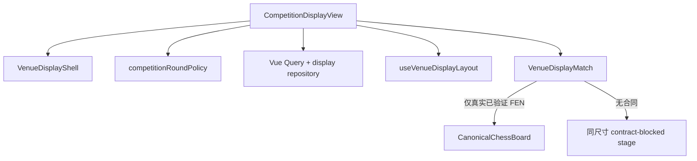

# 开赛了场外大屏页设计规范

## 1. 页面定义

| 字段        | 决定                                                                                   |
| ----------- | -------------------------------------------------------------------------------------- |
| 页面责任    | 以独立、只读、远距离可读的组合，在一个视口内同时展示所选轮次的全部公开对阵             |
| Router path | `/competitions/:hdid/display`                                                          |
| 部署 URL    | `/pgnViewer/competitions/:hdid/display`                                                |
| 当前能力    | 公开赛事、组别、轮次生命周期与对阵元数据；确定性自适应全对阵同屏                       |
| 目标能力    | 在真实合同到位后于同一稳定格子内显示只读实时/最终棋盘与真实生命周期状态                |
| 页面外壳    | 独立 `VenueDisplayShell`；不得导入 `TeachingWorkspace` 或教学右侧面板                  |
| 数据政策    | 仅使用真实确认的公开读取；局面、棋钟、订阅和新鲜度合同未闭合时显示稳定合同阻断棋盘区域 |

- 总入口：[产品 UI 设计索引](../PRODUCT_UI_DESIGN_INDEX.zh-CN.md)
- 视觉：[产品 UI 设计系统](../PRODUCT_UI_DESIGN_SYSTEM.zh-CN.md)
- 布局：[全局布局规范](../PRODUCT_GLOBAL_LAYOUT_SPEC.zh-CN.md)
- 交互：[全局交互规范](../PRODUCT_GLOBAL_INTERACTION_SPEC.zh-CN.md)
- 状态：[全局状态规范](../PRODUCT_GLOBAL_STATE_SPEC.zh-CN.md)
- 响应式：[响应式规范](../PRODUCT_RESPONSIVE_SPEC.zh-CN.md)
- 组件：[组件责任规范](../PRODUCT_COMPONENT_RESPONSIBILITY_SPEC.zh-CN.md)
- 覆盖层：[共用覆盖层规范](../PRODUCT_COMMON_OVERLAYS_AND_DIALOGS_SPEC.zh-CN.md)
- 纠正项：[实施纠正清单](../PRODUCT_IMPLEMENTATION_CORRECTION_BACKLOG.zh-CN.md)

## 2. 入口、轮次解析与出口

### 2.1 入口条件

1. `hdid` 必须是路由中存在的非空赛事标识；页面通过已确认仓储校验，不从格式猜测赛事存在。
2. Page A 负责选择赛事与组别；display route 在没有有效显式轮次时自动解析轮次。
3. 有效显式 display URL `round` 是操作员覆盖，始终优先并保持于 URL；无效值清除后回到自动规则。
4. 自动规则检查规范来源顺序中的最后一个有效轮次：
   - 最后轮 `ongoing`：选择该轮。
   - 最后轮 `upcoming`：选择其前最近的 `completed`；没有则进入稳定无可用已完成轮状态。
   - 最后轮 `completed`：选择该轮。
   - 最后轮 `unknown`：有确认已完成轮时选择最新一轮；否则进入生命周期未知状态，不猜测。
5. 自动解析结果不写入 `round` URL，以保留“自动”与“显式覆盖”的可区分语义；规范组别仍可写回 URL。
6. 绝不因为某轮最新而自动选择 `upcoming`。

### 2.2 出口

- “返回赛事详情”进入 `/competitions/:hdid`，保留仍有效的组别；只在用户显式覆盖轮次时保留该轮次。
- 页面不创建第二工作区，不进入来源专属棋盘工作区，不生成受保护 handoff。
- 浏览器刷新、后退和前进必须恢复相同的显式/自动轮次语义。

## 3. 用户与任务

| 用户                    | 主任务                                                 | 次任务                         |
| ----------------------- | ------------------------------------------------------ | ------------------------------ |
| 赛事组织者 / 大屏操作员 | 选择赛事与组别，让观众同时看清当前应展示轮次的全部对阵 | 显式覆盖轮次、返回赛事详情     |
| 家长 / 普通观众         | 快速识别全部台号、双方、结果/状态与真实棋盘可用性      | 只读浏览，不执行编辑           |
| 教师 / 教练             | 在场地屏幕查看公开赛事全轮上下文                       | 返回详情后进入独立讲解交接流程 |

主任务是“全轮同屏且尽量放大真实棋盘”，不是分页浏览、自动轮换或单盘聚焦。

## 4. 能力分类

| 分类                  | 本页能力                                                                                                                                         |
| --------------------- | ------------------------------------------------------------------------------------------------------------------------------------------------ |
| `CURRENT_IMPLEMENTED` | 匿名公开赛事/组别/轮次/对阵；修订的自动轮次规则；显式 URL 覆盖；稳定来源顺序；`ResizeObserver` 驱动的确定性全对阵同屏；合同阻断棋盘几何          |
| `APPROVED_TARGET`     | 已验证 FEN 到位时复用 `CanonicalChessBoard` 只读显示；存在最后可信真实位置时保留并叠加陈旧/断线标签；真实局部失败保留其他格子                    |
| `CONTRACT_BLOCKED`    | 实时 FEN/走法、完赛最终 FEN、批量订阅、权威棋钟、来源版本/时间、新鲜度阈值、断线/重连真值、匿名实时范围                                          |
| `OPEN_OWNER_DECISION` | `OD-05` 最小/首选棋盘尺寸；`OD-06` 最终边距/间距；`OD-07` 陈旧阈值/棋钟插值；`OD-08` 匿名实时大屏范围                                            |
| `PROHIBITED`          | 分页、轮播、自动换页、聚焦覆盖、隐藏对阵溢出、页面滚动、AI、评价、棋谱编辑、变例、批注、来源写回、伪 FEN、伪棋钟、样例 PGN、默认起始局面成功回退 |

公开对阵组合的匿名性已确认；匿名实时棋盘范围仍由 `OD-08` 决定。`OD-05`、`OD-06` 不因本切片的临时 Token 值而关闭。

## 5. 信息层级与布局

```text
┌ 固定页头：赛事 / 自动或显式轮次状态 / 返回详情               ┐
├ 固定控制行：组别 / 轮次显式覆盖                              ┤
│ ┌ 对阵格 ┐ ┌ 对阵格 ┐ …  所选轮次全部格子同时存在            │
│ │左选手 VS 右选手│  每格相同头部高度和相同正方棋盘尺寸        │
│ │ 真实棋盘或稳定合同阻断舞台 │                               │
│ └────────┘ └────────┘                                        │
└ 固定状态行：全部同屏数量 / 自动规则 / 更新 / 合同边界        ┘
```

层级依次为：赛事与轮次真值、全对阵观看区、最少操作员控制、真实页面状态、离开路径。不得用额外摘要格制造装饰空位。

## 6. 区域与滚动所有权

| 区域               | 内容                                  | 几何                | 滚动所有者 | 所有者                                |
| ------------------ | ------------------------------------- | ------------------- | ---------- | ------------------------------------- |
| `DisplayHeader`    | 产品、赛事、返回详情                  | 固定                | 不滚动     | `VenueDisplayShell.vue`               |
| `OperatorControls` | 组别、显式轮次覆盖                    | 固定、可换行        | 不滚动     | `CompetitionDisplayView.vue`          |
| `DisplayStage`     | 全部对阵的等几何网格                  | 弹性、`min-size: 0` | 不滚动     | `useVenueDisplayLayout.ts` + 页面组合 |
| `VenueMatchTile`   | 三列选手头部、棋盘/阻断舞台、状态覆盖 | 每组内等宽等高      | 不滚动     | 纯 props 的项目展示组件               |
| `DisplayStatusBar` | 数量、选择来源、刷新与合同说明        | 固定                | 不滚动     | 页面组合                              |

`html`、`body`、应用壳和展示舞台均不得滚动。对阵数量增加时由算法缩小等几何格子，不能隐藏或分页。

## 7. 对阵格合同

### 7.1 选手头部

- 上部固定为三列：左方选手信息、居中 `VS` 与台号/结果状态、右方选手信息。
- 姓名使用来源原文；左侧左对齐、右侧右对齐；截断时通过可访问名称和 `title` 保留完整文字。
- 等级分、队伍与其他元数据只在真实 DTO 字段存在时显示；不显示空占位、推导队伍或设备内部标识。
- 状态/结果使用文本，不仅靠颜色；轮空与未知状态保持真实语义。

### 7.2 棋盘舞台

- 舞台始终是与候选算法所得 `boardSize` 相同的正方形；加载、等待、失败、完成和合同阻断都不改变格子几何。
- 只有真实、可由 `chess.js` 验证的权威 FEN 才挂载现有 `CanonicalChessBoard`。
- 进行中使用真实 live FEN；已结束使用真实 final FEN。缺少相应合同时显示同尺寸合同阻断区域，绝不使用标准起始 FEN。
- 规范棋盘显式设置只读、不可走子、不可点击/拖拽、无升变、无批注、无径向菜单、无编辑、无滚轮导航；保留键盘方格阅读、触控阅读、坐标和系统减弱动效。

### 7.3 每台生命周期

| 状态               | 允许的可见内容                                                 |
| ------------------ | -------------------------------------------------------------- |
| `ongoing`          | 来源确认的进行中文案；有真实 live FEN 才显示棋盘，否则合同阻断 |
| `completed`        | 来源确认的结果；有真实 final FEN 才显示棋盘，否则合同阻断      |
| `waiting`          | 未开始真值；没有来源 FEN 时不显示默认起始局面                  |
| `stale`            | 只有来源时间/版本及阈值合同成立时标记；保留最后可信真实 FEN    |
| `disconnected`     | 只有连接合同证实时标记；保留最后可信真实 FEN                   |
| `partial-failure`  | 真实局部失败时只标记受影响格；其他真实格保持原位               |
| `contract-blocked` | 保留完整正方形舞台并说明 live/final FEN 合同未提供             |

当前对阵接口只证明 waiting/ongoing/completed/bye/unknown 元数据，不证明 stale、disconnected 或逐台 partial-failure；页面不得提前宣称这些状态。

## 8. 自动轮次真值表

| 输入                                                | 结果                                   |
| --------------------------------------------------- | -------------------------------------- |
| 有效显式 `round`                                    | 使用显式轮次，标记“显式选择”           |
| 无显式值；最后有效轮 `ongoing`                      | 使用最后轮                             |
| 无显式值；最后有效轮 `upcoming`；前方有 `completed` | 使用前方最近已完成轮                   |
| 无显式值；最后有效轮 `upcoming`；前方无 `completed` | 不请求对阵，显示“没有可用已完成轮次”   |
| 无显式值；最后有效轮 `completed`                    | 使用最后轮                             |
| 无显式值；最后有效轮 `unknown`；存在 `completed`    | 使用最新确认已完成轮                   |
| 无显式值；最后有效轮 `unknown`；不存在 `completed`  | 不请求对阵，显示“轮次生命周期尚未确认” |
| 无轮次                                              | 不请求对阵，显示“当前没有可展示的轮次” |

## 9. 自适应全对阵算法

对 `N > 0`，枚举列数 `c = 1..N`：

```text
r = ceil(N / c)
usableWidth = stageWidth - (c - 1) * gap
usableHeight = stageHeight - (r - 1) * gap
tileWidth = usableWidth / c
tileHeight = usableHeight / r
boardCapacity = max(0, tileHeight - playerHeaderHeight)
boardSize = min(tileWidth, boardCapacity)
emptyCells = c * r - N
aspectDistortion = abs(tileWidth - boardCapacity) / max(tileWidth, boardCapacity, 1)
```

1. 选择 `boardSize` 最大的候选。
2. 在固定浮点容差内同分时，先选择 `emptyCells` 更少者，再选择 `aspectDistortion` 更低者。
3. 仍同分时选择列数更少者，保证确定性。
4. 网格以候选 `c/r` 建立等列、等行；每个棋盘舞台使用同一个 `boardSize`，并在格子中居中。
5. 只在舞台尺寸、对阵数量、头部实测高度或 Token 间距变化时重算；不得按帧重算。
6. 对阵按仓储返回的规范来源顺序渲染；不得按状态、台号或客户端推断重排。

间距、固定头部高度、选手最小文本区与状态覆盖内距使用 `src/styles/tokens.css` 的 venue display Token。它们是 `OD-05/06` 未关闭期间的临时实施值，不是最终设备可读阈值。

## 10. 状态、错误与恢复

- 首次加载在舞台槽显示稳定状态，不替换页头/控制/状态栏。
- retained refresh 保留全部可信格子与几何，只在状态栏显示“正在更新”。
- 查询整体失败且无可信内容时显示可重试错误；真实部分失败保留成功格子，但不得把一次列表请求失败伪装成逐台故障。
- 自动规则无可用轮次时显示第 8 节精确状态，不发起带猜测轮次的对阵请求。
- 切换组别清除显式轮次；显式选择轮次写入 URL；刷新和历史导航不改变语义。

## 11. 键盘、焦点、触控与减弱动效

1. 路由进入后标题接收一次程序性焦点；跳转链接聚焦唯一展示舞台，标题与舞台 ID 不重复。
2. Tab 顺序：跳转链接 → 标题/返回 → 组别 → 轮次 → 真实规范棋盘（仅存在时）→ 状态；合同阻断舞台不伪装为可操作棋盘。
3. 组别/轮次选择遵循原生或项目选择器键盘合同；不注册 `PageUp/PageDown`、轮播、聚焦或全局方向键。
4. 粗指针可操作控件满足项目触控目标；对阵格本身无隐藏 hover 动作。
5. `prefers-reduced-motion: reduce` 下不出现轮播、闪烁、位移或循环状态动效；规范棋盘直接到真实最终状态。

## 12. 响应式与显示档案

| Profile    | 必须结果                                                           |
| ---------- | ------------------------------------------------------------------ |
| 1080p 16:9 | 全部对阵同屏；一盘/少量显著放大；数量增加时按候选结果逐步缩小      |
| 4K 16:9    | 重新测量 CSS 舞台并同样枚举；不按固定设备模板或物理像素猜测列数    |
| 21:9       | 宽度自然使更多列候选可能胜出；棋盘保持正方形，头部和状态区域不删除 |

低宽度浏览器仍保持全部同屏和无 body scroll；最终远距离可读阈值继续由 `OD-05` 的真实设备验收拥有。

## 13. Token、主题与持久化

- 唯一 Token registry 是 `src/styles/tokens.css`；组件样式不得出现 raw governed 视觉值或平行 namespace。
- light/dark 都必须保持姓名、VS、状态、边界、焦点和合同阻断说明可读。
- URL 只拥有组别与有效显式轮次覆盖；自动解析轮次、测量结果、列数、行数、棋盘尺寸、加载/错误状态只在内存。
- 不新增 Dexie、localStorage、Query 持久化、凭据、实时身份或 secret-bearing URL。

## 14. 组件责任



`VenueDisplayMatch` 是无 Store、仓储和持久化依赖的展示组件；页面拥有路由/Query，布局组合式函数只拥有测量与纯候选计算，mapper 拥有 DTO 到领域真值映射。

## 15. COR 与 OD 影响

- 本切片以真实代码和浏览器证据关闭 `COR-004` 的自适应全对阵同屏目标；若任何对阵被分页、隐藏、重排或产生页面滚动则重新打开。
- `COR-005` 仅在修订轮次真值映射与自动规则均有证据时评估；未知生命周期仍必须失败关闭。
- `COR-024` 继续 `OPEN_CONTRACT_BLOCKED`，直至 live/final FEN、时间/版本、连接与匿名范围合同闭合。
- `OD-05`、`OD-06` 保持开放；本切片不批准最终最小/首选棋盘尺寸、最终间距或轮播（轮播在本页被禁止）。

## 16. 窄浏览器验收

1. 使用真实公开赛事覆盖一盘、少量、中等与可找到的最大对阵数量。
2. 对 1080p、4K、21:9 分别记录舞台、行列、格子与棋盘尺寸；确认全部格子同时位于视口内、顺序稳定、无页面滚动和隐藏溢出。
3. 验证左选手 / `VS` / 右选手三列、真实元数据、文本截断和所有棋盘舞台等几何。
4. 验证最后轮 ongoing、completed、latest-upcoming 回退、无前置 completed、unknown、有效显式覆盖的真值表。
5. 验证缺少 live/final FEN 时只显示合同阻断正方形，不出现起始棋盘、棋钟、PGN、AI、评价、编辑或写回。
6. 验证组别/轮次交互、刷新、后退/前进、标题焦点与跳转链接。
7. 验证 light/dark、系统减弱动效、非空 DOM、无 Vite error overlay、无中断控制台错误。
8. 不创建自动化测试、脚本、截图、fixture、mock 或浏览器工件。
