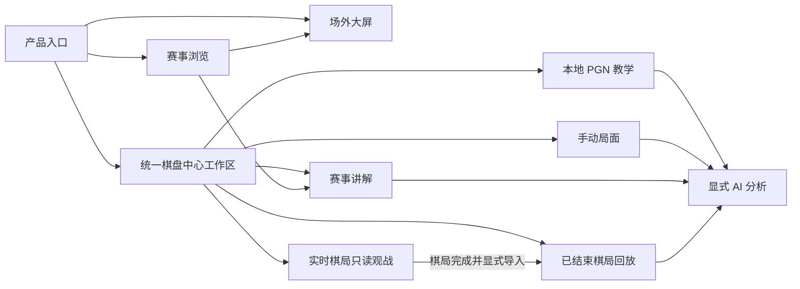
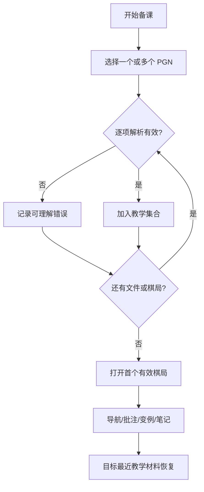
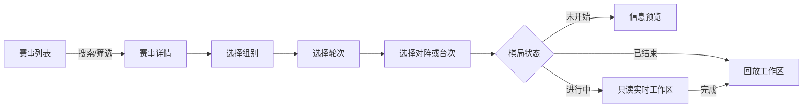
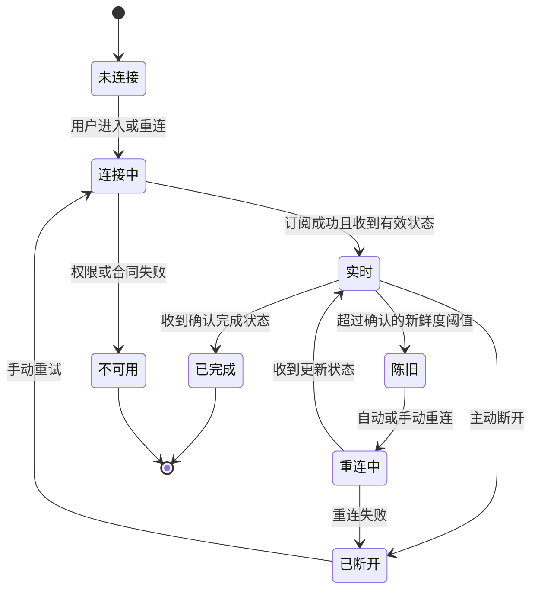
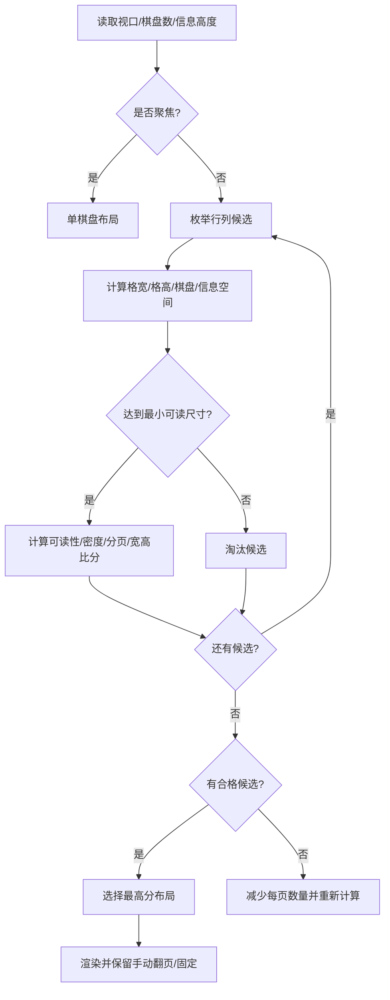
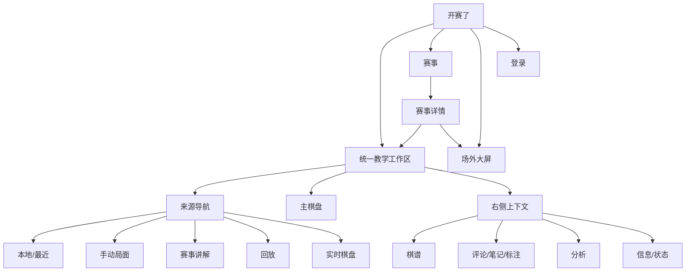
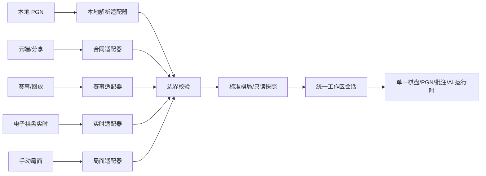
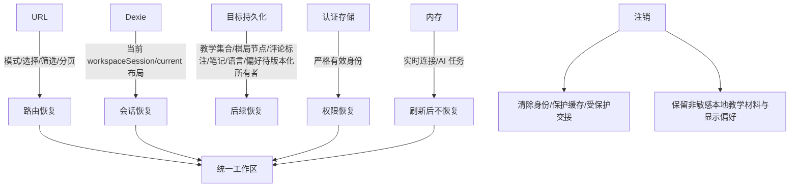
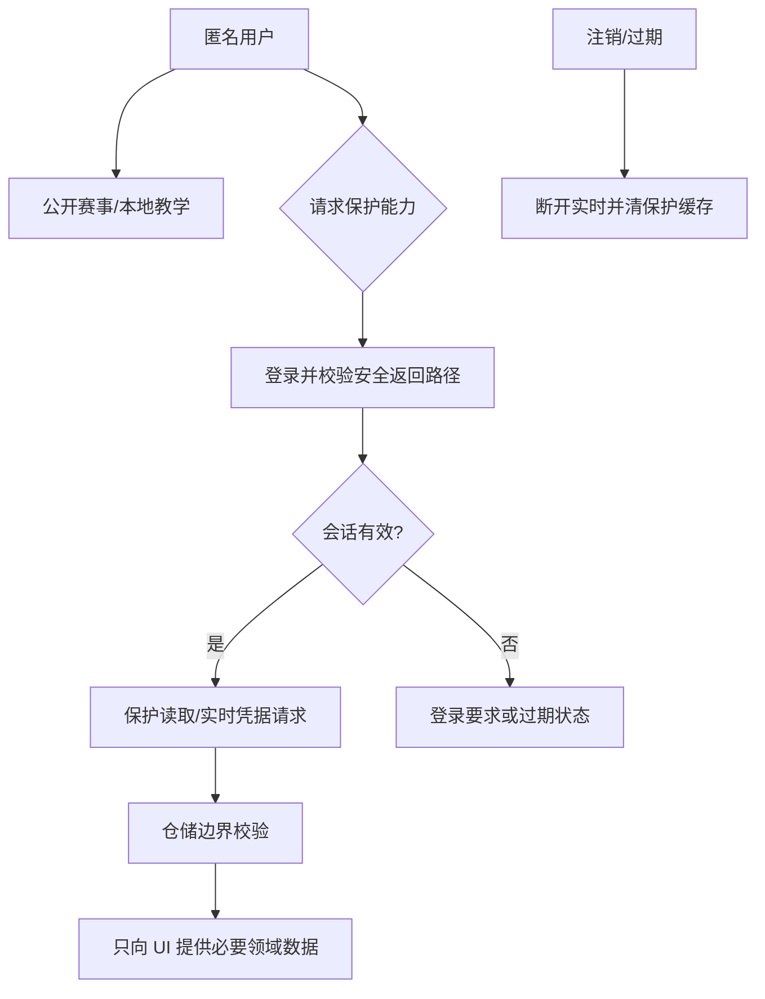

> **非权威性阅读镜像提示**
> 本文档是原始文件 `docs/product/PRODUCT_DESIGN_BLUEPRINT.zh-CN.md` 的中文阅读镜像，仅供人工浏览。产品、设计、架构与实现权威仍保留在原始源路径，请勿将本镜像作为实施或自动化编辑的依据。

# 开赛了融合产品全量需求与中文设计蓝图

## 1. 文档信息

| 项目       | 内容                                                                                              |
| ---------- | ------------------------------------------------------------------------------------------------- |
| 名称       | 开赛了融合产品全量需求与中文设计蓝图                                                              |
| 状态       | `COMPLETE_PRODUCT_DESIGN_FINAL_READY_FOR_PAGE_DESIGN`                                             |
| 版本       | 1.2.1                                                                                             |
| 日期       | 2026-07-14                                                                                        |
| 页面门禁   | `PAGE_BY_PAGE_UI_DESIGN_READY_WITH_TRACKED_OWNER_DECISIONS`                                       |
| 适用项目   | `chess-pgnviewer-vue`                                                                             |
| 目标读者   | 产品、设计、研发、教学、赛事运营、安全与验收人员                                                  |
| 权威范围   | 产品定位、用户角色、产品模式、用户旅程、信息架构、产品级功能需求、页面职责、优先级与验收概念      |
| 非目标范围 | API 字段与端点、认证协议、棋盘与 PGN 内核、AI Worker 实现、持久化安全细节、视觉逐页稿和运行时代码 |

本文是产品设计主权威，但不覆盖已确认的 API、认证、持久化、棋盘、PGN、标注、AI Worker、Token 与架构边界。证据状态统一使用：**当前已实现**、**确认需求**、**合同阻断**、**待所有者确认**、**拒绝**。

产品权威层级只有一套：

1. 本文拥有产品定位、用户、产品模式、旅程、产品级需求、信息架构、优先级、页面职责与验收概念。
2. [`PRODUCT_DEFINITION.md`](../../product/PRODUCT_DEFINITION.md) 只拥有精简产品身份、顶层边界、主要受众、规范表面及本文引用。
3. [`WORKSPACE_MODES.md`](../../product/WORKSPACE_MODES.md) 只拥有与本文和实际运行时一致的技术模式/来源模型、转换、适配器选择和持久化行为。
4. [`OWNER_PRODUCT_REQUIREMENT_BASELINE.zh-CN.md`](产品负责人需求基线.md) 是所有者原始需求的稳定来源，不取代本文。

## 2. 执行摘要

产品以教师的棋盘讲解为中心，将本地 PGN、手动局面、赛事讲解、已结束棋局回放、电子棋盘实时观战和场外大屏统一到一个 Vue 工作区。左侧回答“内容从哪里来”，中央始终保留最大、稳定的棋盘，右侧承载走法、批注、教学笔记、分析、棋局信息与实时状态。来源变化通过类型化适配器进入同一棋局会话，不产生第二套棋盘、PGN、批注或 AI 运行时。

当前目标已具备本地教学主链、棋盘与 PGN 操作、批注、AI 分析、赛事公开读取、赛事展示和登录身份。受保护回放、云端棋谱、分享读取、电子棋盘历史与最新状态、实时凭据、MQTT 订阅和可靠时钟仍受合同阻断。本文定义这些能力的产品位置与失败状态，不宣称其已可用。

## 3. 产品愿景与定位

开赛了是面向国际象棋教学与赛事讲解的单一棋盘中心工作台。教师可以在同一套操作习惯中准备棋谱、课堂讲解、创建变例、标注重点、按需分析，并在赛事场景中从组别、轮次和台次切换到只读实时棋局；赛事运营人员可以在独立大屏表面组织多台棋盘的远距离观看。

产品价值按顺序为：讲解连续性、棋盘可读性、来源真实性、状态可恢复性、实时状态可信度。它不是赛事后台、在线对弈大厅、营销站、通用云盘、3D 棋盘或多框架容器。

## 4. 产品边界与非目标

产品内：本地多 PGN 教学集合、棋局与局面导航、变例与节点批注、手动局面、显式 AI 分析、赛事选择和讲解、只读实时棋局、完成后的回放/导入分析、场外大屏、受控用户设置与恢复。

明确非目标：赛事写入和管理、用户或组织后台、MQTT 发布、浏览器保存上游凭据或实时秘密、通用代理、自动开启 AI、进行中实时棋局编辑、多个来源各自复制工作区、React/小程序运行时迁移、虚假成功数据、技术协议术语直接暴露给普通用户。唯一批准的浏览器账户会话例外见第 28 节。

## 5. 用户角色与权限

| 角色                  | 核心目标                             | 默认权限                                             |
| --------------------- | ------------------------------------ | ---------------------------------------------------- |
| 教师/教练             | 备课、讲棋、创建变例与批注、按需分析 | 本地内容可编辑；受保护来源需登录；进行中实时棋局只读 |
| 俱乐部/机构教学人员   | 复用教学集合、查看赛事、组织课堂     | 与教师相同，组织范围能力取决于已确认合同             |
| 赛事组织者/大屏操作员 | 选择赛事、组别、轮次与台次，控制大屏 | 展示控制可操作；棋局源只读；保护资源需登录           |
| 学员                  | 跟随讲解、查看棋盘与走法             | 课堂表面只读或由教师控制                             |
| 家长/普通观众         | 查看公开赛事、比分与大屏             | 公开读取匿名；受保护棋局不可绕过登录                 |
| 内部支持人员          | 通过非产品流程协助排查问题           | 无产品模式、用户界面诊断、管理、写入或技术控制权限   |

权限原则：能力来自真实身份与已确认合同，UI 不根据旧项目存在过某按钮就推定权限。

## 6. 核心用户任务

1. 教师导入一个或多个本地 PGN，形成临时教学集合，并快速找到要讲的棋局。
2. 在稳定棋盘几何中切换棋局和节点，添加箭头、格子、评论、NAG 与变例，必要时撤销。
3. 显式开启 AI，查看进度、候选线与评价，可取消，切换上下文后拒绝过期结果。
4. 选择赛事、组别、轮次和对阵，将单局交接到统一讲解工作区。
5. 对进行中棋局保持只读，明确显示连接、新鲜度和完成状态；完成后才能回放或导入分析。
6. 大屏操作员按可读性而非“塞满屏幕”选择多棋盘布局，支持分页、聚焦和故障状态。

## 7. 产品模式总览



三个一级产品模式为：教师本地 PGN 教学、教师赛事讲解、离线电子棋盘场外大屏。手动局面、回放与 AI 是统一工作区中的能力状态，不建立重复外壳。

## 8. 统一教学工作区

固定结构为左侧来源导航、中央主棋盘、右侧上下文工作区。顶栏只保留产品级入口、当前来源摘要、模式与账户；棋盘附近持续保留上一步、下一步、翻转、编辑入口和当前状态。外层几何在来源、组别、轮次、棋局、主题和登录状态变化时保持稳定，加载与错误在所属模块内部呈现，页面主体不滚动。

工作区会话包含：来源上下文、教学集合、当前棋局、当前节点、视角、面板状态、可恢复批注、非持久实时连接和可取消 AI 任务。来源适配器只能提供标准化棋局或只读快照，不能拥有产品状态。

## 9. 左侧来源导航设计

左侧以任务而不是技术协议命名：本地教学材料、最近材料、手动局面、赛事与轮次、已结束棋局、实时棋盘。选中赛事讲解后，左侧按“赛事 → 组别 → 轮次 → 对阵/台次”展开；本地模式显示教学集合中的棋局缩略图、标题、棋手、搜索与分页。

本地集合支持批量导入、搜索、选择、重命名、移除、拖拽排序和最近打开。删除、覆盖未保存内容、退出编辑等高损失动作需确认；排序、选择、折叠不弹确认。云端和硬件节点在合同未就绪时显示“暂不可用”及原因，不显示空白成功状态。

## 10. 中央棋盘区域设计

中央棋盘是视觉焦点，保持正方形并取容器宽高最小值。支持合法走子、节点导航、视角翻转、最后一步与选中提示、将军状态、箭头和格子标注。手动局面进入显式编辑态，显示棋子库、清空/初始局面、行棋方等必要控制；“应用”产生新的教学来源，“取消”恢复进入前局面。

实时进行中状态下，棋盘只接受导航与视角类操作，不允许改走法、改 PGN、写变例或启动 AI。连接状态不应遮蔽已有可信棋盘；重连时保留最近成功快照并标记其时间与陈旧状态。

## 11. 右侧工作区设计

右侧采用单一面板体系，节点按任务分组：棋谱、评论与 NAG、教学笔记、标注摘要、AI 分析、棋局信息、实时状态。默认打开棋谱；实时模式默认打开状态；分析启动后打开分析但不覆盖用户可返回的棋谱位置。

PGN 节点评论和 PGN 节点标注随节点保存；候选变例与局面评价也只属于对应节点。棋局级教学笔记随本地教学棋局记录保存，并与标题、双方、结果、标签、说明区分。课次/会话级笔记是否跨棋局保留属于 `OD-02`，当前不创建该实体。受保护来源元数据保持只读；显式导入产生本地副本，任何笔记或标注都不得在没有独立确认写合同的情况下写回远端来源。

## 12. 本地 PGN 教学模式

教师从“导入本地 PGN”开始，可一次选择多个文件；每个有效棋局进入当前教学集合，保持文件内顺序并分配稳定会话标识。多棋局文件按解析顺序展开。无效条目逐项报告文件名、失败位置或可理解原因，其他有效棋局继续导入；不以空棋局代替失败。

FEN 起始棋局以标准初始局面标签进入同一 PGN 模型。切换棋局前先保存当前内存会话中的节点、批注、视角和面板位置；同一会话返回时恢复。最近材料是确认目标，仅指未来版本化本机教学记录中的会话元数据，不扫描任意文件系统。



## 13. 云端棋谱模式

云端棋谱是确认的产品位置但当前为合同阻断。未来入口复用左侧来源导航，提供目录/搜索/文件选择与只读预览，并通过标准化 PGN 适配器进入同一工作区。当前只保留合同就绪后的只读选择与导入位置；云端保存、覆盖、另存和写入均未批准。组织题库和个人棋谱范围取决于明确读取合同与权限，任何写入必须另行确认；当前产品不采用旧项目的云盘协议、兼容常量或浏览器凭据做法。

未登录显示登录要求；已登录但合同未就绪显示“当前版本暂不支持”；请求失败保留已有本地内容并提供重试。云端来源不得变成第二套文件管理产品。

## 14. 手动局面教学模式

教师可从空棋盘、标准初始局面或当前局面进入编辑。编辑态与合法走子态有清晰外观和文案区分；应用前校验王、行棋方和必要的 FEN 合法性。应用后创建新的临时教学棋局，不修改原来源；取消完全恢复进入前状态。是否自动保存为最近材料按统一会话规则处理。

## 15. AI 分析模式

AI 默认关闭，因为它消耗 CPU、电量并可能干扰课堂节奏。教师从右侧“分析”节点显式开启当前局面或整局分析；首次开启说明资源影响。活跃状态显示分析范围、已完成/总局面、百分比、当前局面和取消操作。默认设置属于设备级用户偏好，单次会话允许临时覆盖；具体深度、时间与并发默认值待性能验收，不沿用旧项目数值。

切换走法、棋局或来源时，任务可继续清理但结果必须通过任务令牌和上下文标识校验；过期结果不得写入新上下文。离开路由、关闭会话或注销时取消任务。候选线显示首步、评价、主变化和深度/完成状态，以明确操作将候选线加入当前节点变例。进行中实时棋局严禁 AI；完成后显式导入回放/分析才可使用。

## 16. 赛事选择与讲解模式

赛事选择保留独立浏览表面，支持真实公开赛事列表的搜索、类型/状态/日期筛选、分页与真实加载/空/错误状态。选择赛事后进入详情；“进入讲解”将赛事上下文交接给统一工作区，而不是打开第二套棋盘页。



认证过期时停止保护数据请求和实时订阅，保留非敏感本地教学会话，清除受保护缓存与交接上下文，显示登录恢复入口。返回登录后仅在上下文仍有效时恢复。

## 17. 赛事组别、轮次和对阵模型

组别使用选择器和可扫描列表；轮次按来源确认的顺序展示，标记当前、进行中、已结束和未开始。明确且有效的 URL 轮次选择始终具有最高优先级。

教师赛事讲解默认展开最新已完成轮次；没有已完成轮次时使用当前进行中轮次；否则使用最近的待开始轮次或首个有效轮次。实时观战和场外大屏默认使用当前进行中轮次；没有进行中轮次时使用最新已完成轮次；否则使用首个有效轮次。两类场景不得共用一个通用默认规则。

切换组别时保留赛事级筛选，清除不再有效的轮次和台次；切换轮次时保留组别和对阵搜索。当前目标运行时仅实现来源当前轮次/首项回退，后续页面设计与实现必须补齐上述所有者确认规则。

团体对阵聚合行显示队伍与总比分，展开后才显示单台；个人赛直接以台次行呈现。两者不可用同一种层级误导用户。具体 DTO 映射只由已确认适配器决定。

## 18. 已结束棋局回放模式

已结束棋局可以逐步回放、翻转、查看信息，并由用户明确“导入到分析”后复制为可编辑教学会话。来源回放保持只读，不直接写回赛事记录。受保护回放合同未就绪时，该入口保留为合同阻断；不得以赛事对阵元数据或虚构 PGN 冒充回放。

## 19. 进行中棋局与实时状态模型

状态集合为：未连接、连接中、实时、陈旧、重连中、已断开、已完成、不可用。每次棋盘快照和时钟状态必须有来源确认的版本或时间依据后才能合并；棋盘与时钟异步到达时分别显示各自新鲜度，不根据本地推测覆盖服务端状态。陈旧阈值和时钟插值规则均待合同及所有者确认。



## 20. 电子棋盘赛事模式

电子棋盘模式是赛事讲解的实时来源类型：左侧按赛事、组别、轮次、棋盘列出设备关联台次；中央显示只读棋盘；右侧显示棋手、结果、连接、新鲜度、最近一步和经确认的时钟。历史、最新快照、实时凭据、订阅和时钟当前均为合同阻断，因此当前权威只定义产品状态，不承诺连通。

设备标识只用于适配器内部和必要的操作员诊断；普通观众看到“第 N 台”和棋手，不看到二维码、序列号、主题或内部错误字段。

## 21. 场外大屏观战模式

大屏是独立、只读、远距离观看表面，复用统一棋盘组件和 Token，不复用教学右侧面板。操作员选择赛事、组别、轮次和棋盘集合；明确有效的 URL 轮次优先，否则选择当前进行中轮次、再选择最新已完成轮次、最后选择首个有效轮次。棋盘排序默认优先进行中，其次已完成、即将开始和异常棋盘。布局以可读性优先，空间不足时分页，不无限缩小棋盘。

每格至少保留台号、双方姓名、结果/状态；时钟只有在来源合同确认后显示。断线棋盘保留最后可信局面并标记离线；完成棋局短暂保留并按排序规则移到已完成区，除非被固定。

## 22. 智能大屏布局算法

推荐默认策略：**可读性优先的自适应分页网格，并提供单局固定聚焦**。对候选行列 `(r,c)`：

```text
availableWidth  = viewportWidth - 2*safeMargin - (c-1)*cellGap
availableHeight = viewportHeight - globalHeaderHeight - 2*safeMargin - (r-1)*cellGap
cellWidth       = availableWidth / c
cellHeight      = availableHeight / r
boardSize       = min(cellWidth, cellHeight - playerHeaderHeight - clockStatusHeight)
infoSpace       = cellHeight - boardSize
unusedCells     = r*c - boardsOnPage
pageCount       = ceil(boardCount / (r*c))
```

所有分数和惩罚都必须确定性归一化到闭区间 `[0,1]`。在评分前先淘汰 `boardSize < minimumBoardSize` 的候选。对有效候选：

- `readabilityScore = clamp((boardSize-minimumBoardSize)/(preferredBoardSize-minimumBoardSize),0,1)`；低于最小尺寸为 0，达到或超过首选尺寸为 1。
- `aspectFitScore` 以棋盘面积占扣除必需信息区后的格子可用面积比例计算，并 `clamp` 到 `[0,1]`；它衡量未利用格子几何/棋盘面积利用率。
- `densityPenalty` 同时归一化空格比例与信息区不足比例；两者取等权平均并 `clamp` 到 `[0,1]`。
- `pageCountPenalty` 在当前有效候选集合的最少页数与最多页数之间归一化；全部候选页数相同时为 0。

首选分数保持 `0.55*readability + 0.20*aspectFit - 0.15*densityPenalty - 0.10*pageCountPenalty`。若全部候选在评分前被淘汰，则减少每页棋盘数并重新枚举。

同分时依次选择：1）更大的最小棋盘尺寸；2）更少页数；3）更少空格；4）更大的信息区；5）此前全部相同时更少行数。

初始建议（全部为 `OWNER_CONFIRMATION_REQUIRED`）：最小棋盘 280 CSS px、首选 360 CSS px、安全边距 24 px、格间距 16 px、普通页自动停留 15 秒、异常或固定页不自动跳过。它们是首轮真实屏幕验收起点，不是已确认阈值。

| 棋盘数  | 推荐初始行为                                                                                         |
| ------- | ---------------------------------------------------------------------------------------------------- |
| 1       | 单棋盘居中，信息置于棋盘上下，不拉伸                                                                 |
| 2       | 1×2；窄屏可 2×1                                                                                      |
| 3       | 宽屏 1×3；否则可评估 2×2，并将一格明确定义为赛事摘要区；若该摘要格使棋盘低于最小可读尺寸则拒绝该候选 |
| 4       | 2×2                                                                                                  |
| 5–8     | 在 2×3、2×4、3×2 间评分，必要时两页                                                                  |
| 9–16    | 在 3×3、3×4、4×4 间评分；达不到最小尺寸即分页                                                        |
| 16 以上 | 分页并按状态/固定优先级分组，禁止继续缩小                                                            |

16:9 使用平衡网格；21:9 优先增加列；4K 仍按 CSS 尺寸与观看距离验收，不因像素多盲目增加棋盘；1080p 以 2–3 行为主；更低分辨率提前分页。固定棋局进入单局聚焦，退出后恢复原页、排序与自动轮播计时。



## 23. 信息架构



一级导航不增加“云盘后台”“设备后台”“分析中心”等平行产品。内部诊断不属于产品模式、正常工作区状态或基于权限展示的用户表面。

## 24. 页面与路由地图

路由使用 `import.meta.env.BASE_URL`。下表明确区分 Vue Router 的 `routerPath` 与部署在 `/pgnViewer/` 下的浏览器 URL：

| 页面责任       | routerPath                    | deployedUrl                             | 当前/目标                                                  |
| -------------- | ----------------------------- | --------------------------------------- | ---------------------------------------------------------- |
| 统一工作区     | `/`                           | `/pgnViewer/`                           | 当前统一工作区；承载本地、讲解、实时和回放交接             |
| 赛事列表       | `/competitions`               | `/pgnViewer/competitions`               | 当前匿名公开赛事列表                                       |
| 赛事详情       | `/competitions/:hdid`         | `/pgnViewer/competitions/:hdid`         | 当前匿名公开详情、组别、轮次和对阵；可产生类型化工作区交接 |
| 赛事展示       | `/competitions/:hdid/display` | `/pgnViewer/competitions/:hdid/display` | 当前公开对阵展示；目标演进为合同就绪后的多棋盘大屏         |
| 实时兼容入口   | `/competitions/:hdid/live`    | `/pgnViewer/competitions/:hdid/live`    | 当前实时壳；合同阻断数据源不得伪装可用                     |
| 受保护回放入口 | `/match/:key`                 | `/pgnViewer/match/:key`                 | 合同阻断                                                   |
| 分享入口       | `/share/:uuid`                | `/pgnViewer/share/:uuid`                | 合同阻断                                                   |
| 云端棋谱入口   | `/cloud/:fileid`              | `/pgnViewer/cloud/:fileid`              | 合同阻断                                                   |
| 登录           | `/login`                      | `/pgnViewer/login`                      | 当前登录与安全返回                                         |

赛事列表、详情、登录和大屏保持独立路由；讲解、回放和单局实时通过交接上下文流入统一工作区。URL 只保存可分享且非敏感的模式、赛事/组别/轮次/棋盘选择、搜索与分页；不保存凭据、受保护 DTO 或草稿正文。

## 25. 统一来源适配器模型



适配器负责 DTO 映射、Zod 校验、来源权限和错误翻译；不向 UI 暴露 Axios、端点、MQTT 主题或内部字段。只读来源必须显式标记，导入分析产生副本而非改变来源。

## 26. 状态所有权

| 状态                                                             | 所有者                                                                                             |
| ---------------------------------------------------------------- | -------------------------------------------------------------------------------------------------- |
| 当前棋局、节点、批注、视角、分析任务                             | Pinia/领域会话                                                                                     |
| 赛事公开与保护读取结果                                           | TanStack Vue Query/仓储适配器                                                                      |
| 当前可恢复工作区布局                                             | `src/persistence/workspace/workspaceLayoutPersistence.ts` 的 Dexie `workspaceSession/current` 记录 |
| 目标教学集合、当前棋局/节点、评论/标注、棋局笔记、语言与更广偏好 | 确认需求；须等版本化所有者、Schema、恢复/重置、安全分类与保留规则闭合后才成为当前持久化            |
| 路由模式、可分享选择、搜索与分页                                 | URL                                                                                                |
| 实时连接、订阅、最近消息时间、运行中 AI                          | 仅内存                                                                                             |
| 身份会话                                                         | `src/persistence/auth/authPersistence.ts` 的唯一 `kaisaile.auth.v1` 记录；严格过期与注销清理       |

同一状态只允许一个权威。视图组件接收类型化 props 并发出事件，不直接读取仓储或持久层。

## 27. 持久化与恢复



当前刷新只恢复经验证的主题启动偏好、工作区布局、严格有效身份、非敏感路由/交接上下文，并让 Query 从空内存缓存重新读取。教学集合、当前棋局与节点、节点评论/标注、本地棋局级教学笔记、语言和更广偏好仍是确认目标，须等版本化持久化所有者存在后才恢复；不恢复实时连接、运行中 AI、一次性错误与临时凭据。课次/会话级笔记仍由 `OD-02` 决定。来源不存在或数据校验失败时回到真实来源选择/不可用状态并说明恢复失败，不制造空棋局成功，也不覆盖仍可用的本地材料。受保护来源数据不持久化为可编辑记录；显式导入建立独立本地副本。

## 28. 登录、权限与安全



匿名能力：本地 PGN、手动局面，以及赛事列表、赛事详情、组别、轮次、对阵和当前公开对阵展示组合。公开赛事元数据不因后续单局内容受保护而变成登录能力。

受保护或合同依赖能力：已结束单局回放、云端棋谱、受保护分享内容、电子棋盘历史/最新快照、实时凭据/订阅和权威棋钟。

浏览器只允许一个账户会话记录：键 `kaisaile.auth.v1`，所有者 `src/persistence/auth/authPersistence.ts`，存储于 `localStorage`，严格 Zod 版本 1，最长 43,200 秒，数据字段仅 `token`、`uid`、`accountLabel`、`expiresAt`。密码/摘要、任意或重复认证记录、URL/Router state/Dexie/持久化 Query/工作区交接/PGN/标注/AI 中的认证值、兼容签名常量副本、签名秘密、共享上游凭据、MQTT 凭据、含秘密 URL 和完整敏感响应均禁止。本文不引入额外的服务器认证中介或服务器所有的浏览器会话模型；细分禁止项以《产品定义》和现行认证架构权威为准。

## 29. 加载、空状态、错误和恢复

每个模块必须分别处理：首次加载、保留旧数据的刷新、真实空结果、可重试错误、登录要求、无权限、合同未就绪、实时不可用和恢复失败。加载不改变外壳几何；刷新失败时保留上次成功数据并标记陈旧。错误文案回答“发生了什么、是否影响已有内容、下一步是什么”，不显示堆栈、端点或协议。

## 30. 全局交互规则

选择、筛选、翻页即时执行；删除棋局、清空批注、覆盖内容、退出有未保存编辑时确认。输入和拖拽必须有键盘等价操作。上下文切换保持已确认的本地工作；跨来源交接前先落地当前会话。技术限制以产品语言呈现，例如“实时棋盘暂不可用”，而非“MQTT auth 失败”。

## 31. 键盘、鼠标、触控和滚轮

方向键或既有快捷键导航走法；焦点在输入框时不劫持按键。棋盘标注支持鼠标与触控长按/拖拽，右键行为有触控替代。面板拖柄可聚焦并用方向键调整；拖拽排序提供上移/下移操作。滚轮只作用于当前模块，棋盘缩放不得意外触发页面滚动。所有快捷键可发现且不与浏览器核心操作冲突。

## 32. 动效和减弱动效

动效只用于解释状态变化：棋子移动、面板展开、来源交接和大屏换页。遵循项目 GSAP 权威，组件卸载时清理。`prefers-reduced-motion` 下取消弹性、路径和自动平移动效，棋子与页面直接切换；大屏自动轮播可暂停并提供手动翻页。实时状态不可仅靠闪烁表达。

## 33. 响应式策略

桌面优先保持三栏；中等宽度将左/右面板变为可折叠抽屉但棋盘仍完整可见；小屏采用棋盘优先的单列上下文切换，不允许 body 滚动。赛事选择器与大屏控制在窄屏转为分层工具栏。多棋盘策略由第 22 节算法决定，不复用教学断点硬编码布局。

## 34. 无障碍策略

所有交互有可访问名称、可见焦点、键盘顺序和触控尺寸；棋盘提供当前局面、最后一步、轮到谁和选中格的文本信息。状态颜色同时配合文字/图形；对比度遵循项目规范；弹窗正确管理焦点并可用 Escape 关闭（破坏性未保存场景先确认）。实时更新使用克制的 live region，不逐步淹没读屏。

## 35. 国际化与用户文案

默认简体中文，产品名统一“开赛了”。用户文案描述任务、状态和恢复动作，不暴露 DTO、API、MQTT、Axios 或内部错误码。棋手名、赛事名和 PGN 标签按来源原文显示；日期、时间、数字和棋谱术语走统一格式化。文案键由产品语义命名，禁止组件内复制同义状态。

## 36. 性能与资源管理

棋盘切换不重建应用外壳；长棋谱和大列表按证据决定虚拟化，不预先引入重依赖。AI Worker 显式创建、可取消、离开清理并拒绝陈旧结果。实时仅订阅当前所需棋盘，大屏批量订阅策略须在合同和容量确认后实现。图片与头像保留稳定几何，失败使用本地回退。大屏布局计算在视口、棋盘集合或聚焦变化时运行，不按每帧重算。

## 37. 旧项目补充能力清单

| 能力                                          | 结论                                                                                                 |
| --------------------------------------------- | ---------------------------------------------------------------------------------------------------- |
| 多 PGN 批量导入、缩略图、搜索、分页、拖拽排序 | 接受，纳入本地教学集合                                                                               |
| 系统题库/个人棋谱/电子棋盘批量导入            | 保留候选位置；API 合同未确认时阻断                                                                   |
| 棋谱元信息、标签、说明编辑                    | 接受为棋局级信息                                                                                     |
| 箭头、格子、多颜色、撤销和清除                | 接受，复用当前单一批注运行时                                                                         |
| 单步与整局 AI、进度、候选线、评价图表         | 接受产品概念；资源默认值重定，旧缓存做法拒绝                                                         |
| 面板显示偏好、棋盘主题、音效                  | 接受为用户设置候选；当前仅 `themeMode` 与工作区布局有持久化所有者，其余须走 Token 与版本化持久化权威 |
| 保存棋盘图片、教学报告、打印                  | `COULD`；范围和隐私待所有者确认                                                                      |
| 赛事组别/轮次/台次导航与大屏视图              | 接受，统一到赛事讲解与独立只读大屏                                                                   |

## 38. 旧项目拒绝能力清单

拒绝：第二套棋盘/PGN/AI 运行时、来源专属工作区、React/Zustand/小程序架构、旧 Element/Naive UI 作为产品权威、浏览器直存上游凭据、旧通用代理和写管理接口、MQTT 发布、进行中直播编辑或分析、固定旧 API/字段/主题、localStorage 作为结构化业务库、随机分享标识与硬编码外部 URL、所谓“作弊判定”产品结论、技术调试面板面向普通用户、3D 或装饰性仪表盘。

## 39. 合同阻断能力清单

| 能力                    | 阻断条件                 | 解锁证据                           |
| ----------------------- | ------------------------ | ---------------------------------- |
| 受保护棋局回放          | 无确认读取合同           | API/认证权威、DTO 校验、真实失败态 |
| 云端棋谱与个人/组织棋库 | 读写与权限合同未确认     | 最小读取合同；写入另行批准         |
| 分享读取                | 分享标识与权限合同未确认 | 明确生命周期和匿名/登录规则        |
| 电子棋盘历史与最新快照  | 来源接口未闭合           | API 字段、错误、权限和新鲜度确认   |
| 实时凭据和 MQTT 订阅    | 凭据获取与订阅合同未闭合 | 服务端签发、主题映射、注销清理     |
| 棋钟                    | 时钟权威与同步规则未确认 | 版本/时间戳、暂停/恢复、漂移规则   |

## 40. 功能优先级

**MUST**：统一工作区、本地多 PGN、棋盘/走法/批注/变例、手动局面、显式可取消 AI、赛事选择/组别/轮次/对阵、真实状态、URL/Dexie/内存边界、登录安全、无障碍与响应式、大屏可读性算法。

**SHOULD**：最近教学材料、棋局信息与标签、教学笔记、候选线导入、实时新鲜度、完成后导入分析、固定聚焦与大屏分页、用户主题/布局偏好。

**COULD**：棋盘图片、打印/教学报告、音效、课次级笔记、组织棋库、自动大屏轮播。

**WON’T FOR NOW**：赛事写管理、在线对弈、MQTT 发布、3D、第二工作区、自动 AI、进行中直播分析、未确认云端写入、旧架构迁移。

## 41. 页面级设计交付规则

当前工作从完整产品蓝图进入逐页设计，不再使用基础阶段、迁移切片或旧产品开发门禁。每一页单独完成设计与验收定义，但必须共享同一信息架构、组件所有权、Token、真实数据边界和安全规则。

逐页设计至少交付：页面责任与用户任务、当前/目标/合同阻断能力、信息层级、全部数据状态、桌面/平板/移动端/场外屏适配、滚动与焦点所有权、键盘和触控路径、减弱动效、持久化分类、真实 API 依赖、开放 OD 映射和窄浏览器验收路径。设计不得把概念角色写成已存在组件，也不得把推荐初值写成所有者已确认常量。

当前门禁是 `PAGE_BY_PAGE_UI_DESIGN_READY_WITH_TRACKED_OWNER_DECISIONS`。它允许逐页设计，不代表任何合同阻断能力或 `OD-01` 至 `OD-11` 已关闭。

## 42. 仍开放的所有者产品决策

以下十一项状态全部为 `OPEN`，没有任何一项因本蓝图完成而被接受、默认关闭或转化为运行时事实。

| ID    | 状态   | 决策                        | 推荐初始值                                   |
| ----- | ------ | --------------------------- | -------------------------------------------- |
| OD-01 | `OPEN` | 教学集合是否需要文件夹/命名 | 先用单层命名集合，真实复用需求出现再加文件夹 |
| OD-02 | `OPEN` | 课次级笔记是否跨棋局        | 先仅棋局级和节点级，避免隐式丢失             |
| OD-03 | `OPEN` | AI 设置作用域               | 设备级默认 + 会话临时覆盖                    |
| OD-04 | `OPEN` | AI 首次资源提示与默认资源   | 首次提示；具体深度/时间/并发经性能验收       |
| OD-05 | `OPEN` | 大屏最小/首选棋盘尺寸       | 280/360 CSS px，待真实观看距离确认           |
| OD-06 | `OPEN` | 大屏边距/间距/轮播时间      | 24/16 px、15 秒，全部待设备验证              |
| OD-07 | `OPEN` | 陈旧阈值与时钟插值          | 等待合同，禁止客户端自定                     |
| OD-08 | `OPEN` | 匿名大屏范围                | 仅明确公开赛事；其余登录                     |
| OD-09 | `OPEN` | 手机端是否允许完整编辑      | 先允许导航和轻批注，完整局面编辑待可用性验证 |
| OD-10 | `OPEN` | 导出/打印范围               | 先棋盘图片与简洁教学讲义，不输出敏感来源字段 |
| OD-11 | `OPEN` | 音效默认状态                | 默认关闭，用户显式开启                       |

## 43. 产品验收定义

全局验收：单一工作区和运行时；棋盘始终主导；外壳无 body 滚动；来源切换不丢已确认本地工作；真实加载/空/错误/权限/阻断状态；URL、Dexie、内存与认证边界正确；除唯一批准的 `kaisaile.auth.v1` 会话记录外，不持久化认证数据、实时秘密或敏感响应；无虚假数据或未确认合同；键盘、触控、减弱动效和对比度通过。

问题 1–85 的明确答案：

1. 从最近材料、导入 PGN、手动局面或赛事进入统一工作区。
2. 由本地选择器读取并逐项解析，不上传。
3. 可以，一次选择多个文件且多棋局按顺序展开。
4. 组织为当前教学集合，单层命名方案待 OD-01。
5. 支持搜索、稳定排序、重命名、移除、拖拽及键盘重排。
6. 本机“最近材料”恢复是确认目标，须等版本化教学记录存在后恢复经校验的教学会话。
7. 逐项报错、保留有效项，不制造空成功棋局。
8. 以 FEN 起始标签进入同一 PGN 模型。
9. 从空/初始/当前局面进入显式编辑并应用为新来源。
10. 当前恢复主题、工作区布局、有效身份和非敏感交接；集合、棋局、节点、评论/标注、棋局笔记、语言与更广偏好待版本化所有者。
11. 切换前落地会话状态，返回恢复对应棋局上下文。
12. 箭头、格子、评论、NAG、候选变例和局面评价属于节点。
13. 标题/标签/说明和整局笔记属棋局；课次笔记待 OD-02。
14. 在当前节点创建本地变例，不改原来源。
15. 以规范化走法路径检测并复用同路径。
16. 评论内联于节点；NAG 用文字和符号并提供可访问名称。
17. 走法导航、翻转、模式/来源摘要和状态持续可见。
18. 棋盘工具显式翻转并按棋局会话恢复。
19. 显式进入；应用校验并新建来源；取消完整回滚。
20. 删除、清空、覆盖、放弃未保存编辑需确认；批注支持撤销。
21. 为避免 CPU、电量和课堂干扰；首次资源提示与默认资源由 OD-04 跟踪。
22. 在右侧分析节点显式开启。
23. 显示范围、进度、当前局面和取消。
24. 已完成/总数、百分比、当前局面与当前分析步骤最有用。
25. 提供取消并终止 Worker/拒绝后续结果。
26. 旧任务结果因上下文令牌不匹配被拒绝。
27. 同上，并按策略取消旧任务。
28. 取消任务并清理 Worker。
29. 设备级默认与会话覆盖的作用域由 OD-03 跟踪；首次提示和深度/时间/并发默认值由 OD-04 跟踪。
30. 以评价、首步、主变化和完成状态显示，可显式加入变例。
31. 进行中实时棋局、权限不足或资源策略禁止时。
32. 从赛事列表搜索/筛选并选择详情。
33. 真实查询、分页与保留筛选，不用虚假结果。
34. 选择器加可扫描列表，保持稳定几何。
35. 按来源顺序并标记状态，不自行改造业务顺序。
36. 有效 URL 指定优先；教师讲解依次为最新已完成、当前进行中、最近待开始/首个有效轮次；实时和大屏依次为当前进行中、最新已完成、首个有效轮次。
37. 同时用状态文案、图形与可区分样式。
38. 团体对阵先聚合队伍，展开单台；个人赛直接台次。
39. 用类型化交接上下文进入统一工作区。
40. 状态切为完成，停止实时，允许显式导入回放/分析。
41. 保留赛事筛选、有效组别/搜索；清除失效轮次/台次。
42. 停止保护读取与订阅，清缓存，提供安全登录恢复。
43. 列表、详情、大屏、登录独立；单局讲解/回放/实时进入工作区。
44. 未连接、连接中、实时、陈旧、重连、断开、完成、不可用。
45. 以状态文案、最近更新时间、操作和保留快照组合表达。
46. 仅在权威合同确认后显示；不凭本地推测为真值。
47. 分别标注棋盘与时钟新鲜度，按版本规则合并。
48. 依赖确认的时间/版本与阈值；陈旧阈值和时钟插值待 OD-07。
49. 改走法、局面编辑、变例、AI 和来源写回禁用。
50. 收到确认完成后，用户显式导入副本时。
51. 操作员按赛事、组别、轮次、状态和手动固定选择。
52. 固定优先，其次进行中、已完成、未开始、异常，再按台号。
53. 枚举行列并按第 22 节评分。
54. 初始 280 CSS px，最小/首选棋盘尺寸由 OD-05 确认。
55. 台号、双方姓名、状态/结果；时钟仅合同确认后。
56. 单棋盘居中，保留信息，不拉伸。
57. 宽屏 1×2，窄屏 2×1。
58. 宽屏 1×3；否则可评估 2×2 的明确赛事摘要格，但低于最小可读尺寸时必须拒绝该候选。
59. 2×2。
60. 2×3、2×4、3×2 评分，不足则分页。
61. 3×3、3×4、4×4 评分，不足则分页。
62. 强制分页并分组，禁止继续缩小。
63. 最高密度候选无法达到最小尺寸时开始。
64. 初始 15 秒，边距/间距/轮播时间由 OD-06 确认，异常/固定页暂停。
65. 操作员从棋盘卡片固定，进入聚焦或最高优先级。
66. 退出聚焦后恢复原页、顺序与计时。
67. 保留最后可信局面，标记断线并降低排序优先级，固定不移除。
68. 显示最终状态，短暂保留后按规则移至完成组。
69. 按宽高比评分；4K仍考虑观看距离，1080p/低分辨率提前分页。
70. 最小/首选尺寸由 OD-05，间距/边距/轮播由 OD-06，陈旧阈值/时钟插值由 OD-07 分别确认。
71. 本地教学、手动局面，以及公开赛事列表/详情/组别/轮次/对阵和公开对阵大屏匿名；匿名实时大屏范围待 OD-08。
72. 已结束单局回放、云端/分享保护内容、硬件快照、实时凭据与订阅需登录或合同确认；匿名大屏边界由 OD-08 跟踪。
73. 第 39 节六类能力合同阻断。
74. 模式、非敏感选择、搜索、分页属于 URL。
75. 当前 Dexie 只拥有 `workspaceSession/current` 工作区布局；教学集合、恢复点和更广非敏感偏好仍是目标持久化。
76. 实时连接、运行中 AI、瞬时加载/错误属于内存。
77. 身份、保护缓存、实时连接和保护交接在注销清除。
78. 当前已持久化的主题与布局保留；非敏感本地教学材料只在当前会话或未来版本化教学记录中保留。
79. 在所属模块内真实呈现并给出重试/登录/返回等行动。
80. 所有核心操作有键盘与触控等价方式，模块自己处理滚动；移动端完整编辑范围由 OD-09 跟踪。
81. 取消非必要动画和自动平移，允许暂停大屏轮播。
82. 简中默认、产品名统一、来源名称原样、格式化集中、无技术泄漏。
83. 设置只包含主题、棋盘外观、布局、无障碍、声音、语言和 AI 默认策略；AI 作用域/资源分别见 OD-03/OD-04，声音默认见 OD-11。
84. 范围待 OD-10；不得导出敏感来源字段，来源只读不被改写。
85. 拒绝第二运行时/工作区、旧架构、凭据直存、写管理、发布、自动 AI 和进行中编辑。

## 44. 术语表

| 术语       | 定义                                                   |
| ---------- | ------------------------------------------------------ |
| 教学集合   | 一次备课/讲课中组织的一组本地或导入棋局                |
| 来源       | 提供 PGN、局面、回放或实时快照的入口                   |
| 统一工作区 | 单一左导航、中央棋盘、右上下文的产品外壳               |
| 交接上下文 | 将赛事/回放/实时选择安全传入工作区的非敏感状态         |
| 实时       | 已连接且状态在确认的新鲜度范围内                       |
| 陈旧       | 仍显示最后可信数据，但已超过确认的新鲜度范围           |
| 合同阻断   | 产品位置明确，但因 API/认证/实时合同未闭合不可宣称可用 |
| 所有者确认 | 有推荐初值但需产品所有者签字或真实设备验收的决策       |

## 45. 来源与需求追踪说明

视觉、交互和教学运行时以 `/Users/cc/Work/neobv/Chess/pgnViewer-new` 为主证据；`/Users/cc/Work/neobv/Chess/pgnViewer` 仅补充能力与历史 API/认证线索；当前产品、架构、安全和合同状态以本仓库权威文档与运行时为准；`chess-main-overseas` 仅作为 API/认证源权威，不复制实现或敏感数据。

所有者原始需求稳定记录见 [产品所有者需求基线](产品负责人需求基线.md)。全部需求、拒绝项、重复项、合同阻断和所有者决策见 [产品需求追踪矩阵](产品需求可追溯性.json)；模式能力见 [产品模式与能力矩阵](产品模式与能力矩阵.json)；路由、区域和禁止重复表面见 [产品信息架构](产品信息架构.json)。任何后续实现必须从追踪项出发，先满足合同和验收概念，再进入页面级设计与运行时变更。当前页面设计门禁为 `PAGE_BY_PAGE_UI_DESIGN_READY_WITH_TRACKED_OWNER_DECISIONS`。
