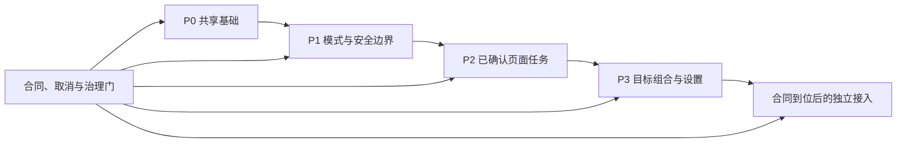

> **中文文件名便捷阅读副本**
>
> 本文件仅用于人工浏览，不是活动权威。活动权威始终是：[原始文档](../../design/PRODUCT_UI_IMPLEMENTATION_HANDOFF.zh-CN.md)。
>
> 镜像源基线：`bcd39d8`

# 产品 UI 实施交接

## 1. 交接结论

本文件把已完成的逐页设计文档转换为可排序、可追踪、可验收的实施输入。它不表示页面运行时已经完成，也不授权接入未确认的远端合同。

实施以[产品 UI 设计索引](UI设计索引.md)为入口，并同时服从以下唯一责任文档：

- [产品 UI 设计系统](UI设计系统.md)：现有 Token、控件和视觉状态。
- [全局布局规范](全局布局规范.md)：壳、区域、几何和滚动。
- [全局交互规范](全局交互规范.md)：动作、输入、焦点和恢复。
- [全局状态规范](全局状态规范.md)：状态标题、解释、动作和恢复。
- [响应式规范](响应式规范.md)：桌面、平板、窄屏和场外大屏组合。
- [组件责任规范](组件职责规范.md)：现有组件、概念责任和依赖边界。
- [Naive UI 映射](Naive UI映射.md)：基础控件候选与项目适配器边界。
- [公共覆盖层与对话框规范](通用浮层与对话框规范.md)：模态、抽屉、sheet 与返回焦点。
- [实施纠正清单](实现修正待办清单.md)：28 项当前实现差异及关闭证据。

## 2. 实施输入与非输入

### 2.1 可直接实施的输入

1. 七个页面族文档中的区域层级、动作优先级、状态、输入方式、响应式组合和验收标准。
2. `CURRENT_IMPLEMENTED` 能力的保留与纠正；该分类不代表现状已通过目标页面验收。
3. `APPROVED_TARGET` 能力的页面组合与组件责任，但必须先补齐列明的运行时所有者。
4. `CONTRACT_BLOCKED` 能力的真实不可用、登录或权限表达；成功数据接入须等待真实合同。
5. `OPEN_OWNER_DECISION` 的固定边界和临时建议；建议值不得变成产品常量。

### 2.2 不得视为实施输入的内容

- 不存在的 API 字段、DTO、实时 provider、棋钟算法、硬件合同、回放合同或共享凭据。
- 第二工作区、第二棋盘/PGN 运行时、来源专属教学壳或场外大屏中的教学 UI。
- 页面局部 palette、平行 Token registry、局部 Naive theme 或让 Naive UI 拥有产品状态。
- 模拟、样例、fixture、回退成功、合成排名、合成团体总分或伪实时局面。
- 未关闭的 `OD-01` 至 `OD-11` 所对应默认值、阈值、范围和持久化承诺。

## 3. 总体实施顺序

| 阶段          | 必做纠正                              | 交付结果                                                                         | 不得提前宣称                             |
| ------------- | ------------------------------------- | -------------------------------------------------------------------------------- | ---------------------------------------- |
| P0 共享基础   | `COR-011/012/013/015/020/021/025/027` | 唯一 RouteShell、Token 使用、项目基础适配器、焦点/对话框合同、组件边界和产品术语 | 页面视觉完成或全页无障碍完成             |
| P1 模式与安全 | `COR-001/002/003/008/014/016/018`     | 模式能力投影、只读门控、安全 handoff、只读棋盘浏览、平板/窄屏壳、保留内容标识    | live/replay 成功合同或完整窄屏编辑       |
| P2 已确认任务 | `COR-005/006/009/017/022/023`         | 登录状态、赛事列表 URL 所有权、个人赛事详情、本地导入、真实回放动作策略          | 团体成功数据、权威回放或匿名实时         |
| P3 目标组合   | `COR-004/019/024/026`                 | 场外大屏目标组合、对局级教学内容、实时状态壳、设置表面                           | 实时棋盘成功、课次实体或未确认设置默认值 |
| 跨阶段门      | `COR-007/010/028`                     | 固定 endpoint/仓储边界、请求取消、防串页和每页实施验收记录                       | 以静态通过替代页面实施验收               |

`CONTRACT_BLOCKED` 的成功态不属于上述阶段的默认交付。真实合同到位后，应建立独立变更，先更新产品/API/安全权威，再接入 typed repository/source adapter。

## 4. 共享组件依赖顺序

| 顺序 | 责任层                                             | 先决条件                      | 输出给下游                                          | 验收所有者                 |
| ---- | -------------------------------------------------- | ----------------------------- | --------------------------------------------------- | -------------------------- |
| C1   | `AppProviders` 与唯一 Token registry               | 当前 provider 与 `tokens.css` | 单一主题上下文；不新增平行 Token                    | Token/theme owner          |
| C2   | `ProductRouteShell`                                | C1、全局布局规范              | 固定页头、唯一内容滚动槽、skip target、页面标题焦点 | Global layout owner        |
| C3   | Button/Field/Select/Tabs/Pagination/State adapters | C1、Naive UI 映射             | 统一 props/emits、状态、焦点环和禁用语义            | UI adapter owner           |
| C4   | Dialog/Drawer/Sheet/Popover adapters               | C1、C3、覆盖层规范            | 圈定焦点、Escape、滚动锁和返回焦点                  | Overlay owner              |
| C5   | `WorkspacePermissionAdapter` 与 mode projection    | C3、当前模式控制器            | 每个模式的可见、隐藏、禁用、只读和 AI 权限          | Workspace mode owner       |
| C6   | Canonical board 只读/可编辑 capability             | C5、规范棋盘                  | 可聚焦浏览与允许走子分离；不创建第二棋盘            | Board accessibility owner  |
| C7   | PGN/source/annotation projections                  | C5、C6、唯一 PGN domain       | 本地副本、节点批注、对局笔记和来源只读投影          | PGN/domain owner           |
| C8   | Query route-state adapters                         | C2、C3、固定仓储              | URL owner、保留刷新、取消和晚到结果隔离             | Vue Query/repository owner |
| C9   | Venue display composition                          | C2、C3、C6、C8                | 独立只读展示壳和可读分页组合                        | Venue display owner        |

展示组件只接收类型化 props 并发出事件；Pinia、Vue Query、仓储和持久化只可由页面组合、容器或明确 adapter 直接依赖。概念责任在真实文件合入前不得改标为 `CURRENT_IMPLEMENTED`。

## 5. 页面依赖与实施顺序

| 顺序 | 页面族                                         | 必要共享依赖      | 纠正依赖                                              | 合同/OD 边界                                      | 可声明完成的最小范围                                          |
| ---- | ---------------------------------------------- | ----------------- | ----------------------------------------------------- | ------------------------------------------------- | ------------------------------------------------------------- |
| 1    | [登录](页面/登录页规范.md)                     | C1、C3、C4        | `COR-009/011/013/021`                                 | 仅使用现有账户合同和安全 return                   | 登录默认、校验、请求、错误凭据、过期、无权限/不可用与安全返回 |
| 2    | [赛事列表](页面/比赛列表页规范.md)             | C1–C4、C8         | `COR-010/012/015/022`                                 | 仅现有公开读取合同                                | URL 筛选/分页、加载、保留刷新、空、失败和响应式浏览           |
| 3    | [赛事详情](页面/比赛详情页规范.md)             | C1–C4、C8         | `COR-005/006/010/023`                                 | 团体聚合和权威回放保持阻断                        | 真实个人详情、层级选择、局部状态和真实动作可用性              |
| 4    | [统一工作区](页面/统一工作区页规范.md)         | C1–C7             | `COR-001/002/003/008/014/016/017/018/019/020/021/025` | `OD-01/02/03/04/07/08/09/10/11`；远端合同保持阻断 | 本地 PGN/手工局面、模式门控、安全只读壳和已确认状态           |
| 5    | [兼容与不可用](页面/兼容性与不可用界面规范.md) | C2–C5、C8         | `COR-006/007/008/009/010/018/021`                     | cloud/share/replay/live 合同未闭合                | 安全 handoff 或真实不可用；绝不渲染第二工作区                 |
| 6    | [设置](页面/设置界面规范.md)                   | C1、C3、C4        | `COR-011/012/013/026/027`                             | `OD-03/04/11` 保持开放                            | 已实现主题与布局状态；目标设置按分类显示且不伪持久化          |
| 7    | [场外大屏](页面/赛场展示页规范.md)             | C1–C4、C6、C8、C9 | `COR-004/005/007/012/014/015/024`                     | `OD-05/06/07/08`；实时成功合同保持阻断            | 当前公开对阵 + 独立只读布局 + 实时不可用/生命周期壳           |

顺序表达依赖，不要求形成单一大型变更。每个页面切片应保持可回退，并只关闭其已有证据覆盖的纠正项。

## 6. 合同与持久化依赖

| 能力                                 | 当前可用所有者                                                   | 实施要求                                                                                                                              | 未满足时的页面行为                                |
| ------------------------------------ | ---------------------------------------------------------------- | ------------------------------------------------------------------------------------------------------------------------------------- | ------------------------------------------------- |
| 账户会话                             | Auth repository/store；`kaisaile.auth.v1` 的 43,200 秒记录       | 保持唯一 owner；401 清除，403 保留                                                                                                    | 登录要求、过期或无权限                            |
| 公开赛事读取                         | TanStack Vue Query → repository → Axios                          | 固定 endpoint、Zod 映射、AbortSignal 贯穿                                                                                             | 区域加载/保留刷新/空/失败                         |
| 主题                                 | 当前 theme bootstrap/Store                                       | 只使用现有 owner                                                                                                                      | storage 不可用时保持本次内存选择并说明            |
| 工作区布局                           | 当前 Dexie 版本化记录                                            | 只保存已批准布局字段                                                                                                                  | 失败时回到安全默认，不声称已保存                  |
| 工作区 handoff                       | `pgnViewer.workspaceHandoff.v1` sessionStorage + memory fallback | 仅非敏感、类型化上下文；当前以会话存储生命周期、显式清理、缺失/损坏记录判定失效。数值 TTL 必须先由持久化/安全权威确认，不在页面层发明 | invalid/unavailable；不得静默变成本地成功         |
| Query 与实时会话                     | 内存                                                             | 不持久化响应、连接、快照或凭据                                                                                                        | 刷新后重新读取；无合同时阻断                      |
| 回放、cloud、share、实时、棋钟、硬件 | 无已确认读取 owner                                               | 先取得权威合同，再建 typed adapter                                                                                                    | “当前版本暂不支持”或已确认合同对应的登录/权限状态 |

不得新增裸 `localStorage` key，不得把密码、摘要、签名秘密、实时凭据、受保护 DTO、完整响应或 secret-bearing URL 放入 URL、handoff、Dexie、持久 Query、PGN、批注或 AI 输入。

## 7. 精确约束与可调整空间

### 7.1 实施必须精确匹配

- 九条路由责任、唯一统一工作区、独立场外大屏和兼容入口行为。
- 五类能力分类及其页面呈现规则。
- 全局状态规范中的状态标题、说明、动作、保留内容、焦点和恢复语义。
- ongoing live 无 AI、评价、编辑、来源批注、变例和写回。
- 页面主次动作顺序、危险动作确认、焦点圈定/返回与唯一滚动所有者。
- `src/styles/tokens.css` 作为唯一 Token registry；现有断点语义和减弱动效合同。
- 当前持久化 owner 和安全边界。

### 7.2 可在实现中局部调整

- 不改变信息层级、动作优先级和 Token 角色的内部组件拆分。
- 不产生第二领域运行时的组合式函数、类型名和私有实现细节。
- 经真实内容验证后的局部文案换行和容器细节，但不得改变精确状态术语。
- 场外大屏候选布局评分的内部算法，只要仍满足可读性、稳定顺序、分页和 `OD-05/06` 边界。

任何可调整项一旦影响公共组件、状态术语、持久化、API、模式权限或跨页行为，必须先回到其全局责任文档复核。

## 8. 开放所有者决策门

| 决策    | 实施前已固定                   | 仍需所有者确认          | 阻断范围                             |
| ------- | ------------------------------ | ----------------------- | ------------------------------------ |
| `OD-01` | 一个统一工作区和本地教学边界   | 教学集合层级            | 集合实体与持久化，不阻断单局本地工作 |
| `OD-02` | 对局笔记与节点批注分离         | 课次/课堂笔记语义       | 课次实体，不阻断对局级目标           |
| `OD-03` | AI 默认关闭                    | 持久化资源设置范围      | AI preferences 持久化                |
| `OD-04` | 首次使用必须提示               | 提示确认周期与资源措辞  | 首次提示最终行为                     |
| `OD-05` | 可读性优先、棋盘正方形         | 大屏最小/首选尺寸与间距 | 最终大屏密度常量                     |
| `OD-06` | 轮换可暂停、减弱动效下不自动切 | 轮换时间与策略          | 自动轮换默认值                       |
| `OD-07` | 保留最后可信数据且不伪造棋钟   | 陈旧阈值与棋钟插值      | live 新鲜度/棋钟成功态               |
| `OD-08` | 公开赛事与对阵可匿名读取       | 匿名实时棋盘范围        | 匿名 live 成功态                     |
| `OD-09` | 窄屏棋盘优先且具只读任务       | 完整窄屏编辑范围        | 完整编辑承诺                         |
| `OD-10` | 不显示未经批准的导出动作       | 导出/打印范围           | 导出与打印入口                       |
| `OD-11` | 声音不应意外自动播放           | 声音默认状态            | 声音设置默认值                       |

## 9. 每页实施验收所有权

每个页面切片由页面实现 owner 收集证据，架构/领域 owner 验证边界，产品 owner 只确认未关闭 OD 的临时值，不以口头确认替代权威更新。

| 验收面                     | 页面实现 owner        | 专项复核 owner           | 必需证据                                                        |
| -------------------------- | --------------------- | ------------------------ | --------------------------------------------------------------- |
| 路由、入口、退出与安全返回 | Page/Router           | Auth/security            | 直接进入、刷新、back/forward、恶意 return                       |
| 当前/目标/阻断真相         | Page composition      | Product/API              | DOM 中不存在伪可用动作或合成成功                                |
| 数据与取消                 | Query composition     | Repository               | 首次、保留刷新、空、局部/完全失败、取消和晚到结果               |
| 模式与只读                 | Workspace composition | Domain/Board/Analysis    | 每模式动作矩阵；来源数据无写回；live 无 AI/评价                 |
| 键盘、焦点和覆盖层         | Page composition      | Accessibility/UI adapter | 主任务键盘路径、初始焦点、圈定、Escape、返回焦点                |
| 响应式与滚动               | Page composition      | Layout                   | 指定断点/显示档案、200% 缩放、唯一滚动容器、安全区              |
| 视觉和 Token               | Component/Page        | Token/theme              | light/dark、focus、对比度、无 raw governed value 或新 namespace |
| 持久化与安全               | Store/adapter         | Persistence/security     | 只写批准记录；失败关闭；无敏感数据泄漏                          |

## 10. 页面完成标准

一个页面族只有同时满足以下条件才可标记“实施完成”：

1. 对应页面规范中的全部非阻断验收项有证据；阻断项保持明确不可用而非跳过。
2. 所有受影响 `COR-*` 已关闭，或以 `CONTRACT_BLOCKED` / `OPEN_OWNER_DECISION` 明确保留并提供真实页面状态。
3. 当前、目标、阻断、开放和禁止能力没有混写；概念组件只在真实文件存在后改标。
4. 页面使用唯一 Token、provider、Router、Pinia graph、Query client、Axios owner、棋盘和 PGN domain。
5. 鼠标、键盘、触控、焦点、滚动、减弱动效和相应响应式档案均通过页面规范要求。
6. 运行仓库规定的 governance、format、lint、Stylelint、Knip、static、typecheck 和生产构建。
7. 对可见页面切片执行一次窄而真实的浏览器验收：目标路由非空、无 Vite 错误覆盖层、无中断控制台错误、焦点行为正确，并发生一次真实交互状态变化。
8. 不创建自动化测试文件或测试基础设施，不运行 `pnpm test`。

文档包本身只证明设计和交接完整，不满足第 7 项，也不得用于宣称页面实现完成。

## 11. 纠正项关闭协议

关闭任一 `COR-*` 必须在同一实现变更中记录：

- 受影响代码路径和实际所有者；
- 从“当前行为”到“必须达到目标”的最小差异；
- 对应页面、模式、状态和响应式档案；
- 运行的静态命令与页面浏览器路径；
- 未关闭的 OD、合同和剩余风险；
- 无伪造成功、无弱化验证、无无关重构的确认。

不得仅凭组件存在、静态命令通过或控件隐藏关闭纠正项。权限和只读纠正必须验证副作用没有发生；保留内容状态必须验证旧内容没有被标作当前成功。

## 12. 实施启动清单

1. 确认当前提交仍包含本索引所列活动产品、UI 和架构权威。
2. 选择一个页面切片，读取其页面规范及所有链接的全局责任文档。
3. 从纠正清单锁定该切片的 `COR-*`，先完成 P0/P1 先决条件。
4. 标记每项能力分类；若需要新合同或关闭 OD，先停止该成功态接入。
5. 明确现有组件、概念责任、Store/Query/repository/persistence owner 和回退边界。
6. 只实施该切片，运行窄验证，再扩展到仓库规定的完整验证。
7. 更新权威、纠正状态和验收证据；不得把实现笔记留成页面规范中的隐含例外。

## 13. 最终交接门

本交接只有在以下设计文档条件成立时有效：七个页面族完整；31 个设计表面完整；九条路由、四个活动模式和全局状态模型均有归属；所有 OD 保持 `OPEN`；交叉链接、标题锚点和 Mermaid 结构通过；执行报告给出允许的最终结论。

满足上述条件后，设计文档可进入实施；实现团队仍须从 P0 开始，并按页面切片分别取得运行时验收证据。
