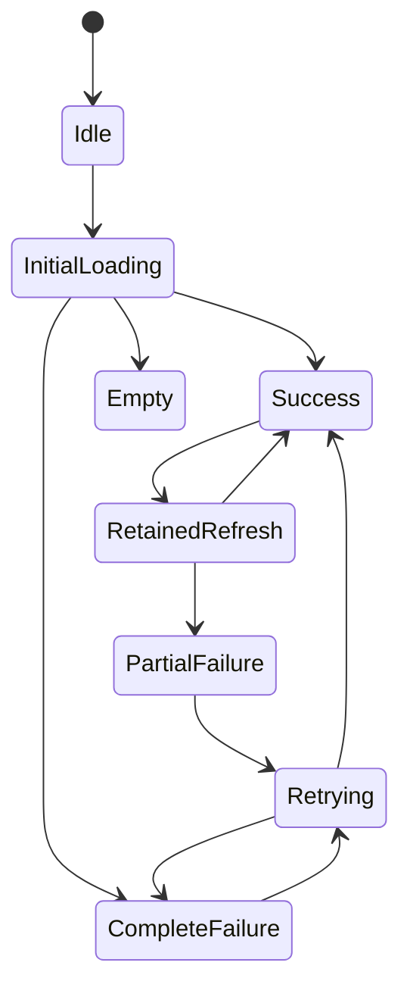
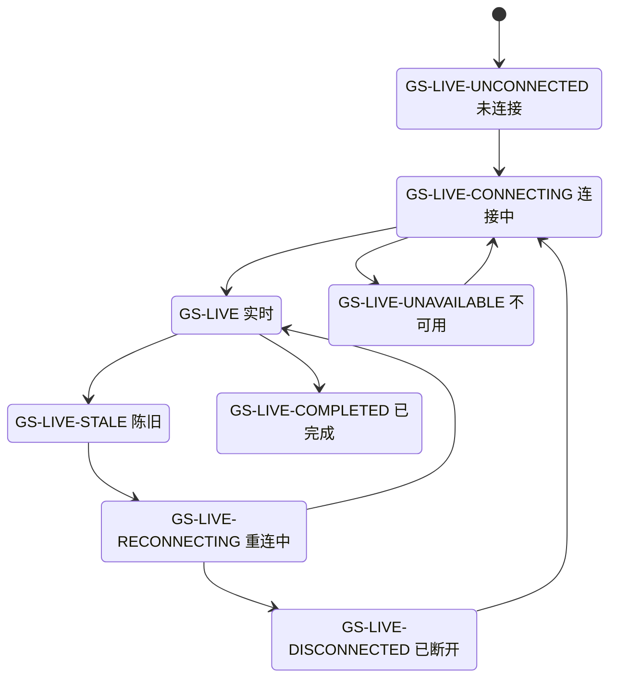

> **非权威性阅读镜像提示**
> 本文档是原始文件 `docs/design/PRODUCT_GLOBAL_STATE_SPEC.zh-CN.md` 的中文阅读镜像，仅供人工浏览。产品、设计、架构与实现权威仍保留在原始源路径，请勿将本镜像作为实施或自动化编辑的依据。

# 开赛了产品全局状态规范

| 字段     | 值                                                          |
| -------- | ----------------------------------------------------------- |
| 产品     | 开赛了                                                      |
| 设计方向 | `静稳棋室`                                                  |
| 产品状态 | `COMPLETE_PRODUCT_DESIGN_FINAL_READY_FOR_PAGE_DESIGN`       |
| 页面门禁 | `PAGE_BY_PAGE_UI_DESIGN_READY_WITH_TRACKED_OWNER_DECISIONS` |
| 文档状态 | `ACTIVE_IMPLEMENTATION_AUTHORITY`                           |
| 状态范围 | 页面资源、来源权限、实时生命周期、AI 生命周期、破坏性确认   |

## 1. 责任与关联文档

本文唯一拥有共用状态 ID、状态优先级、精确简体中文标题与说明、动作、禁用项、语义、播报、初始焦点和恢复路径。页面规范只映射状态 ID，并补充真实资源名称与页特有动作。

- 文档入口：[产品逐页 UI 设计文档索引](UI设计索引.md)
- 状态触发与焦点：[产品全局交互规范](全局交互规范.md)
- 状态覆盖层：[共用覆盖层与对话框规范](通用浮层与对话框规范.md)
- 状态几何与滚动：[产品全局布局规范](全局布局规范.md)
- 状态视觉角色：[产品 UI 设计系统](UI设计系统.md)
- 状态实现责任：[产品组件责任规范](组件职责规范.md)
- 当前差异：[实施纠正清单](实现修正待办清单.md)

适用页面：[登录](页面/登录页规范.md)、[统一工作区](页面/统一工作区页规范.md)、[赛事列表](页面/比赛列表页规范.md)、[赛事详情](页面/比赛详情页规范.md)、[场外大屏](页面/赛场展示页规范.md)、[设置表面](页面/设置界面规范.md)、[兼容与不可用表面](页面/兼容性与不可用界面规范.md)。

本规范定义的是行为责任，不声明存在名为“GlobalState”或下列 ID 的运行时组件。

## 2. 状态不变量

1. 状态只替换或覆盖受影响模块，不改变应用壳、页面头、筛选区、棋盘宿主或相邻模块的外部几何。
2. 有上次可信内容时，刷新、陈旧、重连和可重试失败均保留该内容；内容必须标明其时效，不可继续标为实时或最新。
3. 没有可信内容时不得用空棋局、样例、旧 DTO、缓存截图或合成数据填充成功状态。
4. 合同未闭合时优先显示合同阻断，不先要求登录，也不发起试探请求。
5. 已确认的保护合同存在但没有有效会话时显示登录要求；有效会话收到无权结果时显示权限不足且不注销。
6. 状态动作必须使用同一已验证上下文；重试不改变筛选、来源、棋局、组别、轮次或台次。
7. 状态文案不出现 API、DTO、Axios、MQTT、端点、主题、堆栈、原始错误码、请求标识、位置哈希或凭据。
8. 图标只强化语义并默认 `aria-hidden="true"`；标题、说明和动作始终独立表达完整含义。
9. 非模态状态变化不抢焦点。只有路由初入的完整失败/阻断页或模态确认设置初始焦点。
10. `CURRENT_IMPLEMENTED`只说明当前已有可核对的基础行为；若页面尚未满足本表全部字段，页面必须同时引用纠正清单。

## 3. 文案模板与占位符

下表中的引号内文本是实施文案。允许的占位符必须来自已验证的用户可见领域数据：

| 占位符                                               | 允许值                                                               | 禁止值                         |
| ---------------------------------------------------- | -------------------------------------------------------------------- | ------------------------------ |
| `{资源名称}`                                         | “赛事”“赛事详情”“组别”“轮次”“对阵”“棋谱”“实时棋局”“回放”等固定产品词 | 端点名、DTO 名、表名、协议名   |
| `{成功数量}`、`{失败数量}`、`{总数量}`、`{当前数量}` | 当前操作真实计数                                                     | 推测值、占位假数据             |
| `{更新时间}`                                         | 来源确认或成功接收的格式化时间                                       | 客户端猜测的服务端时间         |
| `{对象名称}`                                         | 已转义、非敏感的赛事/棋局/本地集合可见名称                           | 凭据、内部 ID、设备秘密        |
| `{分析范围}`                                         | 固定值“当前局面”或“整局”                                             | 自由文本、未确认资源参数       |
| `{失败原因}`                                         | 仓储/领域边界映射后的产品语言                                        | 原始响应、堆栈、服务器调试文本 |

缺少可安全显示的动态值时，使用不带占位符的固定句，不显示 `—`、`undefined` 或内部标识。

## 4. 资源与访问状态

| 状态 ID / 分类                                             | 受影响区域与保留内容                                               | 几何                                                               | 精确标题与说明                                                                                                     | 主/次动作                                                    | 禁用动作                                                             | 语义与图标角色                                          | 无障碍播报                                                 | 初始焦点                                                           | 恢复路径                                                                                                                 |
| ---------------------------------------------------------- | ------------------------------------------------------------------ | ------------------------------------------------------------------ | ------------------------------------------------------------------------------------------------------------------ | ------------------------------------------------------------ | -------------------------------------------------------------------- | ------------------------------------------------------- | ---------------------------------------------------------- | ------------------------------------------------------------------ | ------------------------------------------------------------------------------------------------------------------------ |
| `GS-IDLE` `CURRENT_IMPLEMENTED`                            | 尚未开始任务的所属模块；保留页面头、筛选与其他模块                 | 在模块内容槽原位显示，不扩张到整页                                 | 标题：“等待操作”；说明：“选择内容或使用当前区域中的操作继续。”                                                     | 主：该模块的首要开始动作；次：返回上一级（仅有真实上级时）   | 依赖未选择内容的编辑、删除和分析                                     | `status` / 中性信息图标                                 | “等待操作。”，仅模块首次出现时 `polite`                    | 路由初入到模块标题；页内切换不移动焦点                             | 选择有效内容后进入 `GS-LOAD-INITIAL` 或 `GS-SUCCESS`                                                                     |
| `GS-LOAD-INITIAL` `CURRENT_IMPLEMENTED`                    | 首次读取且无可信内容的模块；保留页面外壳和筛选                     | 与最终内容同尺寸的骨架或固定状态槽；不遮蔽其他模块                 | 标题：“正在加载”；说明：“正在获取{资源名称}，请稍候。”                                                             | 主：取消（仅任务可取消时）；次：返回（仅不会丢工作时）       | 同一资源的重复提交、编辑、删除、分页                                 | `status` / 进度图标；非循环动画服从减弱动效             | “正在加载{资源名称}。”，开始时一次 `polite`                | 保持触发点；路由初入时焦点在页面主标题                             | 成功到 `GS-SUCCESS`/`GS-EMPTY`；失败到 `GS-FAIL-COMPLETE`、`GS-AUTH-REQUIRED`、`GS-AUTH-DENIED` 或 `GS-CONTRACT-BLOCKED` |
| `GS-LOAD-REFRESH` `APPROVED_TARGET`                        | 已有可信内容的当前模块；完整保留内容、选择、滚动位置和筛选         | 在模块标题/状态带显示轻量更新标记；不得用骨架覆盖已有内容          | 标题：“正在更新”；说明：“正在获取最新的{资源名称}，当前内容仍可查看。”                                             | 主：取消更新（可取消时）；次：—                              | 重复刷新；会让请求上下文失效的危险动作可暂时禁用，浏览与本地操作保持 | `status` / 小型进度图标                                 | “正在更新{资源名称}。”，一次 `polite`                      | 不移动焦点                                                         | 成功到 `GS-SUCCESS`；失败保留内容并进入 `GS-FAIL-PARTIAL` 或带旧内容的可重试错误                                         |
| `GS-SUCCESS` `CURRENT_IMPLEMENTED`                         | 所属模块展示已验证内容；其他模块不变                               | 使用最终内容几何；成功提示不占永久额外高度                         | 标题：“已更新”；说明：“{资源名称}已更新。”；常规成功不持续渲染状态卡                                               | 主：页面任务主动作；次：页面次动作                           | 仅按权限、生命周期或无数据条件禁用                                   | 成功语义 / 成功图标；常规内容本身不使用 `role="status"` | 异步完成时“{资源名称}已更新。”，一次 `polite`              | 不抢焦点；由触发动作合同决定                                       | 用户继续操作；后续刷新进入 `GS-LOAD-REFRESH`                                                                             |
| `GS-EMPTY` `CURRENT_IMPLEMENTED`                           | 查询成功但真实结果为空的模块；保留筛选、页面头和其他可信模块       | 在结果列表/内容槽原位；分页与筛选条保持稳定                        | 标题：“暂无{资源名称}”；说明：“当前条件下没有可显示的{资源名称}。你可以调整筛选或返回上一级。”                     | 主：清除或调整筛选（存在筛选时）；次：返回上一级             | 选择、分页下一页、依赖结果的编辑/导入                                | `status` / 空状态图标                                   | “暂无{资源名称}。”，首次出现时 `polite`                    | 路由初入到状态标题；筛选导致时保持筛选控件焦点                     | 调整筛选、切换有效上级或重新读取；不得生成示例数据                                                                       |
| `GS-FAIL-PARTIAL` `APPROVED_TARGET`                        | 同一操作部分成功；保留所有已验证成功项、原有内容和失败项清单       | 成功内容保持原位；失败摘要在所属模块或导入摘要层，不替换整页       | 标题：“部分内容未完成”；说明：“{成功数量} 项已可用，{失败数量} 项未完成。你可以继续使用已完成内容，或重试失败项。” | 主：“重试失败项”；次：“继续使用已完成内容”                   | 对失败项执行依赖成功数据的动作；成功项保持可用                       | `status`，严重失败项可用 `alert` / 警告图标             | “部分内容未完成：{成功数量} 项可用，{失败数量} 项失败。”   | 打开摘要时到摘要标题；模块内刷新失败不移动                         | 只重试失败项；继续则保留成功项并关闭摘要                                                                                 |
| `GS-FAIL-COMPLETE` `CURRENT_IMPLEMENTED`，统一行为为目标   | 当前模块没有可用内容；保留页面外壳、筛选及其他模块可信内容         | 模块内容槽原位；不得坍缩为一行或改变页宽                           | 标题：“{资源名称}加载失败”；说明：“当前内容未能加载。请重试；如果问题持续，请返回上一级。”                         | 主：“重试”（可重试时）或“返回上一级”；次：另一个可用动作     | 依赖该资源的所有选择、编辑、导入和分页                               | `alert` / 错误图标                                      | “{资源名称}加载失败。请重试或返回上一级。”，一次 assertive | 路由初入到状态标题；页内请求失败保持触发点，随后可将焦点置于“重试” | 同上下文重试；返回上级；无恢复时保持失败关闭                                                                             |
| `GS-RETRYING` `CURRENT_IMPLEMENTED`，一致保留规则为目标    | 失败模块；保留旧数据或原失败几何、筛选与上下文                     | 原错误卡位置变为进度状态；按钮宽度和模块高度不变                   | 标题：“正在重试”；说明：“正在重新获取{资源名称}，当前选择不会改变。”                                               | 主：“取消重试”（可取消时）；次：—                            | 重复重试、改变同一请求参数的冲突动作                                 | `status` / 进度图标                                     | “正在重试获取{资源名称}。”，一次 `polite`                  | 焦点留在已禁用的重试按钮或模块状态容器                             | 成功到 `GS-SUCCESS`/`GS-EMPTY`；失败回原错误分类，不自动循环                                                             |
| `GS-AUTH-REQUIRED` `CURRENT_IMPLEMENTED`，统一对话框为目标 | 已确认的受保护能力；保留公开内容和非敏感本地工作，清除无效私有内容 | 默认模块内状态；由用户动作触发且可安全返回时可打开登录要求对话框   | 标题：“需要登录”；说明：“登录后才能继续此操作。当前公开内容和本地教学内容不会被清除。”                             | 主：“去登录”；次：“暂不登录”                                 | 受保护请求、导入、实时订阅和回放                                     | `alertdialog`（对话框）或 `status`（内联）/ 登录锁图标  | “需要登录。登录后才能继续此操作。”                         | 内联路由初入到标题；对话框到“暂不登录”                             | 使用已校验相对返回路径到 `/login`；取消留在公开/本地上下文                                                               |
| `GS-AUTH-DENIED` `CURRENT_IMPLEMENTED`，统一文案为目标     | 合同存在且有效会话无权的模块；保留会话、公开内容和本地工作         | 模块内状态，不用登录对话框覆盖全页                                 | 标题：“没有访问权限”；说明：“你的账号无权查看此内容。现有公开内容和本地教学内容保持不变。”                         | 主：“返回可用内容”；次：“切换账号”（仅明确提供注销后登录时） | 重试同一无权请求、受保护编辑/导入                                    | `alert` / 权限锁图标                                    | “没有访问权限。请返回可用内容。”                           | 路由初入到标题；页内失败保持触发点                                 | 返回公开上级；用户明确切换账号；HTTP 403 不自动注销                                                                      |
| `GS-CONTRACT-BLOCKED` `CONTRACT_BLOCKED`                   | 回放、云端、分享、硬件、实时或棋钟等未闭合能力；保留现有可信内容   | 模块内固定状态；兼容入口可成为整页不可用表面；不得显示伪骨架后成功 | 标题：“当前版本暂不支持”；说明：“这项能力尚未具备已确认的读取合同，当前不会发起请求。”                             | 主：“返回可用内容”；次：—                                    | 登录、重试、编辑、订阅、导入、显示虚构结果                           | `status` / 阻断图标；不使用错误爆炸式视觉               | “当前版本暂不支持这项能力。”，一次 `polite`                | 整页入口到标题；模块内不抢焦点                                     | 返回赛事详情、来源选择器或仍有效本地棋局；只有合同权威更新后才能解除                                                     |

## 5. 来源编辑与实时状态

| 状态 ID / 分类                                                    | 受影响区域与保留内容                                         | 几何                                                      | 精确标题与说明                                                                                   | 主/次动作                                                        | 禁用动作                                                           | 语义与图标角色                  | 无障碍播报                                       | 初始焦点                                     | 恢复路径                                                                               |
| ----------------------------------------------------------------- | ------------------------------------------------------------ | --------------------------------------------------------- | ------------------------------------------------------------------------------------------------ | ---------------------------------------------------------------- | ------------------------------------------------------------------ | ------------------------------- | ------------------------------------------------ | -------------------------------------------- | -------------------------------------------------------------------------------------- |
| `GS-SOURCE-READONLY` `CURRENT_IMPLEMENTED`                        | 棋盘、棋谱与来源信息；保留来源数据和浏览位置                 | 状态徽标位于来源/棋局信息区；棋盘和棋谱几何不变           | 标题：“只读来源”；说明：“你可以浏览和切换局面，但不能修改来源内容。”                             | 主：“导入为本地副本”（仅完成、获权且合同允许时）；次：“返回来源” | 改走法、改 PGN、创建变例、来源标注、写回；进行中实时还禁用 AI/评价 | `status` / 只读图标             | 进入上下文时“当前内容为只读来源。”               | 不移动；路由初入到来源标题                   | 合法显式导入后进入 `GS-SOURCE-LOCAL-COPY`；否则一直只读                                |
| `GS-SOURCE-LOCAL-COPY` `APPROVED_TARGET`；当前本地内容可编辑      | 新建或导入的本地教学棋局；原来源保持分离                     | 使用统一工作区原几何；在来源摘要显示本地副本标识          | 标题：“本地副本可编辑”；说明：“更改只保存在本地副本，不会写回原来源。”                           | 主：继续教学/编辑；次：“查看来源信息”                            | 任何远端写回；目标持久化所有者未实现前禁用“已永久保存”类承诺       | `status` / 本地图标             | 创建时“已创建可编辑的本地副本。”                 | 导入成功后到新副本标题；普通编辑不移动       | 继续会话；刷新恢复仅限当前已实现持久化，不能承诺恢复教学副本                           |
| `GS-LIVE-UNCONNECTED` `CONTRACT_BLOCKED`（状态模型已批准）        | 已验证的赛事、组别、轮次与台次摘要；没有可信快照时不绘制棋盘 | 实时状态槽与未来棋盘宿主保持最终几何；不显示假局面        | 标题：“尚未连接实时内容”；说明：“尚未开始接收来源确认的实时状态。”                               | 主：“连接”（仅真实合同允许时）；次：“返回赛事”                   | 编辑、AI、评价、来源写回、无合同的连接尝试                         | `status` / 未连接图标           | “尚未连接实时内容。”，首次进入时一次 `polite`    | 路由初入到页面标题；页内停止连接后回连接按钮 | 显式连接到 `GS-LIVE-CONNECTING`；合同未闭合直接使用 `GS-CONTRACT-BLOCKED`              |
| `GS-LIVE-CONNECTING` `CONTRACT_BLOCKED`（状态模型已批准）         | 保留已验证来源摘要与最后可信内容；首次无快照时保持空棋盘宿主 | 状态槽原位显示不确定进度；不伪造百分比或棋盘              | 标题：“正在连接实时内容”；说明：“正在等待来源确认的有效状态。”                                   | 主：“取消连接”；次：“返回赛事”                                   | 重复连接、编辑、AI、评价、来源写回                                 | `status` / 连接进度图标         | “正在连接实时内容。”，一次 `polite`              | 焦点留在连接触发位置；按钮替换保持稳定       | 有效状态到 `GS-LIVE`；可恢复失败到 `GS-LIVE-UNAVAILABLE`；取消回 `GS-LIVE-UNCONNECTED` |
| `GS-LIVE` `CONTRACT_BLOCKED`（状态模型已批准）                    | 只读棋盘、着法、棋手、连接与经确认时钟；保留当前可信快照     | 实时状态条与棋盘并存，不遮蔽棋盘                          | 标题：“实时连接正常”；说明：“正在显示来源确认的最新局面。”                                       | 主：“停止跟随”或“返回赛事”（由页面责任决定）；次：—              | 全部编辑、来源标注、变例、AI、评价、写回                           | `status` / 实时图标；不得仅闪烁 | 状态改变时“实时连接正常。”；每步只简短播报一次   | 不移动焦点                                   | 超过确认阈值到 `GS-LIVE-STALE`；完成到 `GS-LIVE-COMPLETED`；主动离开断开内存连接       |
| `GS-LIVE-STALE` `CONTRACT_BLOCKED` + `OD-07 OPEN`                 | 保留最后可信棋盘、着法和各自确认更新时间；不再称为最新       | 棋盘不消失；状态条改为警告语义；棋盘/棋钟可分别标注新鲜度 | 标题：“实时内容可能已过期”；说明：“当前保留最后一次可信局面。收到新状态前，不会把它标记为实时。” | 主：“重新连接”（合同允许时）；次：“返回赛事”                     | 编辑、AI、评价、来源写回；未经合同的本地棋钟推算                   | `status` / 警告与陈旧图标       | “实时内容可能已过期，当前显示最后一次可信局面。” | 不移动焦点                                   | 自动或手动重连到 `GS-LIVE-RECONNECTING`；收到有效更新回 `GS-LIVE`                      |
| `GS-LIVE-RECONNECTING` `CONTRACT_BLOCKED`                         | 保留最后可信局面、选择和更新时间                             | 状态条原位显示进度；棋盘维持尺寸                          | 标题：“正在重新连接”；说明：“继续显示最后一次可信局面，等待来源恢复。”                           | 主：“停止重连”；次：“返回赛事”                                   | 重复重连、编辑、AI、评价、写回                                     | `status` / 重连进度图标         | “正在重新连接，当前显示最后一次可信局面。”       | 不移动焦点；手动触发时保留重连按钮位置       | 新有效状态到 `GS-LIVE`；失败到 `GS-LIVE-DISCONNECTED`                                  |
| `GS-LIVE-DISCONNECTED` `CONTRACT_BLOCKED`                         | 保留最后可信局面；清除凭据和连接瞬时状态，不清本地教学内容   | 棋盘与状态条不变；错误不替换整页                          | 标题：“实时连接已断开”；说明：“当前显示最后一次可信局面。你可以重新连接或返回赛事详情。”         | 主：“重新连接”（合同允许时）；次：“返回赛事详情”                 | 编辑、AI、评价、写回、显示未经确认的新时钟                         | `alert` / 断开图标              | “实时连接已断开，当前显示最后一次可信局面。”     | 连接失败后焦点到“重新连接”；被动断开不抢焦点 | 手动重连或返回；注销/过期必须停止重连并清私有状态                                      |
| `GS-LIVE-COMPLETED` `APPROVED_TARGET`（导入动作仍受回放合同阻断） | 保留最终确认局面、结果、棋手和最后更新时间；停止实时连接     | 状态条转为完成语义；棋盘位置不变                          | 标题：“棋局已结束”；说明：“实时更新已停止。当前来源仍为只读。”                                   | 主：“导入为本地副本”（仅完成回放合同闭合时）；次：“返回赛事”     | 继续订阅、直接编辑来源、自动启动 AI                                | `status` / 完成图标             | “棋局已结束，实时更新已停止。”                   | 不移动；用户打开动作菜单时按正常菜单焦点     | 合同未闭合时只返回；合同闭合并显式导入后进入 `GS-SOURCE-LOCAL-COPY`                    |
| `GS-LIVE-UNAVAILABLE` `CONTRACT_BLOCKED`（状态模型已批准）        | 保留已验证公开摘要和可用本地工作；无可信快照时不显示棋盘成功 | 所属实时区域原位；不得覆盖其他可用页面内容                | 标题：“实时内容不可用”；说明：“当前无法查看这项实时内容。现有公开内容和本地教学内容保持不变。”   | 主：“返回赛事”；次：“重试连接”（仅错误可恢复且合同允许时）       | 编辑、AI、评价、来源写回、自动循环重试                             | `alert` / 不可用图标            | “实时内容不可用。”，一次 assertive               | 首次入口到状态标题；连接失败后到可用恢复动作 | 可恢复重试到 `GS-LIVE-CONNECTING`；合同、认证或权限原因分别改用对应全局状态            |

## 6. AI 生命周期状态

| 状态 ID / 分类                                                                                                                   | 受影响区域与保留内容                                                                                             | 几何                                           | 精确标题与说明                                                                                                      | 主/次动作                          | 禁用动作                                                   | 语义与图标角色                         | 无障碍播报                                          | 初始焦点                                             | 恢复路径                                                                                                             |
| -------------------------------------------------------------------------------------------------------------------------------- | ---------------------------------------------------------------------------------------------------------------- | ---------------------------------------------- | ------------------------------------------------------------------------------------------------------------------- | ---------------------------------- | ---------------------------------------------------------- | -------------------------------------- | --------------------------------------------------- | ---------------------------------------------------- | -------------------------------------------------------------------------------------------------------------------- |
| `GS-AI-OFF` `APPROVED_TARGET`                                                                                                    | 非进行中本地可编辑上下文的分析节点；保留棋盘、棋谱和批注                                                         | 分析面板原位，不显示评价轨或旧结果冒充当前结果 | 标题：“AI 分析未开启”；说明：“分析默认关闭，不会占用额外计算资源。”                                                 | 主：“分析当前局面”；次：“分析整局” | 取消、重试、候选线导入；实时/只读上下文连开启动作也隐藏    | `status` / AI 关闭图标                 | 首次进入面板时“AI 分析未开启。”                     | 用户打开分析页签后到面板标题；不自动聚焦开启按钮     | 首次选择任一范围到 `GS-AI-FIRST-USE`；已在当前会话确认提示时到 `GS-AI-RUNNING`                                       |
| `GS-AI-FIRST-USE` `APPROVED_TARGET` + `OD-04 OPEN`                                                                               | 首次显式开启动作；保留已选 `{分析范围}`、当前棋局和面板                                                          | 模态提示，不改变工作区几何                     | 标题：“开启 AI 分析”；说明：“AI 分析会使用设备的处理器和电量，也可能影响课堂中的操作流畅度。只有你确认后才会开始。” | 主：“了解并开启”；次：“暂不开启”   | 背景操作、重复启动；不提供未获批准的资源数值               | `alertdialog` / 信息图标               | 对话框语义读取标题和说明，不另建重复 live 播报      | 初始焦点到“暂不开启”                                 | 确认后启动所选范围；取消回所选范围的触发按钮和 `GS-AI-OFF`；在无持久化所有者前确认只在当前内存会话有效               |
| `GS-AI-RUNNING` `CURRENT_IMPLEMENTED`（当前局面、不定进度基线）+ `APPROVED_TARGET`（显式启动、真实进度、整局、旧结果身份与标记） | 当前可能同时显示未验证的旧结果；目标 `{分析范围}` 面板保留棋盘、棋谱，旧结果仅在身份匹配时保留并标“上一局面结果” | 进度区占固定位置；不推动棋盘或改变面板尺寸     | 标题：“正在分析”；说明：“正在分析{分析范围}。切换棋局、来源或使任务身份失效后，旧结果不会写入新上下文。”            | 主：“取消分析”；次：—              | 重复启动、修改资源默认、在进行中实时显示评价               | `status` / AI 进度图标；减弱动效下静态 | “开始分析{分析范围}。”；完成时“当前局面分析完成。”  | 焦点留在启动按钮；启动按钮替换为取消时保持可预测位置 | 完成到 `GS-AI-COMPLETED`；取消到 `GS-AI-CANCELLED`；失败到 `GS-AI-FAILED`；上下文变更导致结果到 `GS-AI-STALE-RESULT` |
| `GS-AI-COMPLETED` `CURRENT_IMPLEMENTED`（匹配的当前局面结果展示基线）+ `APPROVED_TARGET`（范围表达、整局与显式插入）             | 当前 `{分析范围}` 的分析结果；保留棋盘、棋谱和与当前上下文匹配的候选变化                                         | 结果占分析面板既定内容槽；不改变棋盘几何       | 标题：“分析完成”；说明：“{分析范围}分析已完成。只有显式操作才会把所选节点的候选变化写入本地内容。”                  | 主：“查看主要变化”；次：“重新分析” | 自动插入候选变化、写入远端来源、在只读或实时上下文显示结果 | `status` / 完成图标                    | “{分析范围}分析完成。”，一次 `polite`               | 不抢焦点；用户进入结果区时到结果标题                 | 显式插入只写匹配的本地节点；重新分析到 `GS-AI-RUNNING`；上下文失配到 `GS-AI-STALE-RESULT`                            |
| `GS-AI-CANCELLED` `APPROVED_TARGET`                                                                                              | 分析面板；保留此前已完成且仍匹配当前上下文的结果                                                                 | 在进度区原位显示，不清空整个面板               | 标题：“分析已取消”；说明：“{分析范围}的未完成结果不会保存，当前棋局和批注保持不变。”                                | 主：“重新分析”；次：“关闭分析面板” | 取消、候选线导入（没有完整有效结果时）                     | `status` / 取消图标                    | “分析已取消。”，一次 `polite`                       | 取消后焦点到“重新分析”；若关闭则回分析页签           | 用户重新显式启动或离开分析面板                                                                                       |
| `GS-AI-FAILED` `CURRENT_IMPLEMENTED`（原始失败/重试基线）+ `APPROVED_TARGET`（匹配结果保留、身份校验与统一文案）                 | 当前失败时可能同时显示未验证的旧结果；目标保留棋盘、棋谱，且只保留身份匹配的旧完成结果                           | 错误在分析面板原位，不替换工作区               | 标题：“AI 分析失败”；说明：“{分析范围}未能完成分析。你可以重试，棋局和批注不会受到影响。”                           | 主：“重试分析”；次：“关闭分析面板” | 候选线导入、显示不完整评价、自动循环重试                   | `alert` / 错误图标                     | “{分析范围}分析失败。可以重试。”                    | 被动失败不抢焦点；用户进入面板时到“重试分析”         | 同一有效上下文重试；上下文已变更则回 `GS-AI-OFF`                                                                     |
| `GS-AI-STALE-RESULT` `CURRENT_IMPLEMENTED`（拒绝保护），可见播报为目标                                                           | 分析结果边界；保留当前局面及其现有有效结果                                                                       | 不插入结果卡；只使用短暂状态播报，不占永久空间 | 标题：“已忽略过期分析结果”；说明：“这份{分析范围}结果不属于当前棋局、节点或任务身份，未写入当前内容。”              | 主：—；次：—                       | 显示、缓存为当前、候选线导入                               | `status` / 过期结果图标                | “已忽略不属于当前局面的分析结果。”，节流后 `polite` | 不移动焦点                                           | 当前上下文保持原 AI 状态；用户需要时重新显式分析                                                                     |

## 7. 破坏性确认状态

| 状态 ID / 分类                             | 受影响区域与保留内容                               | 几何                           | 精确标题与说明                                                                                                                 | 主/次动作                                    | 禁用动作                                 | 语义与图标角色           | 无障碍播报                               | 初始焦点       | 恢复路径                                                                               |
| ------------------------------------------ | -------------------------------------------------- | ------------------------------ | ------------------------------------------------------------------------------------------------------------------------------ | -------------------------------------------- | ---------------------------------------- | ------------------------ | ---------------------------------------- | -------------- | -------------------------------------------------------------------------------------- |
| `GS-CONFIRM-DESTRUCTIVE` `APPROVED_TARGET` | 明确命名的本地对象或未应用草稿；确认前完整保留内容 | 模态对话框；背景锁定且几何不变 | 通用标题：“确定{动作}{对象名称}？”；通用说明：“此操作会{影响说明}。完成后{恢复说明}。”；专用摆谱与清除标注文案由覆盖层规范拥有 | 主（危险）：“确认{动作}”；次（安全）：“取消” | 背景操作、重复提交；远端来源写回始终禁止 | `alertdialog` / 危险图标 | 由对话框标题与说明读取；不重复 live 播报 | 永远先到“取消” | 取消返回触发点；成功返回相邻项、空状态主动作或所属模块标题；失败保留对象并进入模块错误 |

通用模板必须把 `{动作}`限制为页面批准的“删除”“移除”“覆盖”或“放弃”，并把 `{影响说明}`、`{恢复说明}`写成具体结果；不得出现“确定吗？”这种无对象、无后果文案。

## 8. 状态组合与优先级

同一模块只能有一个主状态，可附加不改变主状态的来源徽标。按以下顺序选择主状态：

1. 输入、持久化或合同不可信：`GS-CONTRACT-BLOCKED` 或完整失败；
2. 合同已确认但没有有效会话：`GS-AUTH-REQUIRED`；
3. 有有效会话但无权限：`GS-AUTH-DENIED`；
4. 首次无数据请求：`GS-LOAD-INITIAL`；已有数据刷新：`GS-LOAD-REFRESH`；
5. 请求结果：`GS-SUCCESS`、`GS-EMPTY`、`GS-FAIL-PARTIAL` 或 `GS-FAIL-COMPLETE`；
6. 实时上下文使用完整八态：`GS-LIVE-UNCONNECTED`、`GS-LIVE-CONNECTING`、`GS-LIVE`、`GS-LIVE-STALE`、`GS-LIVE-RECONNECTING`、`GS-LIVE-DISCONNECTED`、`GS-LIVE-COMPLETED`、`GS-LIVE-UNAVAILABLE`；其中实时、陈旧、重连、断开和完成可保留最后可信内容；
7. 来源权限徽标：`GS-SOURCE-READONLY` 或 `GS-SOURCE-LOCAL-COPY`；
8. AI 状态只允许出现在非进行中、允许分析的本地上下文；实时主状态存在时 AI 区域完全不呈现，而不是显示“禁用的分析”。

`GS-CONTRACT-BLOCKED`与`GS-AUTH-REQUIRED`不得同时出现：没有合同的能力不应诱导用户登录。`GS-AUTH-DENIED`不得清除仍有效的账户会话。陈旧、重连和断开状态必须保留最后可信数据，但不能保留“实时”成功语义。

实时图只定义批准的产品状态；真实数据、阈值、订阅和棋钟仍为 `CONTRACT_BLOCKED`，`OD-07`保持 `OPEN`。

## 9. 当前持久化与状态恢复边界

- `CURRENT_IMPLEMENTED`：同步 `themeMode`、Dexie `workspaceSession/current`中已列明的布局字段、净化的 `pgnViewer.workspaceHandoff.v1`、严格的 `kaisaile.auth.v1`、内存 Query 缓存、内存分析/实时状态。
- `APPROVED_TARGET`：教学集合、当前棋局/节点、节点评论、标注、棋局级教学笔记、语言和更广非敏感偏好；在版本化所有者存在前不得写“刷新后恢复”。
- 分析运行、分析进度、瞬时错误、实时连接、实时消息、凭据、棋钟和导入进度均不持久化。
- 会话过期清除账户会话、私有 Query、保护交接和实时连接；公开赛事与非敏感本地工作保持。
- 恢复失败进入真实来源选择器、有效本地棋局或状态表中的失败/阻断状态；不建立空白成功棋局。

## 10. 开放决定状态

| OD      | 本规范中的固定边界                   | 保持开放的状态参数              |
| ------- | ------------------------------------ | ------------------------------- |
| `OD-01` | 教学集合空、成功和部分失败状态已定义 | 集合层级及相应空状态层级        |
| `OD-02` | 节点与棋局级内容可恢复目标明确       | 课次级笔记实体及恢复状态        |
| `OD-03` | AI 运行状态为内存态、必须显式启动    | 默认设置作用域                  |
| `OD-04` | 必须有首次资源影响提示               | 提示确认范围及资源默认值        |
| `OD-05` | 大屏不可读时必须分页                 | 最小/首选棋盘尺寸               |
| `OD-06` | 自动行为必须可暂停                   | 边距、间距、轮播是否启用及时间  |
| `OD-07` | 陈旧和棋钟不能猜测                   | 陈旧阈值和棋钟插值              |
| `OD-08` | 公开赛事与当前公开对阵组合匿名       | 匿名实时多棋盘范围              |
| `OD-09` | 窄屏保留导航与轻量交互               | 完整编辑状态范围                |
| `OD-10` | 不导出敏感来源字段                   | 导出/打印成功、失败和空状态范围 |
| `OD-11` | 声音不作为唯一状态反馈               | 默认状态与持久化                |

`OD-01` 至 `OD-11` 全部为 `OPEN_OWNER_DECISION`，本文没有关闭任何一项。

## 11. 页面映射与验收

每个页面规范必须为其每个模块列出：默认状态、首次加载、保留数据刷新、空、部分失败、完整失败、认证、权限、合同阻断、只读/可编辑，以及页面特有的实时或 AI 状态；不适用项必须说明“不适用”的产品原因。

验收必须确认：

1. 标题、说明、动作和播报与本规范逐字一致，只有已批准占位符可替换；
2. 状态只影响所属模块，固定头部、筛选、棋盘宿主和相邻区域不跳动；
3. 保留数据刷新、陈旧、重连和断开确实保留最后可信内容，并移除“最新/实时”错误语义；
4. 完整失败、空和合同阻断没有样例或合成成功内容；
5. 状态优先级不会同时要求登录又宣称合同未就绪；
6. 非模态状态不抢焦点，模态状态初焦点与返回焦点符合[产品全局交互规范](全局交互规范.md)；
7. 状态图标不是唯一信息载体，播报不泄漏技术或敏感信息；
8. 所有当前实现差异均引用[实施纠正清单](实现修正待办清单.md)，不把目标行为伪装成当前事实。
