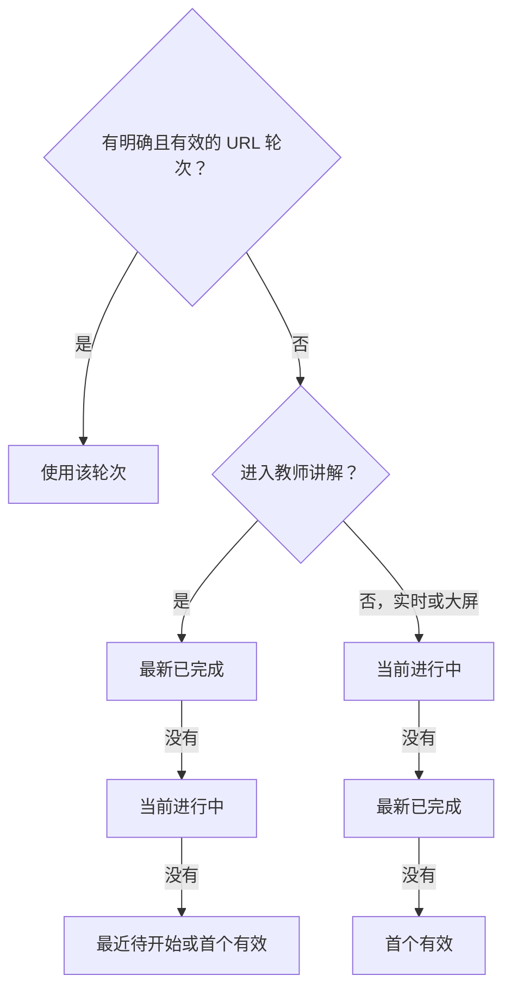

> **非权威性阅读镜像提示**
> 本文档是原始文件 `docs/design/pages/COMPETITION_DETAIL_PAGE_SPEC.zh-CN.md` 的中文阅读镜像，仅供人工浏览。产品、设计、架构与实现权威仍保留在原始源路径，请勿将本镜像作为实施或自动化编辑的依据。

# 赛事详情页规范

## 1. 文档定位

本文定义公开赛事详情、组别、轮次、个人/团体对阵层级和进入讲解、场外大屏、回放或不可用状态的页面组合。公共视觉、布局、状态、交互、覆盖层和组件规则由下列文档唯一拥有：

- [产品逐页 UI 设计文档索引](../UI设计索引.md)
- [产品 UI 设计系统](../UI设计系统.md)
- [产品全局布局规范](../全局布局规范.md)
- [产品响应式规范](../响应式规范.md)
- [产品全局交互规范](../全局交互规范.md)
- [产品全局状态规范](../全局状态规范.md)
- [产品组件责任规范](../组件职责规范.md)
- [产品 Naive UI 映射](../Naive%20UI映射.md)
- [产品共用覆盖层与对话框规范](../通用浮层与对话框规范.md)
- [产品实现纠正清单](../实现修正待办清单.md)

本页是赛事层级选择与安全交接页，不是棋盘工作区、赛事后台或场外大屏。它不得嵌入第二套棋盘、棋谱、批注、AI 或实时运行时。

## 2. 页面身份、路径与访问边界

| 项目            | 规定                                                                                                           |
| --------------- | -------------------------------------------------------------------------------------------------------------- |
| 页面责任        | 展示真实公开赛事摘要，选择组别与轮次，扫描个人台次或团体聚合对阵，并把有效上下文交给统一工作区或独立场外大屏。 |
| Vue Router 路径 | `/competitions/:hdid`                                                                                          |
| 部署 URL        | `/pgnViewer/competitions/:hdid`，实际生成时使用 `import.meta.env.BASE_URL`。                                   |
| 路由参数        | `hdid` 必须通过现有标识校验；无效时失败关闭。                                                                  |
| 访问边界        | 赛事详情、组别、轮次、对阵和当前公开对阵展示组合匿名可读。单局内容、回放和实时来源分别受真实合同与权限约束。   |
| 页面主标题      | 经映射的赛事名；加载前使用“赛事详情”，不得把 `hdid` 拼成面向用户的假标题。                                     |
| 主要用户        | 备课或讲解的教师/教练；查看赛事的运营人员、家长和观众。                                                        |
| 主要任务        | 选择组别、轮次与对阵，并进入讲解或场外大屏。                                                                   |
| 次要任务        | 搜索对阵、查看赛事状态与公开信息、处理回放/实时不可用或保护状态。                                              |

### 2.1 入口

- 从赛事列表“查看详情”进入。
- 直接打开含有效 `hdid`、`group`、`round`、`pairing_search` 或 `page` 的公开深链。
- 从统一工作区、场外大屏、登录安全返回或浏览器历史返回；只恢复仍有效的非敏感选择。

### 2.2 出口

- “进入讲解”创建消毒后的类型化交接并进入统一工作区 `/`。
- “场外大屏”进入 `/competitions/:hdid/display`，不经过工作区外壳。
- 合同与权限闭合后的“打开回放”或“实时观看”进入统一工作区；当前只显示真实不可用/登录/权限状态。
- “返回赛事”进入 `/competitions` 并保留列表自身 URL 状态；本页不猜测或重建列表筛选。

## 3. 能力分类

| 分类                  | 本页能力与呈现                                                                                                                                                                    |
| --------------------- | --------------------------------------------------------------------------------------------------------------------------------------------------------------------------------- |
| `CURRENT_IMPLEMENTED` | 匿名详情、组别、轮次、个人对阵读取；`group`/`round` URL 同步；对阵名称搜索；场外大屏链接；消毒 handoff 基础。当前轮次只使用来源当前轮次/首项回退，所有个人行都会显示“打开回放”。  |
| `APPROVED_TARGET`     | 赛事摘要与组别/轮次/对阵区域独立状态；两套严格分开的默认轮次规则；个人台次层级；对阵选择；“进入讲解”交接；可信分页合同就绪后的 URL 分页；桌面/窄屏组合、焦点与 retained refresh。 |
| `CONTRACT_BLOCKED`    | 团体总比分与单台聚合 DTO、权威已结束回放、实时棋盘/凭据/订阅/棋钟、保护单局内容。它们可显示真实不可用位置，但不得生成成功内容、假比分、假 PGN 或假棋盘。                          |
| `OPEN_OWNER_DECISION` | `OD-08` 保持 `OPEN`：公开赛事摘要/组别/轮次/对阵和当前公开展示组合仍匿名；匿名实时多棋盘范围未定。本页不得因存在公开“大屏”链接而推导实时数据也匿名。                              |
| `PROHIBITED`          | 赛事、组别、轮次、配对或赛果写入；报名/后台管理；从个人台次推导团体总分；把对阵元数据当 PGN；进行中实时编辑、变例、标注、AI、评价或来源写回；第二工作区。                         |

## 4. 用户任务与信息层级

### 4.1 稳定信息层级

1. `RouteHeader`：赛事名、返回赛事、产品导航和会话动作。
2. `EventSummary`：状态、开始/结束时间、组织方，以及真实存在的地址和说明。
3. `PrimaryHandoffActions`：“进入讲解”“场外大屏”；必须持续可达。
4. `GroupRoundControls`：组别、轮次和各自状态；明确显示当前选择来源。
5. `PairingSearchAndActions`：对阵搜索、已应用搜索摘要、结果数量和可用/不可用动作说明。
6. `PairingRegion`：个人台次列表，或真实合同闭合后的团体聚合 → 单台展开。
7. `Pagination/HandoffStatus`：可信分页、选择摘要、交接失败或保护/合同说明。

次级赛事说明可以折叠，但赛事名、生命周期、当前组别/轮次、主动作和对阵状态不可被折叠掉。

### 4.2 页面文案

- 标题和标签使用“赛事详情”“组别”“轮次”“对阵”“台次”“进入讲解”“场外大屏”“打开回放”“实时暂不可用”。
- 生命周期使用来源确认的“未开始”“进行中”“已结束”或“状态待确认”，不显示空字符串、位运算值、DTO 字段或“未返回”。
- 个人项先读“第 N 台 / 白方 / 结果 / 黑方 / 状态”；团体项先读“队伍对阵 / 总比分 / 展开单台”。
- 赛事名、棋手名、队伍名和组织方保留来源原文；日期、时间、等级分和结果走统一格式化。

## 5. 页面布局、固定区与滚动

### 5.1 大桌面（`>1200px`）

    ProductRouteShell
    ├─ RouteHeader [固定]
    └─ RouteBody [minmax(0, 1fr)]
       ├─ EventSummary + PrimaryHandoffActions [稳定]
       ├─ GroupRoundControls [稳定]
       ├─ PairingSearchAndActions + ResultMeta [稳定]
       ├─ PairingRegion [个人表格 / 团体聚合表，1fr，唯一滚动]
       └─ Pagination/HandoffStatus [稳定]

- `EventSummary` 的主列承载赛事名、状态和时间；次列承载组织方、地址和可折叠说明。
- 组别/轮次控件保持固定轨高；长标签截断时提供完整可访问名称，不靠工具提示承载唯一信息。
- 个人台次使用稳定列；团体对阵只在真实聚合合同可用时使用 expandable row。

### 5.2 紧凑桌面（`901–1200px`）

    RouteHeader
    EventSummary [主信息 + 可折叠次级说明]
    PrimaryHandoffActions
    GroupRoundControls [允许换行]
    PairingSearchAndActions [搜索占弹性轨]
    PairingRegion [紧凑表/列表，唯一滚动]
    Pagination/HandoffStatus

- 主动作不进入溢出菜单；次级说明可折叠。
- 对阵列不足时改为紧凑语义列表，不让页面 body 横向滚动。

### 5.3 平板（`561–900px`）

    RouteHeader
    EventSummary [标题、状态、主要时间]
    PrimaryHandoffActions
    CurrentSelectionSummary [当前组别 / 轮次]
    “选择组别与轮次” [打开受控 Sheet]
    PairingSearch
    PairingRegion [单列可扫描列表，唯一滚动]
    Pagination/HandoffStatus

- 赛事完整说明进入可折叠区域；组别和轮次在同一受控 Sheet 内按依赖顺序呈现。
- Sheet 内组别成功切换后更新轮次区域，不关闭；“应用选择”后关闭并返回触发器。
- 个人行和团体聚合均改为纵向层级，不删除状态与动作原因。

### 5.4 窄屏（`<=560px`）

    CompactRouteHeader
    EventIdentity [赛事名 + 状态]
    PrimaryHandoffActions [全宽顺序]
    CurrentSelectionSummary + SelectionButton
    PairingSearch
    PairingRegion [单列卡片，唯一滚动]
    Pagination/HandoffStatus
    GroupRoundSheet / UnavailableSheet [按需覆盖，尊重 safe area]

- 持续可见：赛事身份、当前组别/轮次、进入讲解、场外大屏、对阵状态。
- 地址、说明、组别列表、轮次列表和合同说明进入 Sheet/折叠区，但仍可达。
- 团体项先显示队伍与总比分，激活展开后在同一卡片下显示单台；禁止直接铺平为个人卡片集合。

### 5.5 滚动所有权

| 区域                            | 尺寸                          | 滚动规则                                       |
| ------------------------------- | ----------------------------- | ---------------------------------------------- |
| `RouteHeader`、摘要、控制、动作 | 内容决定的稳定轨              | 不随对阵滚走                                   |
| `PairingRegion`                 | `minmax(0, 1fr)`              | 唯一页面内容滚动区；`scrollbar-gutter: stable` |
| 团体单台展开                    | 占 `PairingRegion` 正常文档流 | 不创建内层纵向滚动                             |
| 组别/轮次 Sheet                 | 覆盖层有界内容体              | Sheet 自有唯一滚动；关闭释放 scroll lock       |
| body / AppShell                 | `--workspace-viewport-h`      | `PROHIBITED` 作为主滚动区                      |

## 6. URL 与选择状态

### 6.1 允许的公开 Query

| Query            | 所有权与规则                                                                                                        |
| ---------------- | ------------------------------------------------------------------------------------------------------------------- |
| `group`          | 经适配器确认属于当前赛事的组别 ID；无效时从 URL 删除。                                                              |
| `round`          | 经适配器确认属于当前组别的轮次 ID；明确且有效时拥有最高优先级。                                                     |
| `pairing_search` | 修剪后的对阵搜索文本，最大 80 个字符，拒绝控制字符；显式提交，不防抖。                                              |
| `page`           | 从 1 开始；只有仓储返回可信总数或 `hasMore` 语义后才显示并执行分页。当前响应没有权威总数时保持 1/省略，不伪造多页。 |

- `hdid` 在 path 中；不得把保护 DTO、设备秘密、凭据、PGN 或认证值写入 path/query/router state。
- 未应用搜索草稿、展开的团体行、当前选中对阵和 Sheet 开关只在页面内存。
- `group` 或 `round` 无效时使用 `router.replace` 清理，不把无效深链当成功选择。
- 用户显式选择组别/轮次使用 `router.push`，使 back/forward 恢复历史选择。

### 6.2 组别切换

1. 有效 URL `group` 优先；否则使用来源顺序中的首个有效组别。自动默认只作为解析结果，不必写回 URL。
2. 用户选择新组别后写入 `group`，删除旧 `round` 和 `page`，清除当前对阵选择与团体展开状态。
3. 保留 `pairing_search`，但新组别结果为空时清楚说明当前搜索在该组别无结果。
4. 轮次区域独立进入加载/刷新；组别控件和赛事摘要不坍缩。

### 6.3 轮次切换

1. 用户选择轮次后写入 `round`，保留 `group` 与 `pairing_search`，把 `page` 置为 1，并清除当前对阵选择。
2. 切换请求必须传递 `AbortSignal`；取消不显示错误，旧 group/round 的晚到结果不得覆盖当前选择。
3. 如果选中轮次在刷新后失效，删除 URL `round`，重新执行对应场景的默认规则并公告选择已调整。

## 7. 两套默认轮次规则

两套规则是不同产品策略，不得用一个 `sourceCurrentRoundId ?? first` 函数同时实现。

### 7.1 教师赛事讲解

严格顺序：

1. 明确且有效的 URL `round`。
2. 来源顺序中最新的已完成轮次。
3. 来源确认的当前进行中轮次。
4. 来源确认且按来源顺序最近的待开始轮次；没有时使用首个有效轮次。

### 7.2 实时观战与场外大屏

严格顺序：

1. 明确且有效的 URL `round`。
2. 来源确认的当前进行中轮次。
3. 来源顺序中最新的已完成轮次。
4. 首个有效轮次。

### 7.3 实现约束

- “已完成”“进行中”“待开始”和来源顺序必须来自经确认的仓储投影；不得用客户端当前时间、数组索引或空 `status` 推测。
- 当前 mapper 丢弃 `roundfinish` 且 `round.status` 为空，因此只能标为当前实现缺口；补齐前不得声称两套规则已实现。
- URL 没有 `round` 时，详情页可在内存中解析讲解默认轮次，但不把它自动写成显式 URL 值。
- 用户手动选轮次后它成为显式 URL 选择，可同时传给讲解或大屏。
- 用户未手动选轮次时，“进入讲解”传递讲解解析结果；“场外大屏”不复制该结果，而让 display 路由独立执行大屏规则。这一来源标记不得通过新 query 暴露。

## 8. 个人赛与团体赛组合

### 8.1 类型判定

- 赛事组合类型只能由确认合同经 repository/domain mapper 输出，不由 UI 根据名称、棋手字段、组别名或对阵数量猜测。
- 无法确认类型时显示“对阵结构暂无法确认”，保持详情与组别/轮次可用；不得默认成团体或从个人行计算团队数据。

### 8.2 个人赛（`APPROVED_TARGET`）

个人对阵直接呈现台次，信息顺序为：

1. 台次或稳定可见标识。
2. 白方姓名与真实等级分（有则显示）。
3. 结果；未完成时显示生命周期，而不是虚构结果。
4. 黑方姓名与真实等级分（有则显示）。
5. 状态及当前可用动作。

当前 `CompetitionPairing` 投影足以呈现个人行，但区域状态、可信分页、动作真相和可访问选择仍为目标补齐项。

### 8.3 团体赛（`CONTRACT_BLOCKED`）

- 第一层必须是来源确认的两支队伍与总比分聚合；第二层才是该聚合下的真实单台集合。
- 概念投影只描述“队伍身份与名称、总比分、单台集合”语义，不在本文发明 DTO 字段名或计算公式。
- 聚合行使用实际 disclosure button 与 `aria-expanded`；展开不强制移焦，折叠保持触发器焦点。
- 单台加载、空或失败在对应聚合下表达；不产生第二纵向滚动区。
- 当前仓储没有团体聚合合同。识别为团体但合同缺失时显示 `GS-CONTRACT-BLOCKED`，不得把个人列表分组、累加结果或填入样例比分。

## 9. 对阵搜索、选择与动作

适用[全局交互规范](../全局交互规范.md)动作合同：页面/赛事/工作区导航使用 `IA-PRODUCT-NAV`，区域重试使用 `IA-RETRY`，URL 与层级恢复使用 `IA-RECOVERY`，窄屏层级/不可用说明使用 `IA-DRAWER-SHEET`，可取消请求使用 `IA-CANCEL`。本节只拥有组别、轮次、对阵选择和类型化交接的页面增量。

### 9.1 搜索与选择

- 对阵搜索使用显式“查询对阵”或表单 `Enter` 提交，不防抖；合法后写入 `pairing_search` 并把 `page` 置为 1。
- 个人列表每项使用实际“选择第 N 台”按钮或等价项目适配器，`aria-pressed` 表达当前选择；不得让整行点击成为唯一选择方式。
- 选中对阵只在页面内存，切换组别、轮次、搜索结果或页码后若不再存在则清除。
- 选择后焦点留在触发按钮，`polite` 公告台次与双方可见名称；动作区更新为该对阵的真实可用动作。
- 团体聚合展开与单台选择是两种状态：展开不等于选中，选中单台才可创建单局 handoff。

### 9.2 动作矩阵

| 动作           | 分类                                  | 显示条件                                 | 启用条件                                                                       | 禁用/不可用结果                                                     |
| -------------- | ------------------------------------- | ---------------------------------------- | ------------------------------------------------------------------------------ | ------------------------------------------------------------------- |
| 进入讲解       | `APPROVED_TARGET`                     | 始终位于主动作区                         | 详情、组别和讲解规则解析出的轮次有效；可无单台进入赛事层级，有单台时附带该选择 | 依赖数据缺失时禁用并关联区域状态；handoff 保存失败显示可恢复错误    |
| 场外大屏       | `CURRENT_IMPLEMENTED`，选择策略为目标 | 公开赛事详情成功后显示                   | 至少有有效组别；显式轮次有效时携带，否则让 display 独立选默认                  | 无组别时禁用；不因实时合同缺失隐藏当前公开对阵展示                  |
| 打开回放       | `CONTRACT_BLOCKED`                    | 仅选中且来源确认“已结束”的单局显示其位置 | 只有权威 replay 合同、身份/权限和完整对局均闭合时启用                          | 当前显示“回放暂不可用”及原因；不得先进入工作区再失败                |
| 实时观看       | `CONTRACT_BLOCKED` + `OD-08 OPEN`     | 仅选中且来源确认“进行中”时显示其位置     | 真实只读 live 合同、身份/权限及匿名范围闭合                                    | 当前显示“实时暂不可用”；不链接空 live handoff，不提示登录掩盖无合同 |
| 查看不可用说明 | `APPROVED_TARGET`                     | 当前选中项存在阻断动作时显示             | 始终可用                                                                       | 打开区域说明或 Sheet；关闭返回触发器                                |
| 返回赛事       | `CURRENT_IMPLEMENTED` / 目标统一      | 始终可达                                 | 始终                                                                           | 导航失败进入真实不可用状态                                          |

- 危险动作：本页没有。任何“编辑赛事”“删除”“改比分”“重新配对”必须从 DOM 移除，而非置灰保留后台入口。
- 生命周期不相关的动作隐藏：未开始对局不显示回放或实时；进行中不显示回放；已结束不显示实时。
- 生命周期相关但合同阻断的动作位置可见并解释原因，使用户不会把“没有按钮”误解为对局状态缺失。

### 9.3 类型化交接

“进入讲解”成功时创建现有 `workspaceHandoff` 允许的最小非敏感上下文：

- `mode: competition_commentary`。
- 来源只使用现有类型集合中的合适值；选中对阵时可使用 `competition_pairing`，无对阵时不得伪造游戏标识。
- `readonly: true`，直到用户在合同允许的完成内容上显式导入本地副本。
- 仅写入经校验的 `competitionId`、`groupId`、`roundId`、可选 `boardId/gameId`、可见标题和消毒后的 `returnRoute`。
- 不写入 token、Cookie、Authorization、密码、设备秘密、原始 DTO、完整 PGN 或秘密 URL。

Handoff 只负责选择与模式，不证明回放或实时内容可用。目标路由必须再次验证来源、合同和 handoff 有效性；失败时显示真实不可用，不能静默回落为本地空棋局。

## 10. 组件责任与 Naive UI 映射

### 10.1 当前实现所有者

| 所有者                      | 当前责任                                                  | 必须纠正的边界                                                  |
| --------------------------- | --------------------------------------------------------- | --------------------------------------------------------------- |
| `CompetitionDetailView.vue` | 路由、四组 Vue Query、选择、搜索、display link 和 handoff | 不合并区域错误；不继续把 replay 与 commentary 混用              |
| `RouteHeader.vue`           | 共享 h1、导航和会话动作                                   | 收敛到 `ProductRouteShell`；不拥有详情状态                      |
| `ResourceState.vue`         | 通用 pending/empty/error 基础                             | 支持 retained 和区域焦点，不能用一个 primary error 覆盖全部区域 |
| `tournamentRepository`      | 详情、组别、轮次、对阵读取及映射                          | 输出可确认 lifecycle；不把 DTO 交给 UI                          |
| `workspaceHandoff.ts`       | 消毒、验证、保存和构建统一工作区路由                      | 不持有产品默认轮次或远端可用性                                  |

### 10.2 目标概念责任

| 概念责任                       | 分类               | 类型化输入                                                              | 语义事件                                                        |
| ------------------------------ | ------------------ | ----------------------------------------------------------------------- | --------------------------------------------------------------- |
| `ProductRouteShell`            | `APPROVED_TARGET`  | title、subtitle、busy、backTarget                                       | `back`、`retry`                                                 |
| `CompetitionHierarchySelector` | `APPROVED_TARGET`  | groups、rounds、selection、`commentary/display` policy、regional states | `select-group`、`select-round`、`retry`                         |
| `IndividualPairingCollection`  | `APPROVED_TARGET`  | pairings、selection、permissions、availability                          | `select`、`enter-commentary`、`open-replay`、`show-unavailable` |
| `TeamPairingCollection`        | `CONTRACT_BLOCKED` | 真实团队聚合、展开 ID、真实单台                                         | `toggle-team`、`select-board`、`show-unavailable`               |
| 项目状态/不可用适配器          | `APPROVED_TARGET`  | 全局状态 ID、资源名、恢复动作                                           | `retry`、`login`、`return`                                      |

这些名称在创建真实文件前只是责任描述；呈现组件不读取 Store、repository 或持久化。

### 10.3 Naive UI 候选

- 组别/轮次：`NSelect` 或小集合 `NRadioGroup`，经 `ProductSelect`；默认策略与 URL 同步留在页面层。
- 搜索：`NInput` + `NForm`，经项目适配器；提交、取消和 Query key 留在页面层。
- 状态：`NTag`、`NAlert`、`NResult`，经 `ProductStatusTag`、`ProductStateBanner`、`ProductUnavailableState`。
- 个人对阵：桌面可用 `NDataTable`，窄屏可用 `NList`；列、选择和动作权限由产品层拥有。
- 团体展开：合同闭合后可用 `NCollapse` 或 DataTable expanded row，经 `ProductDisclosure`。
- 分页：只有权威总数/has-more 合同就绪时使用 `NPagination`；不得以当前数组长度假分页。
- 平板/窄屏选择与不可用说明：`NDrawer` bottom placement，经 `ProductSheet`，遵循焦点圈定和 safe area。

## 11. 区域状态矩阵

精确文案、语义和恢复继承[全局状态规范](../全局状态规范.md)。详情摘要、组别、轮次和对阵是四个状态区域，不能合并为一个 `loading/error`。

| 场景         | 状态 ID / 分类                                             | 受影响区域                                         | 保留内容与恢复                                                    |
| ------------ | ---------------------------------------------------------- | -------------------------------------------------- | ----------------------------------------------------------------- |
| 默认成功     | `GS-SUCCESS` `CURRENT_IMPLEMENTED`                         | 各成功区域                                         | 显示已验证摘要、选择和对阵；常规成功卡不常驻                      |
| 首次加载     | `GS-LOAD-INITIAL` `CURRENT_IMPLEMENTED`                    | 每个首次读取区域                                   | 保持该区域最终几何；依赖项禁用，不遮蔽其他已成功区域              |
| 保留刷新     | `GS-LOAD-REFRESH` `APPROVED_TARGET`                        | 正在更新的单一区域                                 | 保留上次可信摘要/组别/轮次/对阵、选择和滚动位置                   |
| 组别为空     | `GS-EMPTY` `APPROVED_TARGET`                               | 组别区                                             | 标题“暂无组别”；禁用轮次、对阵和 handoff，保留赛事摘要            |
| 轮次为空     | `GS-EMPTY` `APPROVED_TARGET`                               | 轮次区                                             | 标题“暂无轮次”；保留赛事与组别，禁用对阵和 handoff                |
| 对阵为空     | `GS-EMPTY` `CURRENT_IMPLEMENTED`，统一恢复为目标           | `PairingRegion`                                    | 保留赛事、组别、轮次和搜索；有搜索时主动作“清除搜索”              |
| 页面部分成功 | `GS-FAIL-PARTIAL` `APPROVED_TARGET`                        | 任一子区域失败但其他区域成功，或刷新失败保留旧数据 | 成功区域继续可用；失败区同上下文重试，旧内容明确不是最新          |
| 区域完整失败 | `GS-FAIL-COMPLETE` `CURRENT_IMPLEMENTED`，区域化为目标     | 无该区域可信数据                                   | 只替换所属槽；依赖控件禁用；不清其他区域                          |
| 路由完整失败 | `GS-FAIL-COMPLETE`                                         | `hdid` 无效或详情与组别均无可信内容                | 保留 RouteHeader；提供“重试”或“返回赛事”                          |
| 重试中       | `GS-RETRYING`                                              | 原失败区域                                         | 使用相同 hdid/group/round/search；不切默认、不循环重试            |
| 登录需要     | `GS-AUTH-REQUIRED` 仅用于合同已确认的保护单局动作          | 回放/实时动作区域                                  | 公开摘要和选择保留；安全登录返回后只在上下文仍有效时恢复          |
| 权限不足     | `GS-AUTH-DENIED` 仅用于合同已确认且账号无权的单局动作      | 对应动作区域                                       | 保留公开页面；返回可用内容，不自动注销                            |
| 合同阻断     | `GS-CONTRACT-BLOCKED`                                      | 团体聚合、回放、实时或棋钟位置                     | 标题“当前版本暂不支持”；不登录、不重试、不造成功                  |
| 只读来源     | `GS-SOURCE-READONLY` `CURRENT_IMPLEMENTED` / 目标统一      | 全部赛事数据及 handoff 来源                        | 允许浏览和导航；禁止写赛事或远端单局                              |
| 可编辑       | 本页 `PROHIBITED`；`GS-SOURCE-LOCAL-COPY` 仅属于统一工作区 | 不适用                                             | 合同允许的完成内容经用户显式导入后形成独立本地副本；原赛事仍只读  |
| 对局完成     | `GS-LIVE-COMPLETED` 的生命周期语义                         | 当前选中对局                                       | 停止任何未来 live 跟随；只有 replay 合同闭合后才显示可用回放/导入 |

### 11.1 公共接口意外返回认证/权限

公开详情、组别、轮次或对阵不应因登录状态改变。若这些公开读取返回认证要求或权限不足，按公开合同/服务错误在该区域失败关闭，不把整个页面改为保护页，不自动跳登录，也不以登录掩盖合同问题。`GS-AUTH-REQUIRED` / `GS-AUTH-DENIED` 只用于已确认的保护单局动作。

## 12. 输入方式、焦点、覆盖层与动效

### 12.1 鼠标和触控

- 单击实际 select、button 或 link 完成选择；整行点击和双击不承载唯一动作。
- 个人台次选择、团体展开、进入讲解、回放和不可用说明都有独立可访问控件。
- 粗指针目标至少使用 `--board-touch-target-min`；列表滚动不触发横向切换或隐式选择。
- 触控 Sheet 有明确关闭按钮；拖动关闭不是唯一方式。

### 12.2 键盘顺序与复合控件

- 路由进入后焦点到 h1；顺序为页头 → 主动作 → 组别/轮次 → 对阵搜索 → 对阵选择/行动作 → 分页/状态。
- select/listbox 保留方向键、Home/End、Enter 和 Escape 的标准行为；页面不注册无上下文方向键。
- 对阵表格行本身不进入 Tab 顺序；选择、展开和动作按钮进入。
- 团体 disclosure：Enter/Space 展开，`aria-controls` 关联单台区，折叠后隐藏单台控件并保留触发器焦点。
- 搜索表单 `Enter` 显式提交；输入法组合不触发提交。

### 12.3 选择后的焦点

- 组别选择：焦点留在组别控件；轮次区域更新并 `polite` 公告，失败不移焦。
- 轮次选择：焦点留在轮次控件；对阵区域回到顶部并公告新轮次。
- 对阵选择：焦点留在选择按钮；动作区更新，只有导航动作激活后由新路由接管焦点。
- 对阵搜索成功/空：焦点留在提交按钮并公告数量；分页成功聚焦对阵结果标题。
- 当前选择因刷新失效：优先聚焦 `PairingRegion` 标题并公告，不跳到默认动作。

### 12.4 Sheet 与不可用说明

- 打开组别/轮次或不可用 Sheet 前记录触发器；打开后焦点进入标题后的首个可操作项。
- Tab/Shift+Tab 在最上层 Sheet 内循环；背景不可交互；Escape 只关闭最上层 Sheet。
- “应用选择”关闭并返回触发器；验证失败保持打开并聚焦首个无效项。
- 关闭后触发器若因断点变化消失，焦点返回当前选择摘要标题。

### 12.5 动效与减弱动效

- 只允许摘要折叠、团体展开、Sheet 和区域刷新标记的解释性动效；状态和 URL 在动画前已经提交。
- 对阵刷新不逐项飞入，不闪烁状态，不以动画区分个人/团体。
- `prefers-reduced-motion: reduce` 下展开和 Sheet 直接到最终状态，进度以静态文本/非循环指示表示，滚动与焦点即时完成。
- 路由、group 或 round 变化时清理动画、请求、Sheet 锁与旧选择。

## 13. 持久化、API 与安全

### 13.1 状态所有权

| 状态                                                            | 所有者                                                                       |
| --------------------------------------------------------------- | ---------------------------------------------------------------------------- |
| `hdid`、显式 `group`/`round`、`pairing_search`、可信分页 `page` | URL；公开、非敏感、可分享。                                                  |
| 自动默认轮次的场景与来源、当前对阵选择、展开行、搜索草稿、Sheet | 页面内存；不持久化。                                                         |
| 详情、组别、轮次、对阵结果与 fetch/error                        | TanStack Vue Query 内存；按 query key 分区。                                 |
| 工作区交接                                                      | `workspaceHandoff.ts` 的现有版本化、消毒记录；只含允许字段，进入后再次验证。 |
| 认证                                                            | 唯一 `kaisaile.auth.v1` owner；不得复制进 handoff、URL、Query 或赛事对象。   |
| 实时连接、凭据和订阅                                            | 当前 `CONTRACT_BLOCKED`；未来只在内存，离开/过期清除。                       |

### 13.2 API 与领域边界

- 当前公开读取只通过 `tournamentRepository.detail/groups/rounds/pairings`；页面不直接调用 Axios 或 endpoint。
- 外部响应先通过 Zod 和 mapper，输出最小领域投影；UI 不读取 `roundfinish`、`actflag`、位字段或原始 DTO。
- `AbortSignal` 贯穿 Query → repository → client；取消不渲染错误，晚到结果按 query key 和来源身份丢弃。
- 团体、replay、live 和 clock 新合同只能通过新的类型化 repository/source adapter 接入；不得在页面临时拼接。

### 13.3 安全与隐私

- 所有赛事、棋手、队伍、地址和说明文本由 Vue 转义；不使用 `v-html`。
- Handoff 和 URL 禁止 token、Cookie、Authorization、密码、签名秘密、MQTT 信息、设备秘密、受保护 DTO、完整敏感响应和含秘密 URL。
- 登录过期停止保护请求/未来订阅，清保护缓存和受保护 handoff；保留公开详情与非敏感选择。
- 本页不执行写/admin endpoint、通用代理、MQTT publish、远端标注、赛事修改或来源写回。

## 14. Token、视觉与术语约束

- 仅使用 `src/styles/tokens.css` 已存在语义：`--bg`、`--surface`、`--surface-2`、`--surface-3`、`--text`、`--text-muted`、`--text-faint`、`--border`、`--border-strong`、`--accent`、`--accent-strong`、`--success`、`--warning`、`--danger`、`--info`、`--state-focus-ring`、`--s-*`、`--r-*`、`--control-h*`、`--workspace-viewport-h`、`--workspace-border-w`、`--board-touch-target-min`。
- 状态色必须配文字/图形；个人和团体层级不只靠缩进或颜色区分。
- 页面或 scoped style 不写原始治理色值、尺寸、阴影、透明度或平行 Token。
- “讲解”是进入统一工作区；“回放”只指已结束且合同可用的完整棋局；“实时”只指来源确认的新鲜只读状态；“场外大屏”是独立展示。
- 不向用户显示 Axios、DTO、MQTT、Worker、request ID、位置 hash、兼容签名或内部错误码。

## 15. 相关实现纠正与实施交接

### 15.1 必须关闭或验证的纠正项

| 项        | 本页要求                                                                    |
| --------- | --------------------------------------------------------------------------- |
| `COR-005` | repository 输出可信轮次 lifecycle，并分别实现讲解与 display/live 默认规则。 |
| `COR-006` | 回放动作只在完成 + 合同 + 权限都成立时可用；commentary 与 replay 不混用。   |
| `COR-007` | 团体、replay、live、clock 继续合同阻断，不编造 provider/DTO/成功数据。      |
| `COR-008` | Handoff 无效/过期进入真实不可用，不静默回落为本地空工作区。                 |
| `COR-009` | 保护动作区分登录、过期、权限和合同；`OD-08` 不被登录实现关闭。              |
| `COR-010` | 快速切换 hdid/group/round 时取消旧请求，旧结果不串页。                      |
| `COR-012` | 清除详情页原始治理视觉值并回归唯一 Token registry。                         |
| `COR-013` | 补齐 h1、选择、搜索、分页、Sheet、展开与区域错误焦点。                      |
| `COR-015` | `ProductRouteShell` 有界，`PairingRegion` 是唯一滚动区。                    |
| `COR-021` | 移除“生产”、协议和内部状态文案。                                            |
| `COR-023` | 拆分四个区域状态；个人设计补齐；团体保持合同阻断；无可信 total 不分页。     |
| `COR-027` | 使用项目自有 Button/Field/Select/State/Sheet/Disclosure 适配器。            |
| `COR-028` | 实施期完成真实窄浏览器验收；不创建自动化测试文件。                          |

### 15.2 建议实施顺序

1. 先落地 `ProductRouteShell`、项目基础控件、状态和 Sheet/Disclosure 焦点能力。
2. 修正轮次 mapper，使真实合同能输出可确认 lifecycle；无法确认时保留 unknown，不推测。
3. 建立独立的 commentary 与 display/live round resolver，并保留 URL 显式选择来源。
4. 将详情、组别、轮次和对阵拆为独立 Query 状态投影；补 retained refresh、取消与局部恢复。
5. 完成个人对阵选择、“进入讲解” handoff 和真实动作策略；移除当前无条件“打开回放”。
6. 完成四档响应式、唯一滚动、键盘/触控/焦点和产品文案。
7. 团体、replay 和 live 只实现 truthful blocked 表面；等待独立合同阶段，不阻断本页其余验收。

## 16. 页面验收标准

### 16.1 路由、默认与数据真相

- 匿名用户可读取公开详情、组别、轮次和对阵；登录状态不改变公共内容可达性。
- 有效 URL group/round 始终优先；无效值失败关闭并被清理。
- 教师讲解严格使用“有效 URL → 最新已完成 → 当前进行中 → 最近待开始/首个有效”。
- 实时/大屏严格使用“有效 URL → 当前进行中 → 最新已完成 → 首个有效”。
- 自动讲解默认不会被复制成大屏默认；用户显式选择才成为两者共同的 URL 优先项。
- 个人对阵直接按台次；团体只有真实聚合合同后才按队伍总比分 → 单台展开，当前没有假聚合。

### 16.2 状态与动作

- 详情、组别、轮次、对阵分别验证首次加载、保留刷新、空、局部失败、完整失败和重试。
- 任一区域失败不清除其他可信区域；旧内容明确不是最新。
- 未开始、进行中、已结束、状态待确认同时有文字语义；不得由本地时间猜测。
- “进入讲解”只创建最小消毒 handoff；详情页不渲染棋盘或第二工作区。
- 当前 replay/live/团队数据缺合同时直接显示不可用，不先登录、不先跳转、不造 PGN/棋盘/比分。
- 权威 replay 合同未来就绪后，只有已结束、获权且完整对局显示可用回放；实时仍保持只读且无 AI/评价/编辑。

### 16.3 响应式、滚动与无障碍

- 四个断点均持续显示赛事身份、当前组别/轮次、对阵状态、进入讲解和大屏入口。
- `PairingRegion` 是唯一页面内容滚动区；团体展开不创建嵌套纵向滚动；body 不滚动。
- 仅键盘可选择组别/轮次、搜索、选择台次、展开团体、打开不可用说明和执行主动作。
- Sheet 有初始焦点、焦点圈定、Escape 和返回触发器；断点变化后返回合理标题。
- 触控目标满足 `--board-touch-target-min`，没有 hover-only 或精确拖动任务。
- 减弱动效下无弹性、位移、闪烁或自动平滑滚动，状态与焦点仍完整。

### 16.4 实施验证路径

实施完成后至少执行一次窄真实浏览器路径：匿名进入有效 `/pgnViewer/competitions/:hdid` → 验证摘要 → 切换组别 → 用 URL 和默认策略切换轮次 → 搜索并选择个人台次 → 进入讲解并安全返回 → 打开场外大屏 → 验证回放/实时阻断 → 制造一个局部读取失败并重试。另以真实团体合同缺失状态确认没有假聚合。核对非空 DOM、无 Vite error overlay、无 console-breaking error、焦点、唯一滚动、触控和减弱动效。

该验证不得生成测试文件、脚本套件、fixture、snapshot、截图循环或像素测量；仓库禁止运行 `pnpm test`。只有治理、格式、lint、Stylelint、Knip、`check:static`、类型检查、生产构建和上述页面验收均有证据时，才可声明实现完成。
